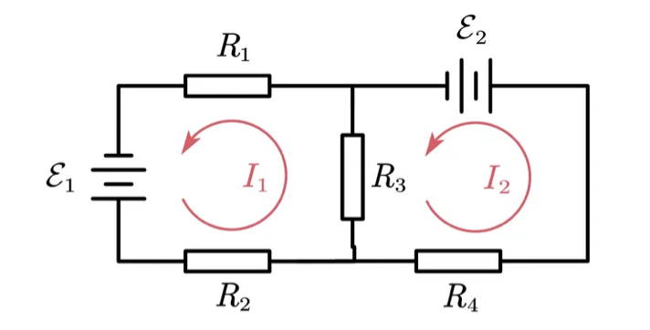

# 電路

## 內文
### 電阻

$R = \frac{V}{I}$

對於長條狀電阻而言， $R = \rho \frac{L}{A}$，其中$\rho$ 為材料的電阻率，L 為長度，A 為截面積

### 電容

$C = \frac{Q}{V} = \frac{I}{\dot V}$（因為 $I = \frac{dQ}{dt}$）

對於平行電板而言，$C = \epsilon \frac{A}{d}$ ，其中 $\epsilon$ 為中間填充材質的電容率，A 為面積，d 為距離

### 電感

$L = \frac{V}{\dot I}$

對於單層密繞的螺線圈而言，$L = \mu n^2 V$，其中 $\mu$ 為中間填充材質的磁導率，n 為單位長度的線圈數， V 為體積

- 電感還可以互感，不過在同一電路中電路的互感很複雜，先跳過

### 串聯與並聯

1. 串聯時，$\begin{cases} R_總 ＝ R_1 + R_2 + ... = \sum R_i\\ \frac{1}{C_總} ＝ \frac{1}{C_1} + \frac{1}{C_2} + ... = \sum \frac{1}{C_i}\\ L_總 ＝ L_1 + L_2 + ... = \sum L_i \end{cases}$
2. 並聯時，$\begin{cases} \frac{1}{R_總} ＝ \frac{1}{R_1} + \frac{1}{R_2} + ... = \sum \frac{1}{R_i}\\ C_總 ＝ C_1 + C_2 + ... = \sum C_i\\ \frac{1}{L_總} ＝ \frac{1}{L_1} + \frac{1}{L_2} + ... = \sum \frac{1}{L_i} \end{cases}$

之所以電容這麼特別，純綷是因為當初沒用 $\frac{1}{C}$ 當特徵量的鍋

### 直流電

中的電阻、電容、電感

因為 $\dot V = 0 、\dot I = 0$

1. 電阻 $R = \frac{V}{I}$
2. 電容 $C = \frac{I}{\dot V}$ ⇒ $I = C\dot V$ ⇒ $I = 0$ ，即斷路
3. 電感 $L = \frac{V}{\dot I}$ ⇒ $V = L\dot I$ ⇒ $V = 0$ ，即導線（短路）

### 交流電

中的電阻、電容、電感

對於 $\begin{cases} V = V_0 e^{i\omega t}\\ I = I_0 e^{i\omega t} \end{cases}$的交流電路而言，定義阻抗 (Impedance) $Z = \frac{V}{I}$，則

1. 電阻 $R = \frac{V}{I} =\frac{V_0 e^{i\omega t}}{I_0 e^{i\omega t}}$ 的阻抗為 $Z = \frac{V}{I} =\frac{V_0 e^{i\omega t}}{I_0 e^{i\omega t}} = R$
2. 電容 $C = \frac{I}{\dot V} = \frac{I_0 e^{i\omega t}}{i\omega V_0 e^{i\omega t}}$ 的阻抗為 $Z = \frac{V}{I} =\frac{V_0 e^{i\omega t}}{I_0 e^{i\omega t}} = \frac{1}{i\omega C}$
3. 電感 $L = \frac{V}{\dot I} = \frac{ V_0 e^{i\omega t}}{i\omega I_0 e^{i\omega t}}$ 的阻抗為 $Z = \frac{V}{I} =\frac{V_0 e^{i\omega t}}{I_0 e^{i\omega t}} = i\omega L$
   即 $V = I Z = I( R + \frac{1}{i\omega C} + i\omega L )$，其中阻抗 $Z = R + \frac{1}{i\omega C} + i\omega L$ 可以再分成
   1. 實部的電阻 $R$
   2. 虛部的電抗 $\frac{1}{i\omega C} + i\omega L$，其中 $\frac{1}{i\omega C}$ 稱為容抗，$i\omega L$ 稱為感抗

### 克希荷夫電路定律

1. 對於任意點，流入電流 = 流出電流
2. 對於任意迴路，繞一圈以後電壓不變

⇒ 衍伸觀念：可以把電路拆成數個獨立的電路迴路，這幾個迴路的電流可以線性相加

ex: 如下圖，通過電阻 $R_3$ 的電流為 $I_1 - I_2$

