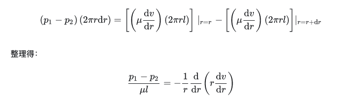

# 黏滯流體：N-S equation & Poiseuille's law

## 內文
### 流體與彈性體的不同

1. 在彈性體中，切應力 $\tau_{xy} = \mu \gamma_{xy} = \mu (\frac{\partial u_y}{\partial x} + \frac{\partial u_x}{\partial y})$ 與位移有關
2. 但是在黏性流體中，切應力 (摩擦力) 則是與速度有關，即
   $\tau_{xy} = \mu (\frac{\partial v_y}{\partial x} + \frac{\partial v_x}{\partial y}) = \mu \dot \gamma_{xy}$，其中此處的 $\mu$ 即為**<u>黏度 viscosity</u>**
3. 同理，其實整個流體應變張量可以改寫成
   $$
   \overleftrightarrow e' =  \begin{bmatrix}
\dot \epsilon_x & \frac{1}{2}\dot \gamma_{xy} & \frac{1}{2}\dot \gamma_{xz} \\
\frac{1}{2}\dot \gamma_{yx}  &  \dot \epsilon_y & \frac{1}{2}\dot \gamma_{yz} \\
\frac{1}{2}\dot \gamma_{zx}  & \frac{1}{2} \dot \gamma_{zy} &  \dot \epsilon_z
\end{bmatrix} = \begin{bmatrix}\frac{\partial v_x}{\partial x} & \frac{1}{2}(\frac{\partial v_y}{\partial x} + \frac{\partial v_x}{\partial y}) & \frac{1}{2}(\frac{\partial v_z}{\partial x} + \frac{\partial v_x}{\partial z}) \\\frac{1}{2}(\frac{\partial v_x}{\partial y} + \frac{\partial v_y}{\partial x} ) &  \frac{\partial v_y}{\partial y} & \frac{1}{2}(\frac{\partial v_z}{\partial y} + \frac{\partial v_y}{\partial z}) \\\frac{1}{2}(\frac{\partial v_x}{\partial z} + \frac{\partial v_z}{\partial x})  & \frac{1}{2} (\frac{\partial v_y}{\partial z} + \frac{\partial v_z}{\partial y})&  \frac{\partial v_z}{\partial z}\end{bmatrix}
   $$
   使廣義虎克定律從 $\overleftrightarrow \sigma = \overleftrightarrow C \overleftrightarrow e$ 被改寫為 $\overleftrightarrow \sigma = \overleftrightarrow C' \overleftrightarrow e' + \overleftrightarrow \sigma_p$ ⇒

$\begin{bmatrix} \sigma_x & \tau_{xy} & \tau_{xz}\\ \tau_{yx} & \sigma_y & \tau_{yz}\\ \tau_{zx} & \tau_{zy} & \sigma_z \end{bmatrix}_總 = \begin{bmatrix} 2\mu\dot\epsilon_x +\lambda \dot\delta -p & \mu\dot\gamma_{xy} & \mu\dot\gamma_{xz} \\ \mu\dot\gamma_{yx} & 2\mu\dot\epsilon_y +\lambda \dot\delta -p& \mu\dot\gamma_{yz} \\ \mu\dot\gamma_{zx} & \mu \dot\gamma_{zy} & 2\mu\dot\epsilon_z+\lambda \dot\delta-p \end{bmatrix}$

- 注意：注意此處 $\lambda、\mu$ 的量綱都有改變

### 納維爾－斯托克斯方程式 (N-S equation)

1. 同理想流體的歐拉方程，同樣利用 $\vec f_{外力} + \vec f_{\overleftrightarrow \sigma} = m \vec a$
2. 同樣根據高斯定理，$f_{\overleftrightarrow \sigma} = \oint \overleftrightarrow \sigma \cdot d\vec A = \int (\nabla \cdot \overleftrightarrow \sigma)dV$，而這次不同的是 $\nabla \cdot \overleftrightarrow \sigma$ 比較複雜
   $$
   \nabla \cdot \overleftrightarrow \sigma = \begin{bmatrix}
\frac{\partial \sigma_x}{\partial x} + \frac{\partial \tau_{yx}}{\partial y} + \frac{\partial \tau_{zx}}{\partial z}\\
 \frac{\partial \tau_{xy}}{\partial x} + \frac{\partial \sigma_y}{\partial y} + \frac{\partial \tau_{zy}}{\partial z}\\
\frac{\partial \tau_{xz}}{\partial x} + \frac{\partial \tau_{yz}}{\partial y} +\frac{\partial \sigma_z}{\partial z}
\end{bmatrix}_總=\begin{bmatrix}
\frac{\partial(2\mu\dot\epsilon_x +\lambda \dot\delta -p)}{\partial x} +\frac{\partial \mu\dot\gamma_{yx}}{\partial y}+\frac{\partial \mu\dot\gamma_{zx}}{\partial z} \\
\frac{\partial \mu\dot\gamma_{xy}}{\partial x}  +\frac{\partial(2\mu\dot\epsilon_y +\lambda \dot\delta -p)}{\partial y} + \frac{\partial \mu\dot\gamma_{zy}}{\partial z} \\
\frac{\partial \mu\dot\gamma_{xz}}{\partial x}  + \frac{\partial \mu\dot\gamma_{yz}}{\partial y}+\frac{\partial(2\mu\dot\epsilon_z +\lambda \dot\delta -p)}{\partial z}
\end{bmatrix}
   $$
3. 接下來的化簡方法同<u>彈性動力學方程</u>：（以第一行為例）
   $$
   \frac{\partial(2\mu\dot\epsilon_x +\lambda \dot\delta -p)}{\partial x} +\frac{\partial \mu\dot\gamma_{yx}}{\partial y}+\frac{\partial \mu\dot\gamma_{zx}}{\partial z} \\=  2\mu\frac{\partial^2 v_x }{(\partial x)^2} + \lambda \frac{\partial(   \dot\delta)}{\partial x} -\frac{\partial p}{\partial x} +\mu(\frac{\partial^2 v_y}{\partial x \partial y} + \frac{\partial^2 v_x}{(\partial y)^2}+\frac{\partial^2 v_z}{\partial x \partial z} + \frac{\partial^2 v_x}{(\partial z)^2}) \\=-\frac{\partial p}{\partial x} + \lambda \frac{\partial(   \dot\delta)}{\partial x} +\mu[\frac{\partial^2 v_x }{(\partial x)^2} +\frac{\partial^2 v_y}{\partial x \partial y} +\frac{\partial^2 v_z}{\partial x \partial z} ]\\ + \mu[\frac{\partial^2 v_x }{(\partial x)^2} + \frac{\partial^2 v_x}{(\partial y)^2} + \frac{\partial^2 v_x}{(\partial z)^2}] \\=-\frac{\partial p}{\partial x} + \lambda \frac{\partial(   \dot\delta)}{\partial x} +\mu\frac{\partial}{\partial x} [\frac{\partial v_x }{\partial x} +\frac{\partial v_y}{ \partial y} +\frac{\partial v_z}{\partial z} ]\\ + \mu[\frac{\partial^2 v_x }{(\partial x)^2} + \frac{\partial^2 v_x}{(\partial y)^2} + \frac{\partial^2 v_x}{(\partial z)^2}] \\= -\frac{\partial p}{\partial x} + \lambda \frac{\partial(\nabla \cdot\vec v)}{\partial x} +\mu\frac{\partial(\nabla \cdot\vec v)}{\partial x}  + \mu\nabla^2 v_x \\= -\frac{\partial p}{\partial x} + (\lambda + \mu) \frac{\partial(\nabla \cdot\vec v)}{\partial x} + \mu\nabla^2 v_x
   $$
   $$
   ⇒ \nabla \cdot \overleftrightarrow \sigma = \begin{bmatrix}
-\frac{\partial p}{\partial x} + (\lambda + \mu) \frac{\partial(\nabla \cdot\vec v)}{\partial x} + \mu\nabla^2 v_x  \\ -\frac{\partial p}{\partial y} + (\lambda + \mu) \frac{\partial(\nabla \cdot\vec v)}{\partial y} + \mu\nabla^2 v_y \\-\frac{\partial p}{\partial z} + (\lambda + \mu) \frac{\partial(\nabla \cdot\vec v)}{\partial z} + \mu\nabla^2 v_z
\end{bmatrix}  \\= -\nabla p + (\lambda + \mu) \nabla(\nabla \cdot\vec v)+ \mu\nabla^2 \vec v
   $$
4. $\vec f_{外力} + \vec f_{\overleftrightarrow \sigma} = m \vec a$ ⇒ $\vec f_{外力} + \int (\nabla \cdot \overleftrightarrow \sigma)dV= m \vec a$
   ⇒ 全部同除以體積以計算成密度 ⇒ $\overline f_{外力} + \nabla \cdot \overleftrightarrow \sigma = \rho \vec a$
   $$
   ⇒ \overline f_{外力} -\nabla p + (\lambda + \mu) \nabla(\nabla \cdot\vec v)+ \mu\nabla^2 \vec v   = \rho \frac{d \vec v}{d t}
   $$
   此即為 **<u>納維爾－斯托克斯方程式 (N-S equation)</u>**
5. 比理想流體的歐拉方程多了兩項：$(\lambda + \mu) \nabla(\nabla \cdot\vec v)+ \mu\nabla^2 \vec v$ ⇒ 這就是黏度所貢獻的力
6. 延伸（跟歐拉方程的延伸很像，多了不可壓縮流體）
   1. 對於不可壓縮流體而言，體應變率 $\nabla \cdot\vec v = 0$
      改寫為 $\overline f_{外力} -\nabla p +  \mu\nabla^2 \vec v = \rho \frac{d \vec v}{d t}  = \rho \frac{\partial v}{\partial t} + \rho(\vec v\cdot\nabla) v$

### 帕醉定律 Poiseuille's law

1. 這邊是因為 $r\frac{dv}{dr}\vert_{r=r}^{r=r+dr}={d(r\frac{dv}{dr})}$（取極限就是微分的定義，f(x+dx) - f(x) = df(x)）
   
