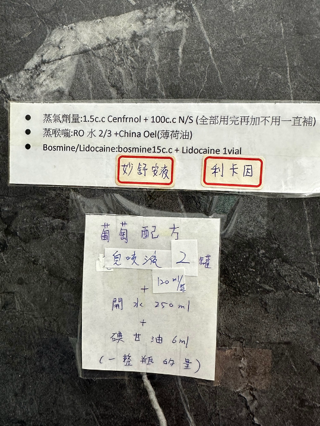

# 耳鼻喉科診所 procedure

## 摘要
治療檯上藥罐與噴劑的位置與用途（B+L、碘甘油、ATT）、鼻竇炎治療、抽鼻涕、吸耳屎、內視鏡操作步驟，以及蒸氣與病毒疹的小備註。原筆記標註「還沒整理」。

## 內文
### 治療檯

### 藥罐

右到左

- BI (Betadine)消毒
- ATT / Albothyl Concentrate (Policresulen): 用於口腔潰瘍的化學灼燒
  - 傳統上用硝酸銀較具刺激性
- Hydrocortisone acetate (美時皮質醇軟膏 1%）
- Bosmin+Lidocaine (B+L)
- 碘甘油 (最左邊深褐色玻璃罐)

使用方式

- 嚴重鼻竇炎、擦耳朵: B+L
- 咽喉發炎: (B+L) +碘甘油 (\*塗在軟顎)(\*塗完後三十分鐘可以進食)
- 外耳炎：(B+L)+BI or 皮質醇
- Oral ulcer: ATT

### 噴劑

右到左

- 右一：葡萄 息咳液+碘甘油
- 右二：草莓 羅得噴喉口腔消炎 (Benzydamine HCl): 草莓口味 (小孩多覺得草莓滿好吃的)
- 右三：Bosmine: 用來噴鼻黏膜
- 左邊兩個不會用到

### 鼻竇炎治療

- 棉棒沾bosmin + lidocaine (\*選左邊的ENT棉棒)
- 一根在common meatus (平、深)，另一根在middle meatus (朝上)
- 拿掉棉棒之後抽鼻涕
- S/p SMP: 用鑷子夾出快要脫落的血塊與結疤

### 抽鼻涕

- common meatus -> inferior meatus -> middle meatus
- 盡量不要朝內，容易戳到Little’s area (\*吸嘴先水平進去，再朝下往深處)
- 嬰兒哭的時候鼻涕就很容易出來了，不用伸太裡面(不要超過第一個凹槽)

(\*先噴B+L 或 鼻竇炎治療，等做完其他檢查和開完處方後，再來吸鼻涕)

(\*成人噴B+L用擴鼻器輔助，吸鼻涕用擴鼻器+細鐵管；成人噴B+L用錐形器輔助，吸鼻涕用塑膠軟管)

### 吸耳屎/夾耳屎

- 會有神經反射咳嗽
- 耳鑷比鼻鑷短
- 硬耳屎：可以用serene點藥水先軟化，再用吸的
- 乾耳屎：用手(不管左右耳，都用左手撐拉) or 用金屬錐形器把耳朵撐開，用頭鏡的燈來照耳朵，再用金屬吸管來吸
- 濕耳屎：用棉棒轉一轉

### 內視鏡 Scope

- 請護理師拿來->插上顯示器，開啟顯示器電源->用酒精棉球擦拭鏡頭，確認乾淨->用白紙設定好白平衡->用熱氣加熱鏡頭
- 內視鏡有三個按鈕，中間是白平衡設定，上面是拍照，下面是錄影
- 適用部位：耳朵、鼻腔，喉嚨/聲帶
  - 若要用於喉嚨，需要先用Xylocaine局麻喉嚨(噴六下)(不可以吞下)，並等待十分鐘

rash

- 病毒疹: blanchable，皮下微血管
- 水痘

蒸氣

- 吸蒸氣: 含bronchodilator，對於咳嗽有痰、呼吸音悶者
- 蒸喉嚨: 純水蒸氣，對於單純喉嚨癢癢卡卡的
