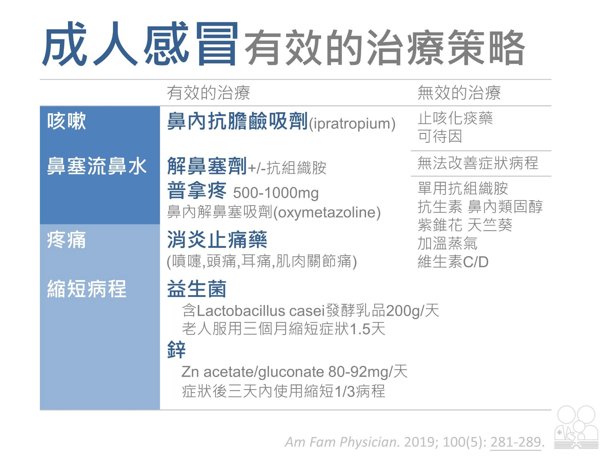

# 鼻子

## 摘要
鼻塞用 Rontec／pseudoephedrine 類（注意 BPH、Theophylline、孕婦）；鼻水、倒流、噴嚏用抗組織胺（Polaramine、Primalan、Zyrtec，小孩用 Cypromin）；過敏性鼻炎＝一顆口服抗組織胺＋一支類固醇鼻噴劑。

## 內文

### 鼻塞

1. Rontec：複方 Anti-histamine + pseudoephendrine，較不嗜睡
   - Rontec - 1 tab TID \* 3 day 或 2 tab PRNX \*3 day
   1. BPH 病人不可用（α agonist）
   2. 不可與強 bronchodilator（Theophylline） 合用（怕 Afib） ⇒ 改 PRN
   3. 不要與 Anti-histamine 合用（同樣成分）
   4. 孕婦慎用 (Class B)
2. Pseudoephedrine：α + β2 agonist ⇒ vasoconstriction + bronchi relaxation
3. Phenylephrine: α agonist，弱版 Pseudoephedrine（弱到 FDA 覺得沒效）

### 鼻水、鼻涕倒流、噴嚏

1. Polaramine（dexchlorpheniramine，一代 H1）：較強，較嗜睡
   - Polaramine - 1 tab TID \* 3 day 或 3 tab PRNX \*3 day
2. Primalan（Mequitazine，二代 H1）
3. Rontec：最弱，但若濃鼻涕 / 鼻涕擤不出來，不要給 anti-histamine ，因為會讓鼻涕變稠，改用Rontec
4. 小孩鼻水：Cypromin（Cyproheptadine，一代 H1）藥水
   - 小朋友就算症狀偏向鼻子，但除非明確過敏性鼻炎，不然咽喉氣管藥還是一起給
5. 夜間止鼻涕：Zyrtec（Cetirizine，二代 H1），小孩改成 Cypromin
   - Zyrtec - 1 tab HS \* 3 day（2-6 歲: 0.5 tab）

### 過敏性鼻炎

一顆口服 Anti-histamine + 一顆噴劑（三種鼻噴劑效果差不多）

**口服 Anti-histamine：**

1. mild allergic：Zyrtec（Cetirizine，二代 H1）, Denosin（Desloratadine，二代 H1）, Xyzal（Levocetirizine，二代 H1）
2. severe allergic：Allegra（Fexofenadine，二代 H1)

**Glucocorticoid 噴劑：**

1. Beclomet（Beclomethasone）
2. Avamys（Fluticasone）
3. Nasonex（Mometasone）
