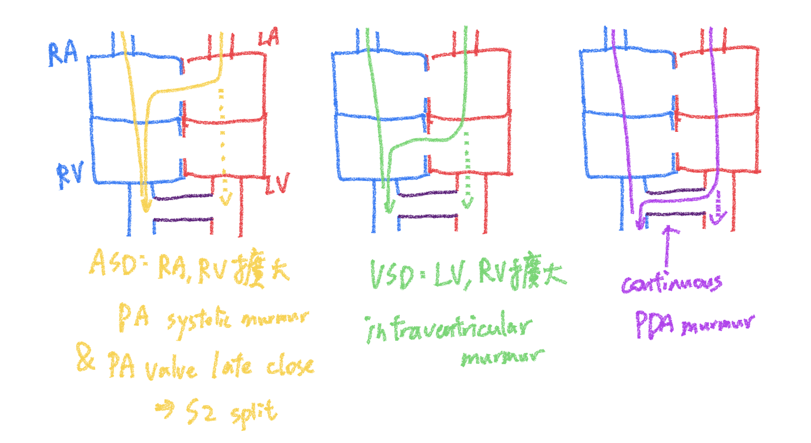

# 打洞類

## 摘要
VSD, ASD, PDA（隨便打一個洞，因為壓力差，通常都是 Left-to-right shunt，易 pulmonary hypertension）

- 新生兒出生後三天才會出現明顯 Left-to-right shunt，開始聽到murmur

## 內文

1. CXR：肺紋增加
2. 心音：ASD（收縮期雜音、寬且固定S2心音）、VSD（holosystolic murmur）、PDA（murmur at anytime）
3. ASD ⇒ 右心房 & 室擴大、VSD ⇒ 左右心室擴大、PDA ⇒ 左心室擴大
4. Qp（肺循環血流量） : Qs（體循環血流量）
   1. VSD ⇒ > 2 : 1 開刀
   2. ASD ⇒ > 1.5 : 1 開刀

- [[打洞類/PDA、ASD、VSD 長期開著的後遺症|全文|扁平]]
