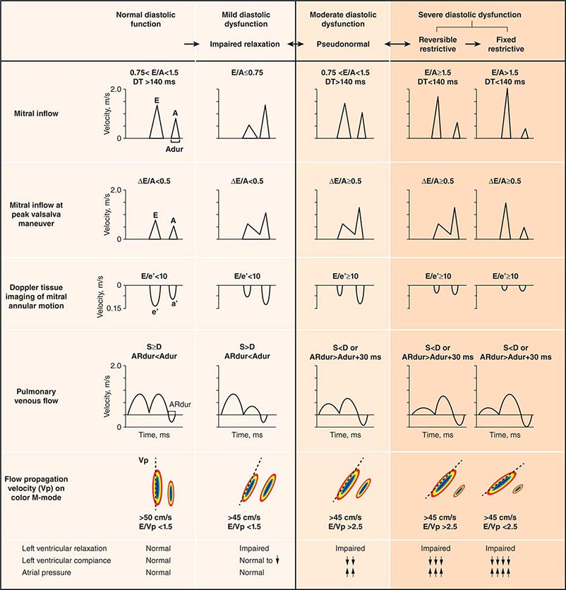

# Heart echo for diastolic dysfunction

## 摘要
E/A（mitral inflow）：E/A 隨病程先變小再變大

E/e’（tissue Doppler）：E/e’ 越大代表 LV 越硬、反映 LVEDP；並區分 diastolic dysfunction（病生理）與 HFpEF（症狀）。

## 內文
[[Diastolic dysfunction 的 echo 指標/Diastolic dysfunction vs HFpEF|摘要]]

[[Diastolic dysfunction 的 echo 指標/Mitral inflow view|全文|群組縮排]]

[[Diastolic dysfunction 的 echo 指標/Doppler tissue of mitral annular motion|全文|群組縮排]]
