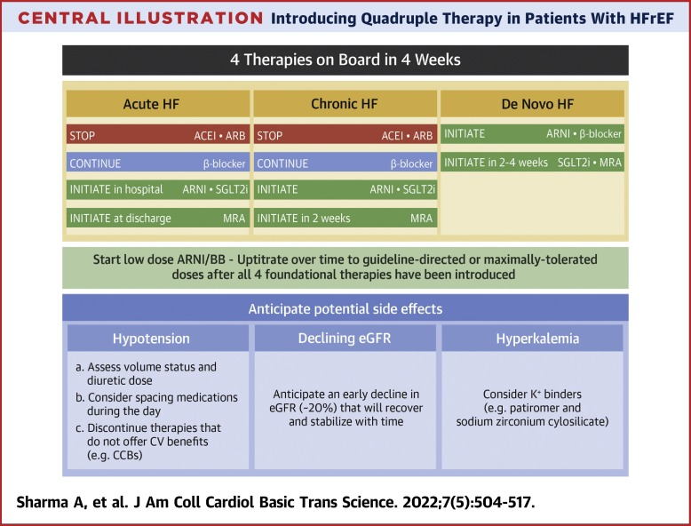
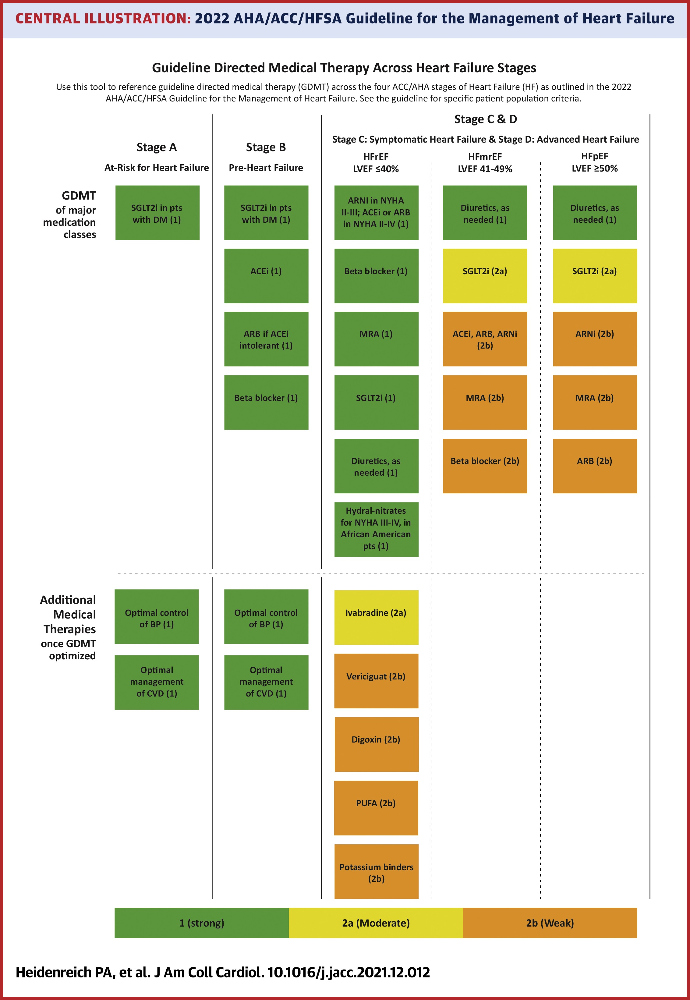

# 2022 guideline-directed medical therapy (GDMT)

## 摘要

1. Beta-blocker: 心臟相關降壓藥首選，保護心臟
   - 只有 Bisoprolol、Carvedilol、Metoprolol 有 evidence
2. SGLT-2: 神藥，病人沒DM可以保護心臟，有DM直接用
3. [[2022 guideline-directed medical therapy (GDMT)/ARNi: ARB + neprilysin inhibitor。新藥，indication 還沒這麼多，以後可能更多|扁平]]
4. ACEi: Stage B開始用，不併用ARB ，注意鉀離子、腎功能。劑量用到最滿
5. ARB: 不能用ACEi or ARNi的人才用，對心臟evidence沒那麼高
6. MRA: mineral corticoid receptor (Spironolactone)
7. Ivabradine: funny current channel inhibitor(IIa), for **LVEF<35%, sinus rhythm, resting HR>70** to **reduce HR** (a fib 不適合)
8. CCB: 降壓藥，對心臟無影響，病人血壓低的話優先停此藥

## 內文

[【治療指引】2022年美國心臟衰竭治療指引更新｜AHA/ACC/HFSA | 小涵藥師研究室 (tinapoint.com)](https://tinapoint.com/024-2022-acc-hf-guideline/)

[【治療指引】心臟衰竭治療大更新！2021 ESC 歐洲心臟學會 | 小涵藥師研究室 (tinapoint.com)](https://tinapoint.com/g002/) (裡面有dose)
