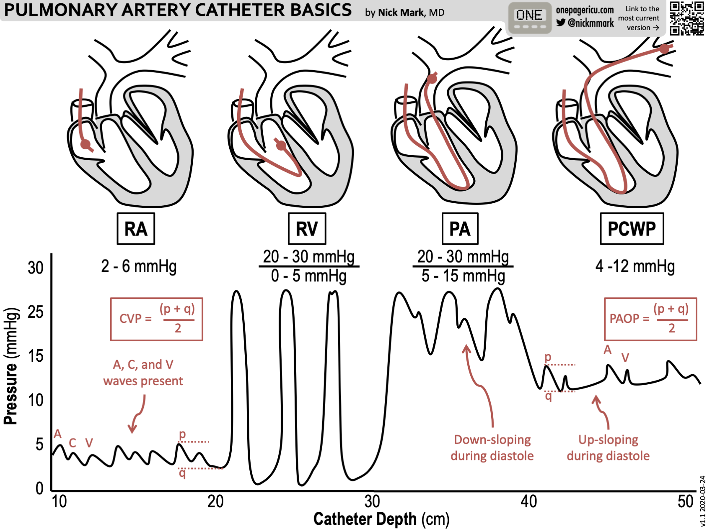

# Swan-Ganz

## 摘要
直接量測：CVP、PAP、PCWP（>18 表 congestion）
衍生指標：PAPi（<0.9 表 RV failure）、TPG、DPG、PVR

## 內文
[[Usage of Swan-Ganz/Direct measurement|全文|群組縮排]]

[[Usage of Swan-Ganz/Indices|全文|群組縮排]]

[[Usage of Swan-Ganz/無關的補充：Pulmonary hypertension Dd|摘要]]

[[Usage of Swan-Ganz/大圖|摘要]]
