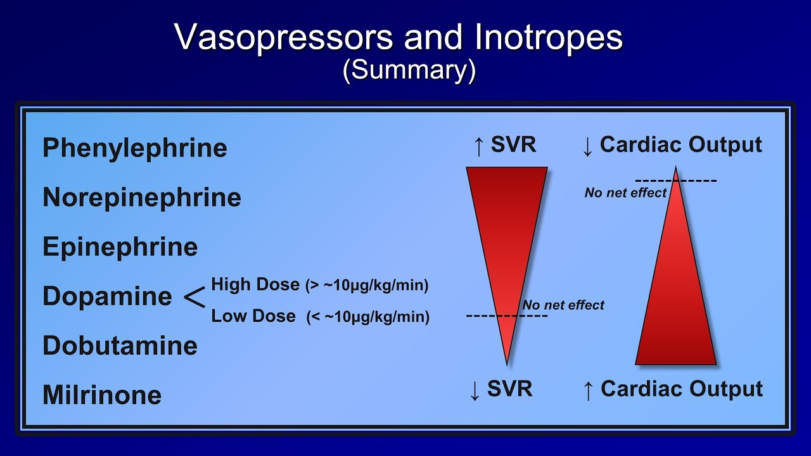
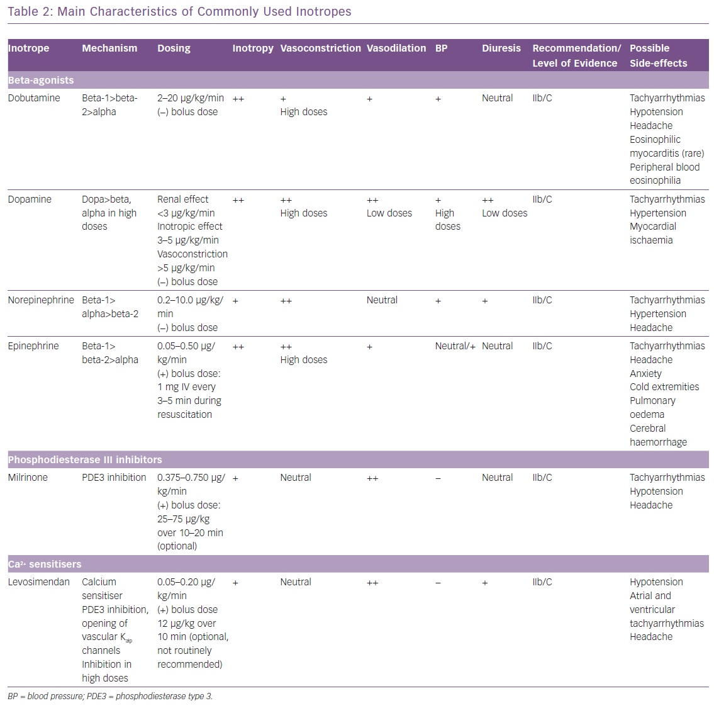

# Inotropes for wet & cold & low BP (hemodynamic support)

## 內文
1. Maximize cardiac output & diastolic pressure
2. Avoid tachycardia & preserve diastolic filling time
3. Minimize any increase in myocardial oxygen demand

