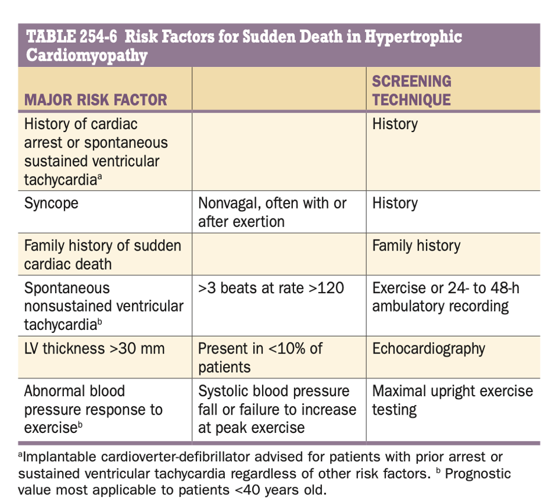

# Prevention of sudden death

## 內文
1. Major cause: **sustained VT, VF, sudden cardiac arrest**. Also high prevelance of ventricular arrhythmias (88% have ventricular premature beat, 12% had ≥ 500 VPBs; 15~30% have nonsustained ventricular tachycardia (NSVT))
2. Pathophysiology: myocardial ischemia / LV outflow tract obstruction / high adrenergic states ⇒ myocyte disarray & interstitial fibrosis
3. Management:
   1. ICD for ≥ 1 major risk factor, especially in the young people.
   2. beta blocker for symptoms control
   3. Avoid competitive sports.
   4. Other major risk factors: LV apical aneurysm & End-stage HCM (LVEF <50%)
   
