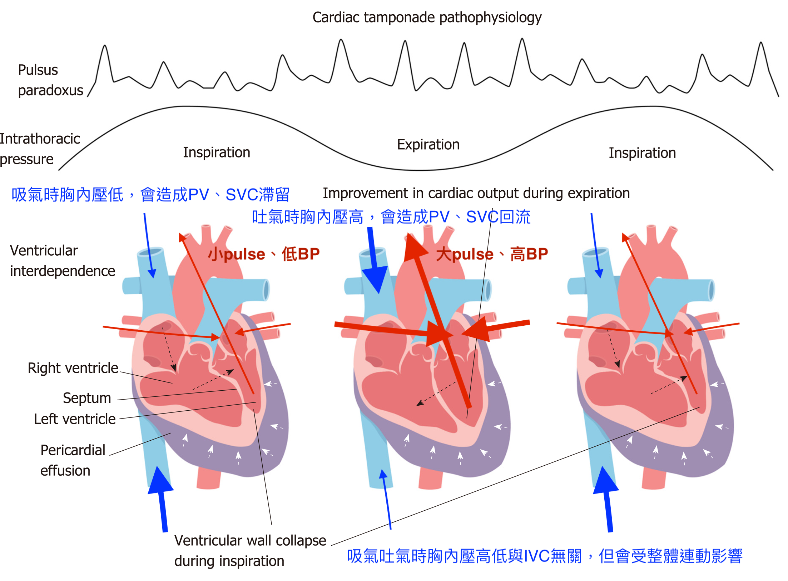

# PE: 聽診(murmur, breathing sound, friction rub)、pulse、jugular vein distension、 reproducible pain

## 內文
1. 聽診：
   1. systolic murmur: ischaemic mitral regurgitation(associated with poor prognosis of ACS) or aortic stenosis(mimicking ACS)
   2. cardiac friction rub (伴隨心跳出現): pericarditis, pericardial effusion, cardiac temponade
   3. pleural friction rub (伴隨呼吸出現): pneumonia / pulmonary embolism / pleuritis
   4. unilateral sound loss: pneumothorax
   5. crackle / wheezing / stridor
2. pulse：
   1. irregular pulse: ????
   2. bilateral pulse 不對稱 or 上下 pulse/BP 差太多: aortic dissection
   3. Pulsus paradoxus: 吸氣掉10 mmHg以上，此時心音聽得到但Pulse摸不到(paradox)，有可能心臟被包住、RV壓力過大、吸氣時LV壓力過小
      
      1. 心臟被包住: **<u>Cardiac temponade</u>**, constrictive pericarditis（吸氣時septum擠壓LV，呼氣時擠壓RV）
      2. RV 壓力過大: **<u>PE</u>**
      3. 吸氣時 LV 壓力過小: Lung hyperinflation(吸氣時肺泡張開血液不回LV，如**<u>COPD, asthma, tracheal obstruction ex:croup</u>**)、Anaphylactic shock(vasodilation)
3. jugular vein distension: indicate right heart failure
   1. from right heart (右心 爛掉/進不去/出不來 ) : right heart failure, tricuspid valve stenosis, superior vena cava obstruction
   2. from whole heart(左心＋右心一起糟): constrictive pericarditis, cardiac tamponade, heart failure
   3. from lung: PE
   4. other causes: **Tension pneumothroax**
4. pain reproduced by chest or abdominal palpation: pathology of the musculoskeletal chest wall, cannot rule out PE & cardiac
