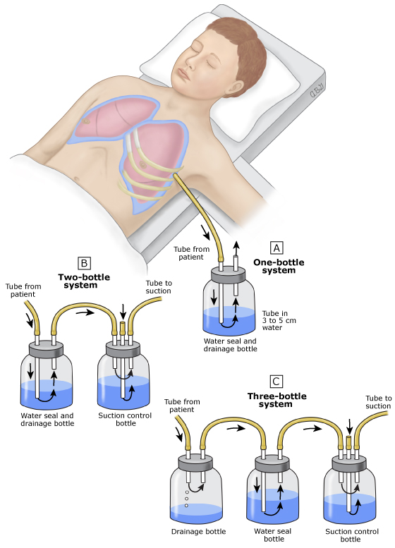
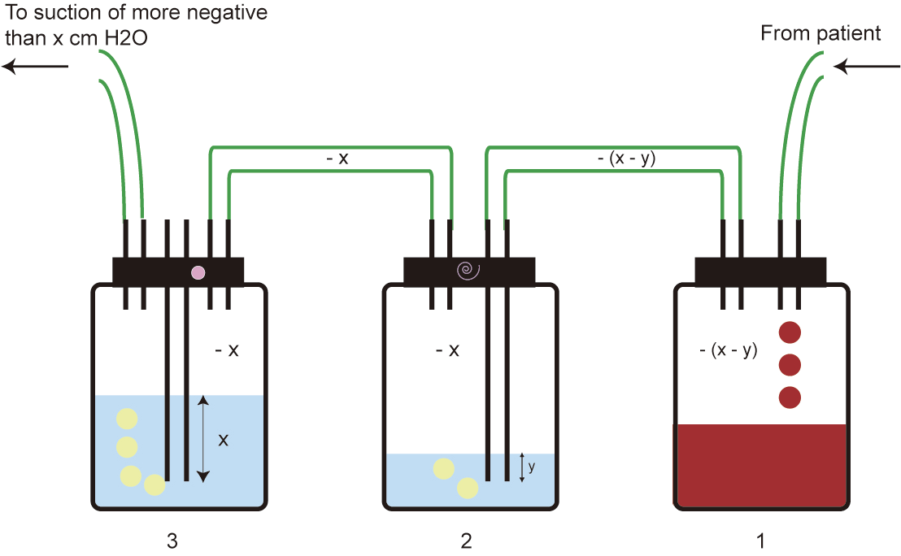

# Chest tube drainage

## 內文
2-bottle 和 3-bottle 為了維持胸內負壓，最後面接suction control tube (1 bottle 是接外面大氣) 。在台大醫院的 suction control 是用牆上的吸嘴控制，不用另外放一個瓶子

氣胸用 1 bottle / 2 bottle（因為沒什麼液體）

有水有氣要排的話就要用 3 bottle 第一個瓶子接水 第二個瓶子接氣 這樣不會水越接越多以後水淹過管子的深度(y)大 氣體出不來

