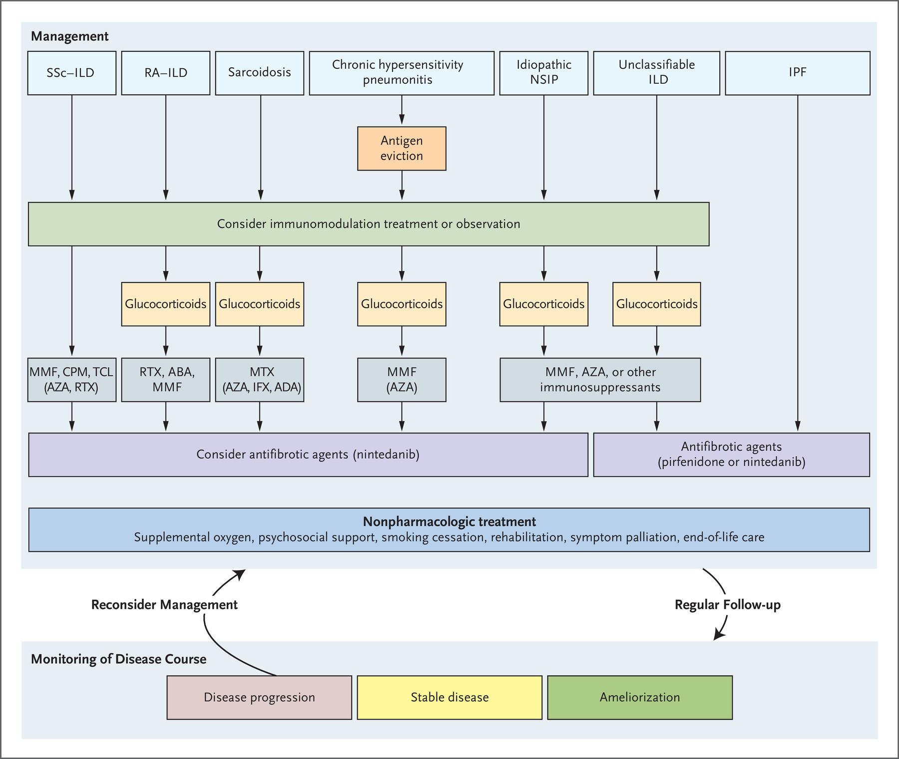

# Interstitial Lung Disease ⇒ Fibrotic Lung Diseases

## 內文
If 年輕人 ⇒ 考慮換肺

1. [[Interstitial Lung Disease ⇒ Fibrotic Lung Diseases/Pathophysiology tissue injury in lung parechyma ⇒|扁平]]
3. Etiology
   1. Autoimmune-related interstitial lung disease

      [[Interstitial Lung Disease ⇒ Fibrotic Lung Diseases/Connective tissue disease related (CTD-ILD) RA|摘要]]
      - Others: pulmonary langerhans cell histiocytosis, lymphangioleiomyomatosis(LAM), amyloidosis, eosinophilic pneumonia, Goodpasture syndrome (anti-GBM)
   2. Granuloma-related interstitial lung disease：見 「感染科 ⇒ Innate immunity (granuloma related)」
      1. Sarcoidosis
      2. Granulomatous with polyangiitis (c-ANCA)
      3. Eosinophilic granulomatous with polyangiitis (p-ANCA)
      4. TB
      5. Other foreign body / dust exposure（見下面 c.）
   3. Exposure-related interstitial lung disease (pneumoconiosis) ⇒ Also granuloma
      1. asbestosis（石綿肺）
      2. Silicosis（矽肺病，礦場/工地工人吸入矽塵）
      3. Anthracosis / Coal workers’ pneumoconiosis （碳）
      4. Aluminosis（鋁） / Berylliosis（鈹） / Pulmonary siderosis（鐵）
      5. Organ dust toxic syndrome（農場）/ Byssinosis（棉塵症，紡織工人）
      6. Drug: 化療、放療、amiodarone、phenytoin 、cocaine、heroin
      - 注意：Pneumoconiosis + Rheumatoid arthritis ⇒ Caplan syndrome
   4. Idiopathic interstitial lung disease / Idiopathic pulmonary fibrosis

   [[Interstitial Lung Disease ⇒ Fibrotic Lung Diseases/Etiology 互相交織、互相影響|摘要]]
4. Classification: AIP, COP, NSIP, DIP, RB-ILD, LIP, UIP

   [[Interstitial Lung Disease ⇒ Fibrotic Lung Diseases/主要是看 HRCT(high-resolution CT)、病理切片、進程速度|摘要]]

[Spectrum of Fibrotic Lung Diseases | NEJM](https://www.nejm.org/doi/10.1056/NEJMra2005230)

