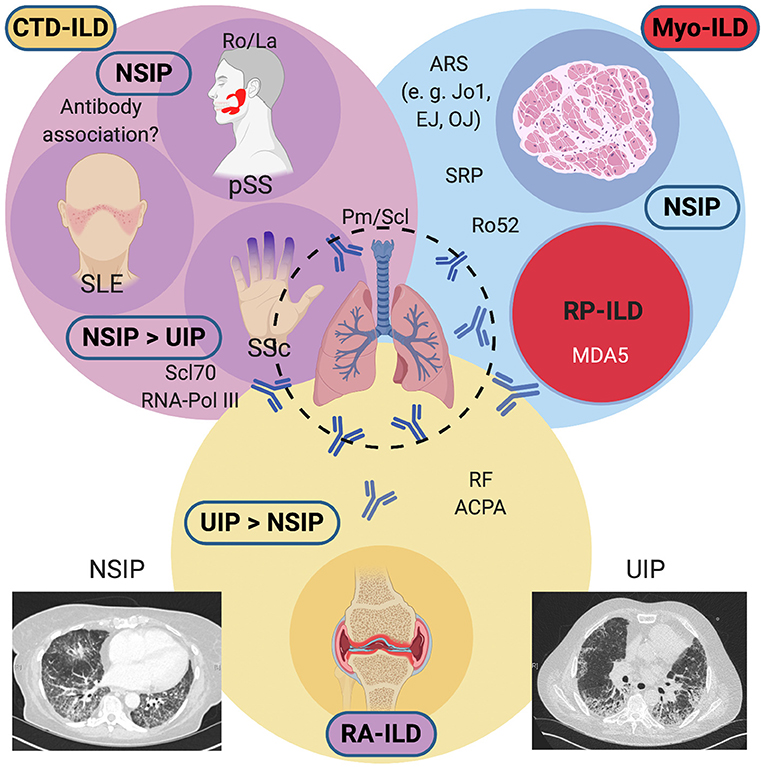

# Connective tissue disease related (CTD-ILD)

## 內文
[Editorial: Interstitial Lung Disease in the Context of Systemic Disease: Pathophysiology, Treatment and Outcomes](https://www.frontiersin.org/articles/10.3389/fmed.2020.644075/full)

