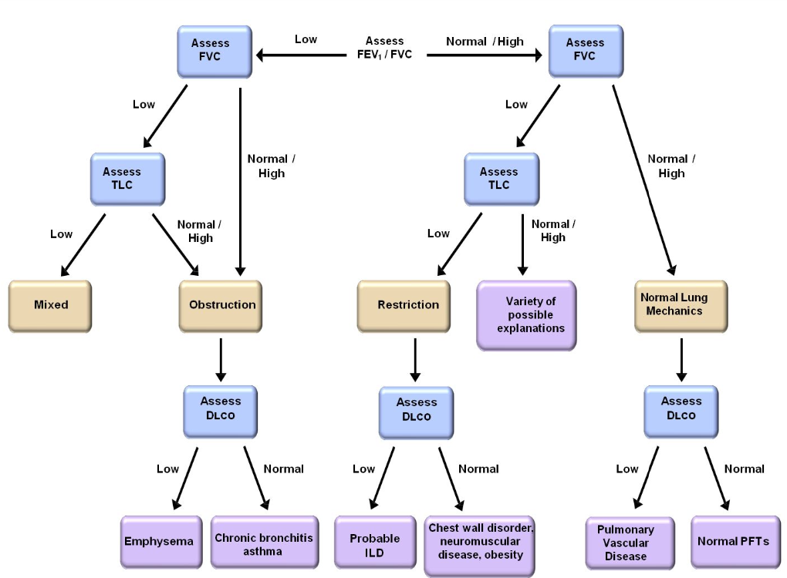
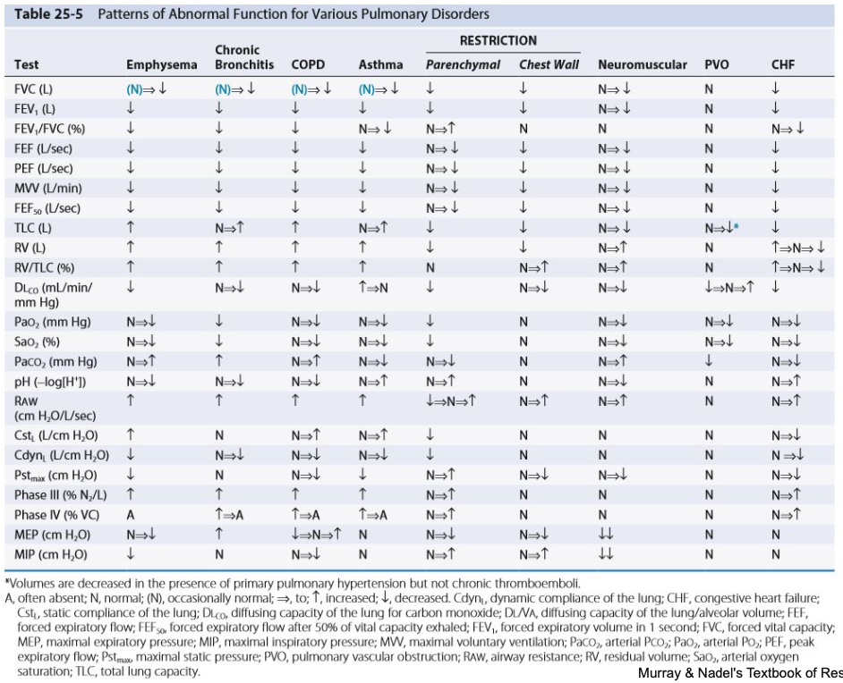

# Lung Function Test

## 內文
[[Lung Function Test/在 ABG 或 CXR 有變化以前就先抓到疾病|摘要]]

重點要看的數值：

- 注意：% Predicted 意思為相較模型預測（以性別、年齡、身高、體重、種族下去算），此病人的實際測量值為模型的幾%

1. FEV1 / FVC (Observed)：看像不像 obstructive
2. FVC (% Predicted)：看像不像 restrictive，如果像要測 TLC
3. TLC (% Predicted)：restrictive lung disease 的診斷標準 （但是難測）
4. DLCO：看氣體（一氧化碳）擴散到肺部血液的能力好不好

