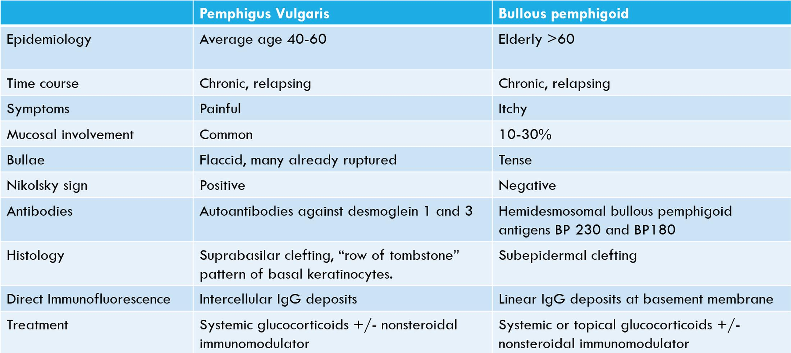

# Bullous disease

## 內文
Type II hypersensitivity，為autoimmune 疾病的一種，出現anti皮膚細胞之間黏著分子的antibody

[[Bullous disease/Pemphigoid(類天皰瘡 Bullous pemphigoid)|摘要]]

[[Bullous disease/Pemphigus(天皰瘡)|摘要]]

### Linear IgA bullous dermatosis
