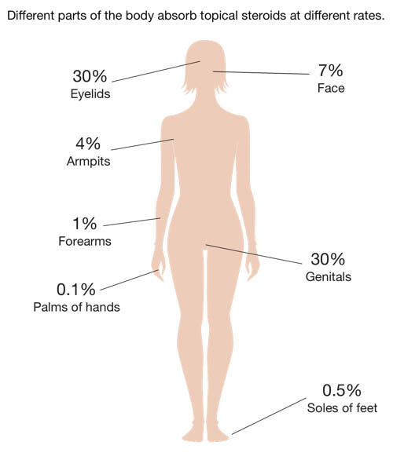
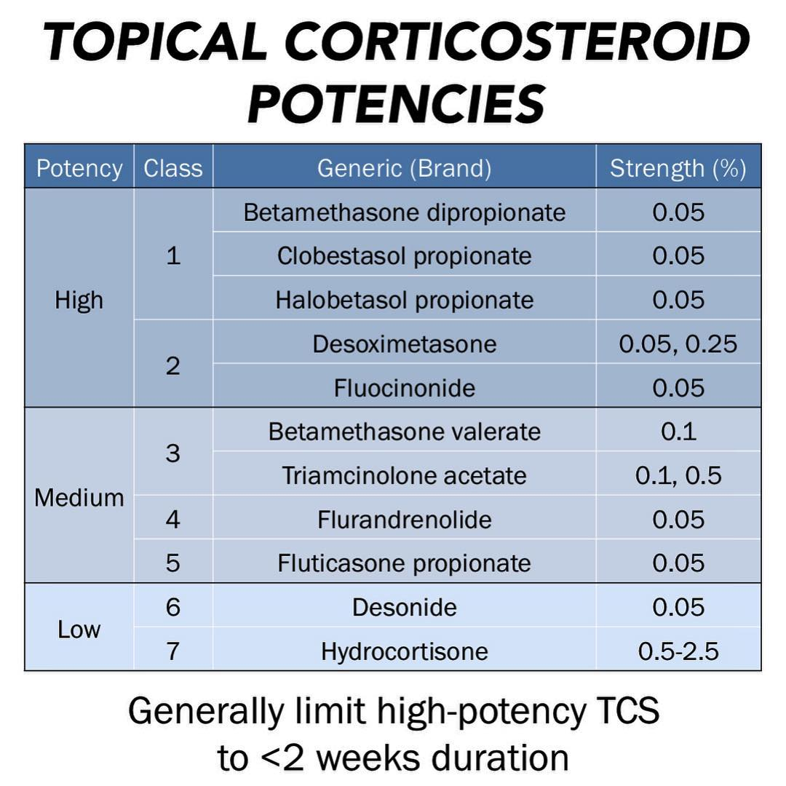
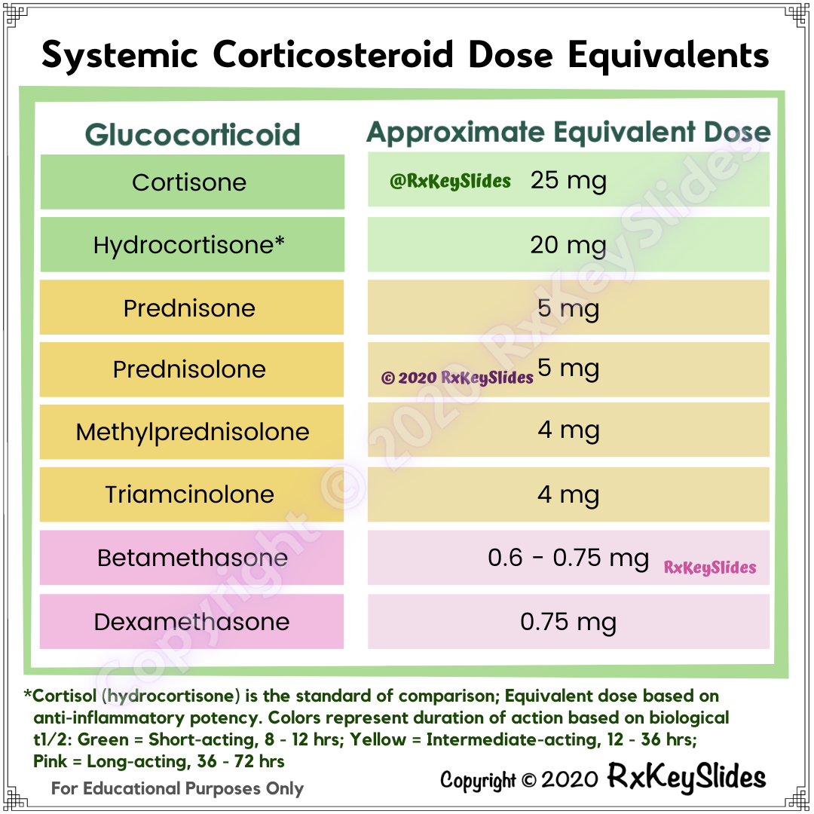

# Steroid 使用原則

## 內文
不同形狀外用藥下Ointment potency高>cream>liquid >gel

Oral steroid 如果給超過1mg/kg 或是給超過2周 就有可能出現副作用

Face, groin 的steroid absorption高，不可給太強

Topical steroid 強度分七級

不同Systemic steroid之間的強度換算
