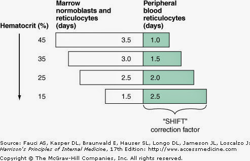

# RPI (造血能力)

## 內文
1. RPI (造血能力) = RI (Reticulocyte 數)/ 校正數字 (1.0~2.5)
   - RPI 是算 reticulocyte 實際的製造速度（一樣是體積）
   - 校正數字是根據 HCT% ，如下圖
2. RI = reticulocyte(%) \* Actual Hct(%) / normal Hct(即 45%)
   - RI 是計算 reticulocyte 在全血中佔幾 % 的 體積

