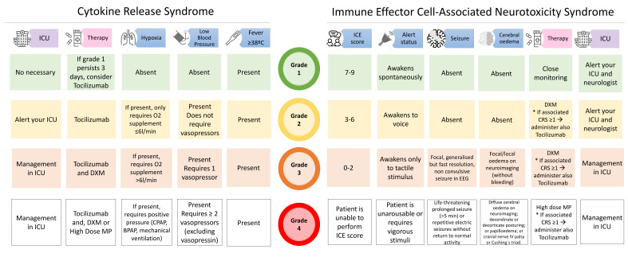
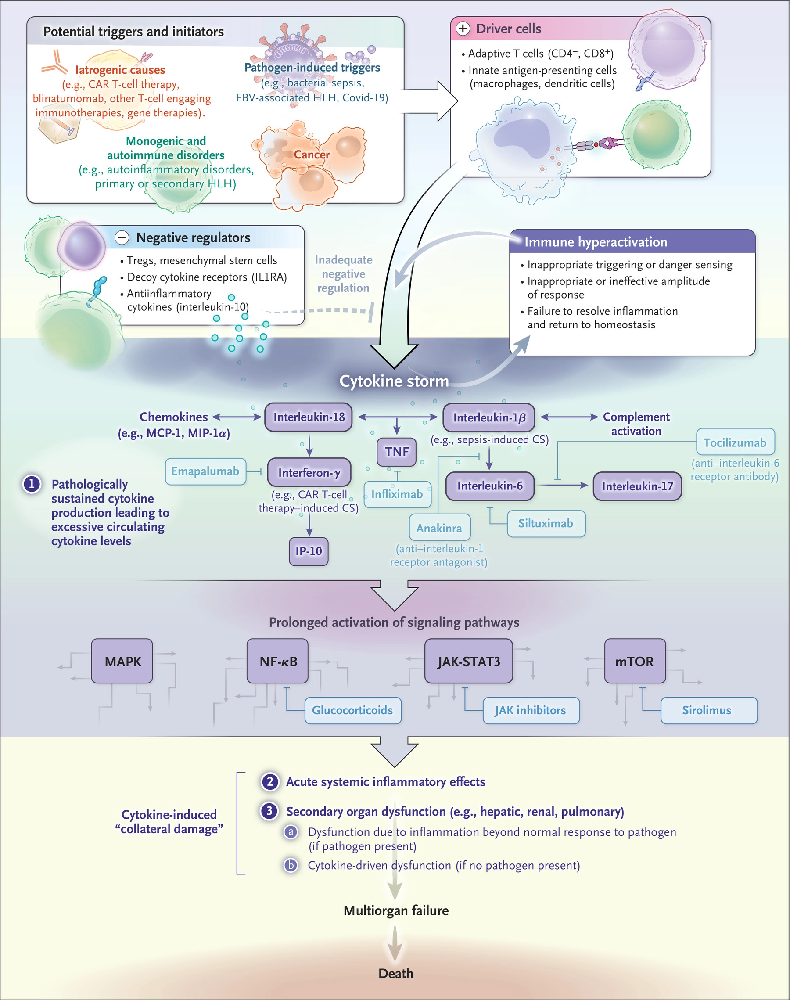

# CRS & ICANS post CAR-T

## 內文
CRS：注意三件事 O2? Hypotension? Fever?(⇒ infection focus?)

Biomarker: CRP, ferritin & IL-6

[[CRS & ICANS post CAR-T/Cornell Assessment of Pediatric Delirium (CAPD)|摘要]]

[[CRS & ICANS post CAR-T/ICE Score|摘要]]

