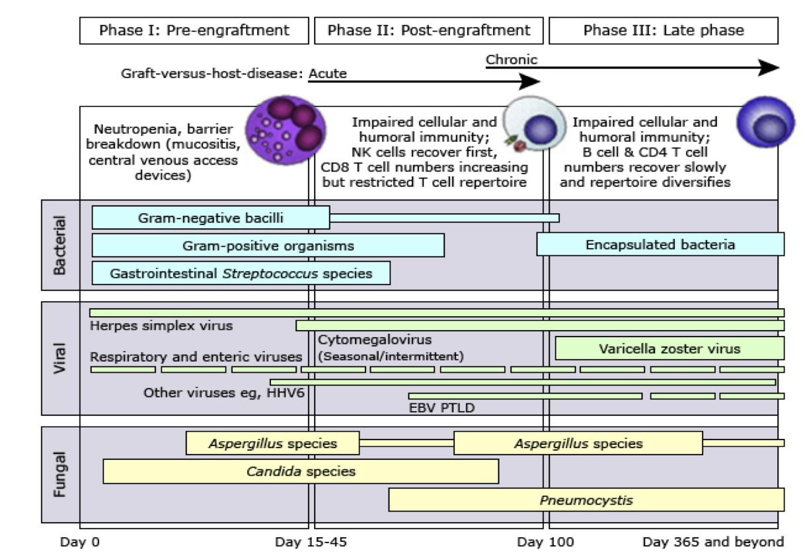

# 同場加映：Antimicrobial prophylaxis in Hematopoietic stem cell transplantation (HSCT) recipients

## 內文

[Infectious Complications in Paediatric Haematopoetic Cell Transplantation for Acute Lymphoblastic Leukemia: Current Status](https://www.frontiersin.org/articles/10.3389/fped.2021.782530/full)
