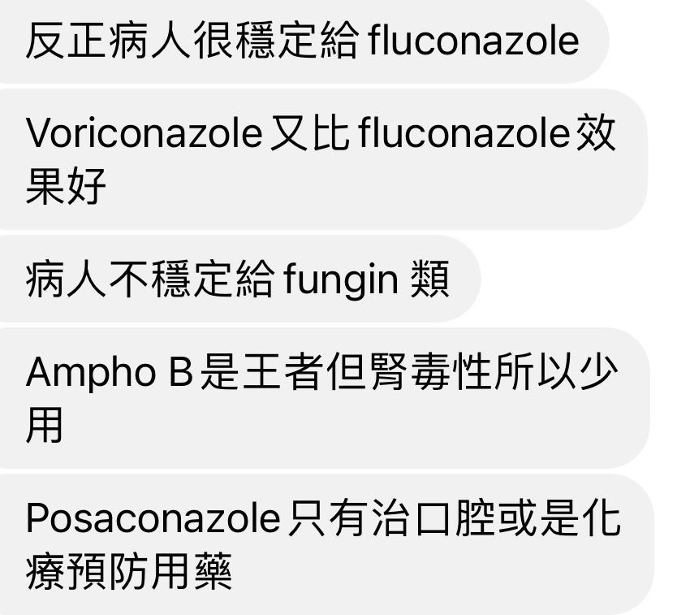

# Candida

## 內文
Candida、E. coli、enterococcus 不太會造成 Pneumonia。如果出來 candida，要小心有其他嚴重的 blood stream infection。

Candida 有百百種，對各 Azole 類或 Ampho B 效果彼此差異很大，但都對 **Echinocandin** (XXX-fungin)有效。

**Echinocandin** 無法過腎臟、BBB ⇒ UTI, CNS, **<u>eye</u>** involve 則改用 azole。

- [[Candida/Candida risk: Candida Score|扁平]]
- Fluconazole 劑量 for candida
  1. Non-invasive: Oral candidiasis 跟 UTI 用低劑量
  2. Invasive: candidemia & CNS & eye 用高劑量
- Candidemia ⇒ remission 後額外 14 Days anti

