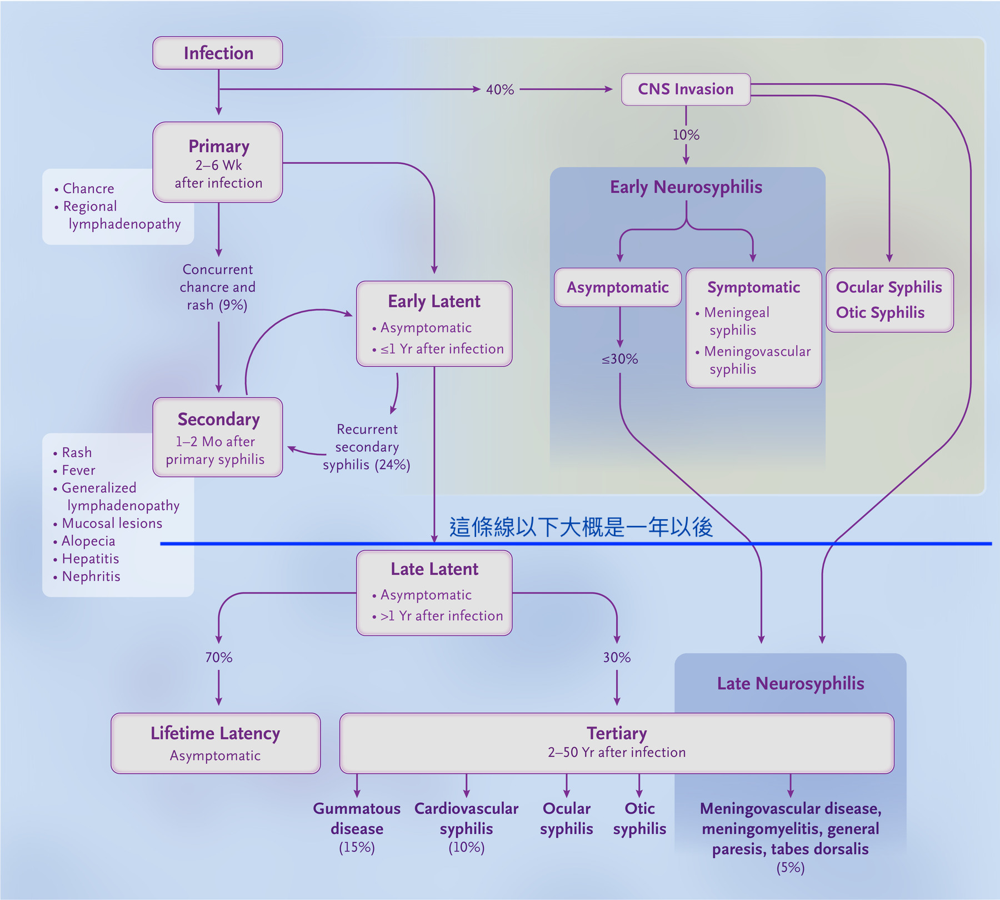

# 梅毒

## 內文

### 症狀
1. Primary：生殖器硬性下疳 + 淋巴結腫大
2. Secondary：疹子會長在手掌腳掌，很特別（洪爺：看不懂的疹子先猜梅毒）
3. Neurosyphilis：光照不收縮，但鬥雞眼時會收縮（light-near dissociation）

### 診斷
RPR 是 for screen & 追蹤，TPPA 是 for 確診（不會拿來追蹤，完全治好的也會高）。

### 治療
1. Early latent 以前的梅毒只要一針 penicillin G 就好
2. Late latent（>1 year）梅毒要三針 penicillin G
3. Neurosyphilis 要 IV 14 天 ⇒ 不確定的話要 Lumbar puncture 確認
4. 不知道多久但無神經學症狀，視同 latent ⇒ 3 針

治療後 titer 通常降得很慢，只要一年內下降成 1/4 就很成功了，沒變化也沒關係。如果 titer 上升 > 4 倍，代表治療失敗 ⇒ 再打一針。
