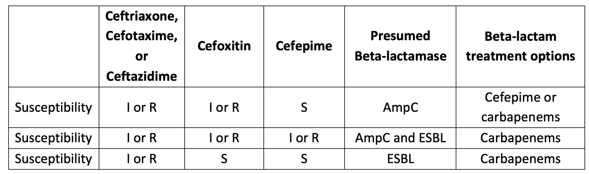

# Gram-negative bacilli (GNB)

## 內文
1. GNB + GNC: PEcK(Proteus + E.coli + Klebsiella spp.(KP)), Enterobacter, Salmonella, Shigella, Neisseria(GNC)
   1. Cepha / Aminoglycoside (腎 + 耳毒性，成人少用) ⇒ Carbapenem or Quinolone
   2. Cepha: 3>2>1，非 PEcK 一律用三代，但如果病情單純(ex: uncomplicated UTI)，可以 1⇒2⇒3
2. Aeromonas hydrophila in water, Vibrio in salt water ⇒ Quinolone / Ceftriaxone 嚴重的話加 doxycyline
3. Pseudomonas: Tazocin, Brosym (不可過BBB), Ceftazidime, Cefepime, Quinolone(除了Moxi), Carbapenem(除了Erta), Aminoglycoside(Gentamicin, Amikacin), Colistin
   - 沒有 Unasyn, Augmentin, Moxifloxacin, Ertapenem
4. Acinetobacter sp. (baumannii): 抗藥性超多（CRAB、MDRAB），先照會感染科 ⇒ Sulbactam (Unasyn, Brosym), Carbapenem(除了Erta), Tigecycline, Colistin
5. Drug-resistant GNB:
   1. AmpC (AmpC beta-lactamase，剋 1~3 代 cepha) ⇒ Cefepime or Tazocin
   2. ESBL (Extended-spectrum beta-lactamase，剋全部 cepha) ⇒ Ertapenem (若Pseudomonas / Acinetobacter 要改用 Mepem)
      因為藥敏是 in vitro 測試，所以出現 S (sensitive) 很有可能是假的 ⇒ 當 **<u>三代 Cepha 出現 I 或 R 時</u>**，就要先假設是 ESBL or AmpC ⇒ Carbapenem
      - Especially for E. coli, K. pneumoniae, K. oxytoca & P. mirabilis
      

      [[GNB/ESBL 案例]]
      - ref：[https://www.idstewardship.com/5-important-things-know-extended-spectrum-beta-lactamases-esbl-insights-clinical-microbiologist/](https://www.idstewardship.com/5-important-things-know-extended-spectrum-beta-lactamases-esbl-insights-clinical-microbiologist/)
   3. 危險大殺器：
      1. Tigecycline：cover VRSA/VRE，但不 cover Pseudo, Proteus，也不打 UTI、Bactermia**<u>（老虎怕水）</u>**。 AE: thrombocytopenia & 肝功能異常
      2. Colistin：嚴重腎、神經毒性，不 cover Proteus, Moraxella…
