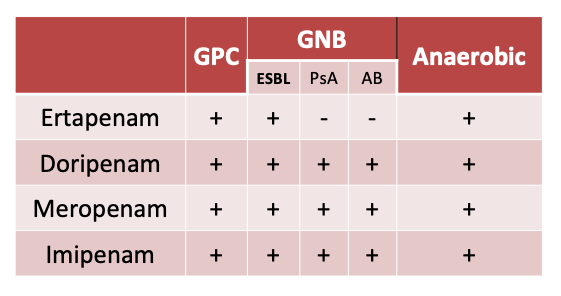
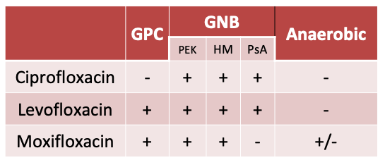

# Carbapenam & Quinolone 整理

## 內文
### Carbapenem

1. Erta 不 cover Pseudo & Acinetobacter
2. **Carbapenem resistance mechanism 多樣，抗一個有機會用另一個**
3. 副作用：seizure

### Quinolone

1. **<u>Cipro 不治肺炎</u>**，因為不 cover GPC
2. **<u>Moxi 不進尿液</u>**，不治 UTI（也不 cover Pseudo，但有 cover 厭氧，可治IAI & 肺炎）
3. Atypical pathogens 效果好 (不能給TB，要小心)
4. 機制相近，只要有抗藥性常一起抗藥
5. 副作用：**prolonged QTc**

