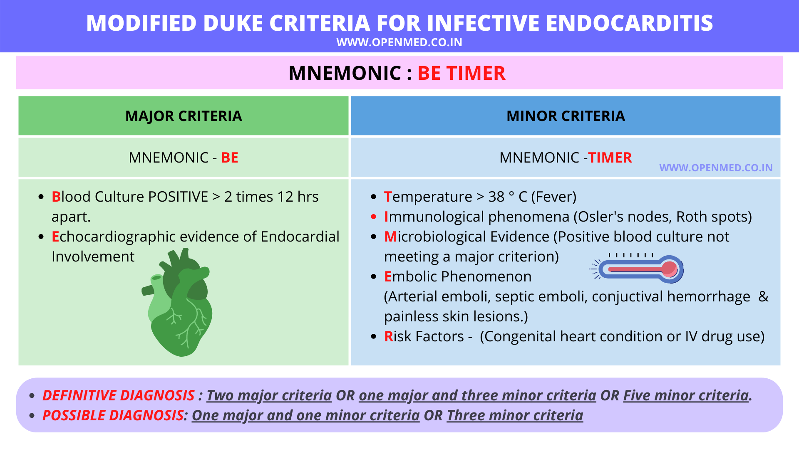

# Infective endocarditis：modified Duke criteria

## 摘要
感染性心內膜炎以 bacterial proof 加 structural change 為核心，整理 modified Duke criteria、常見菌種與拔牙前 amoxicillin prophylaxis。

## 內文

- [[Infective endocarditis/Organisms|扁平]]
- Prophylaxis for Infective endocarditis（ex: 準備拔牙） : amoxicillin
  For 哪些病人：
  1. 所有congenital heart disease
  2. 剛修完
