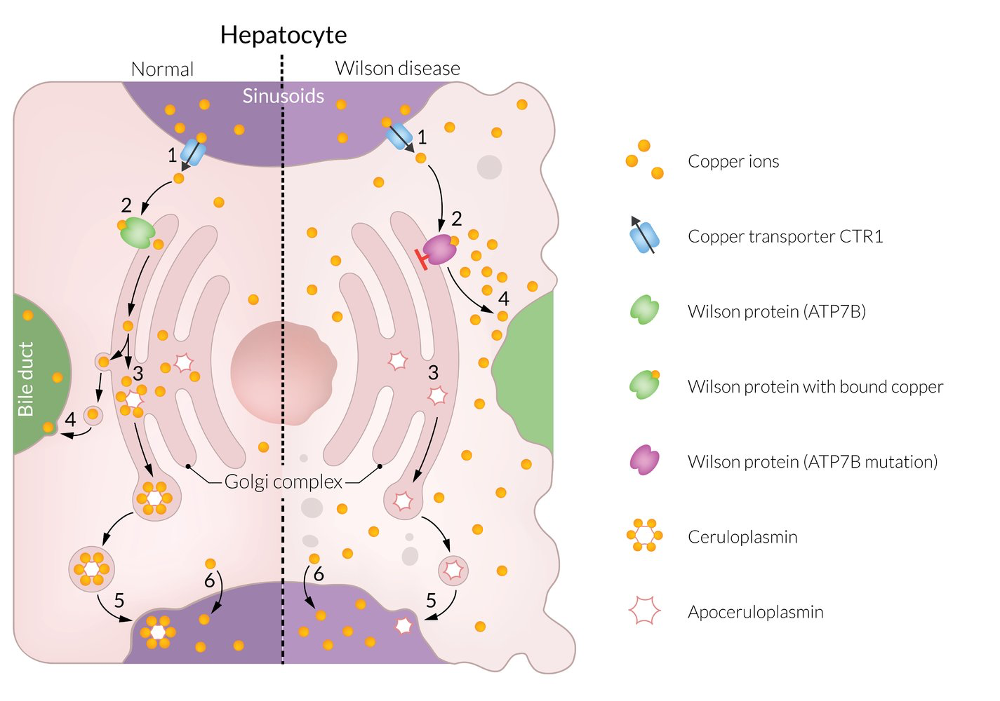

# Wilson disease: 銅儲備 (ceruloplasmin) 蛋白缺乏 ⇒ 血銅上升

## 內文
1. <u>**autosomal recessive**</u> mutations in the <u>ATP7B gene</u> on chromosome 13
2. <u>**serum ceruloplasmin ↓**</u>、 <u>**free serum copper ↑**</u>、<u>**total serum copper ↓**</u> (total = free + binding to ceruloplasmin)
3. accumulation in
   1. liver ⇒ <u>hepatosplenomegaly</u> & chronic hepatitis
   2. cornea ⇒ <u>Kayser-Fleischer rings</u>
   3. CNS: cerebellum(⇒ dysarthria), basal ganglia(⇒ extrapyramidal symptoms, Parkinsonism), brain stem, cortex (seizure, cognitive impairment, psychosis, depression)
   4. kidneys (⇒ Fanconi syndrome) and enterocytes
   5. RBC ⇒ hemolytic anemia
4. Treatment: <u>Penicillamine</u>（螯合劑）

