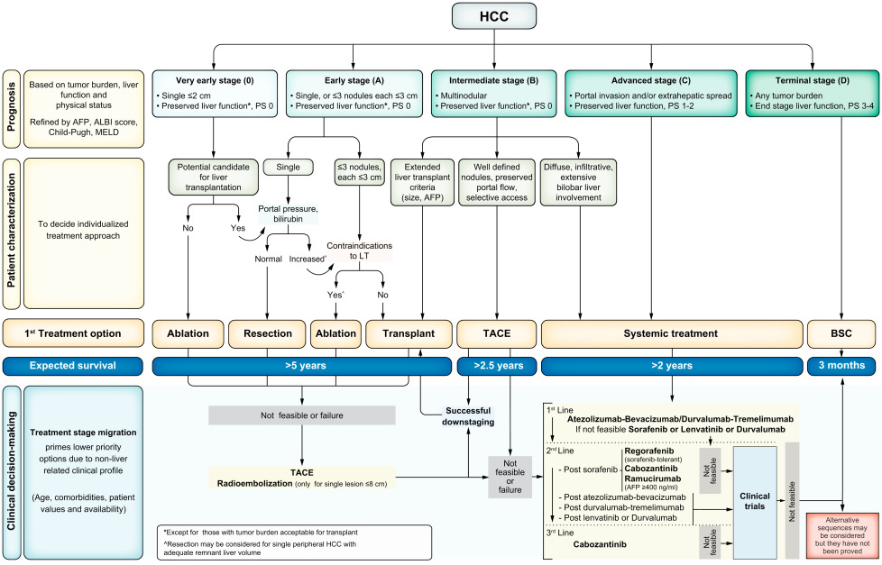

# HCC & Cholangiocarcinoma & Hemangioma

## 內文
[[HCC & Cholangiocarcinoma & Hemangioma/CT 下 不同腫瘤的顯影表現|摘要]]

HCC ⇒ Atezo + Beva ⇒ sorafenib / lenvatinib

Cholangiocarcinoma

1. cholangiocarcinoma 從 bile duct / canaliculi cell 長出來，這些細胞平常接觸很毒的 bile 慣了，很強，所以對化療 & 放療的反應都很差
2. Intra-hepatic cholangiocarcinoma 與 HBV HCV 有關

### Hemagioma（良性）

1. arterial phase 從外圍開始亮
