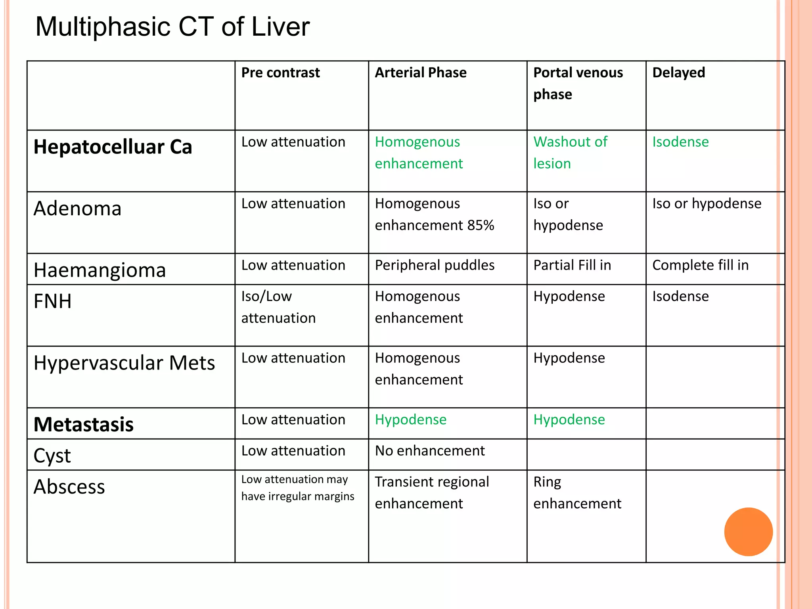
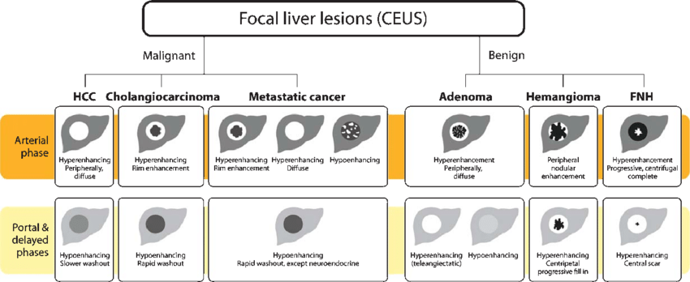

# CT 下 不同腫瘤的顯影表現

## 內文

CT 下的顯影表現

| Property | Non-contrast | Arterial phase | Portal phase | Delayed phase (>180s) |
|---|---|---|---|---|
| HCC | low (iso) | high(亮) | washout(low) | washout(low) |
| Cholangiocarcinoma | low (iso) |  |  |  |
| Hemangioma | low (iso) | 外圈先亮 | high(filling) | high(亮) |
| FNH (focal nodular hyperplasia) | low (iso) | low (iso) | iso(中央有黑scar) |  |
