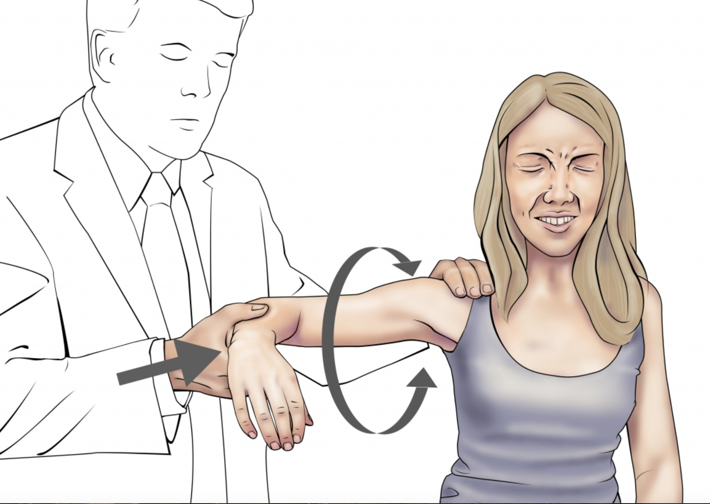

# Crank’s Test

## 內文

1. Examiner passively flexes patient’s the elbow at 90° and abducts the shoulder at approximately 90°, with one hand on the shoulder and the other on the elbow
2. 在elbow上的手do passive internal and external rotation
3. positive if it elicits any pain or metallic sounds in the shoulder
