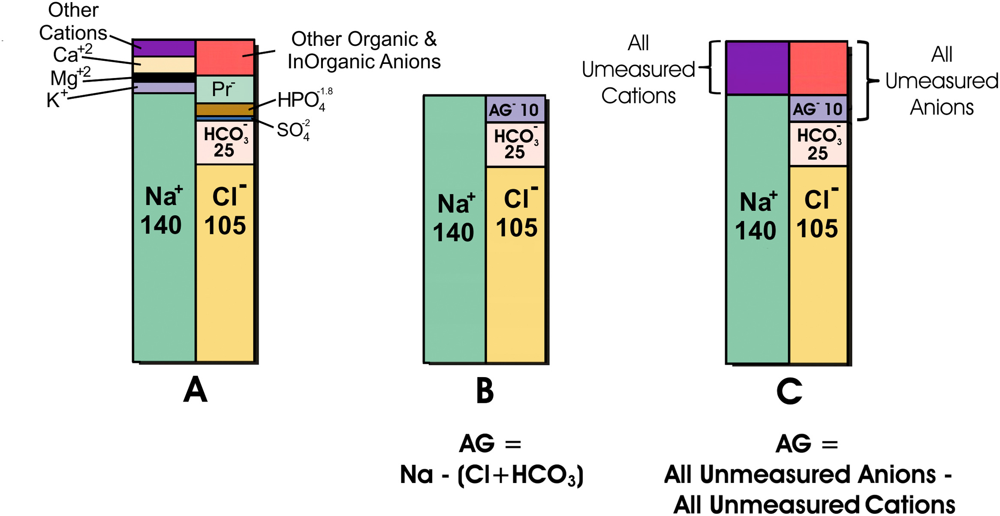

# Metabolic acidosis：AG？ Δ/Δ？

## 內文

1. 算 Anion Gap: Na – (Cl + HCO3) 應該要等於 albumin(4 g/dL) × 2.5 ( = 10 )
   
   - 注意：Anion Gap 即為 非氯&非碳酸氫陰離子 - 非鈉陽離子 = albumin - NH4
2. 算 Δ/Δ : ΔAG / ΔHCO3 = (calculated AG – expected AG) / (24 – HCO3)
   1. Δ/Δ = 1 ~ 2 → pure AG metabolic acidosis
   2. Δ/Δ < 1 → AG metabolic acidosis + non-AG acidosis
   3. Δ/Δ > 2 → AG metabolic acidosis + metabolic alkalosis

[[Metabolic acidosis：AG？ Δ／Δ？/High anion gap|全文|群組縮排]]

[[Metabolic acidosis：AG？ Δ／Δ？/Normal anion gap|全文|群組縮排]]

- [[Metabolic acidosis：AG？ Δ／Δ？/三種 RTA 詳細情形|扁平]]
