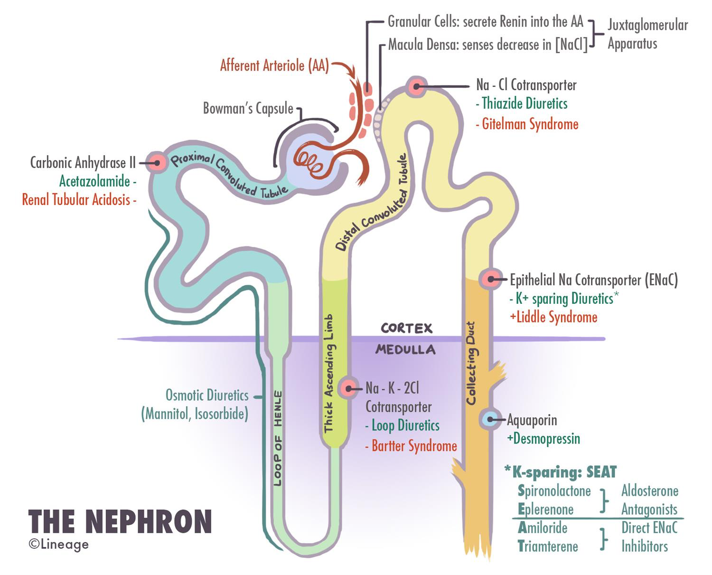
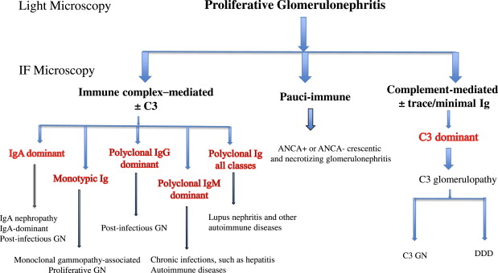
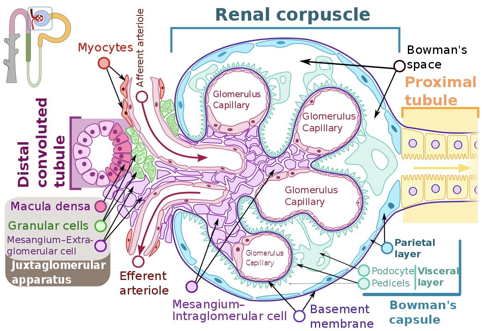
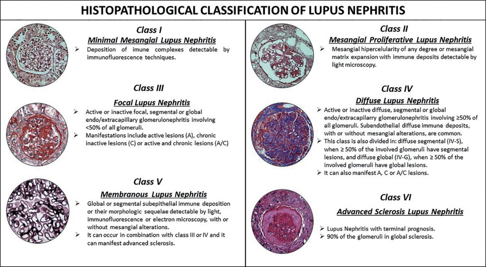

# Others

## 內文

[https://www.facebook.com/guhjy/posts/pfbid02ZZq5TgfRKwnpxL2XYioM7S5X6c8PzoP5SdL8rfXkr9JAAFnMTBdGFTjVt78s6HfRl](https://www.facebook.com/guhjy/posts/pfbid02ZZq5TgfRKwnpxL2XYioM7S5X6c8PzoP5SdL8rfXkr9JAAFnMTBdGFTjVt78s6HfRl)

**Membranoproliferative glomerulonephritis involves the basement membrane and mesangium, while membranous glomerulonephritis involves the basement membrane but not the mesangium**. (Membranoproliferative glomerulonephritis has the alternate name "mesangiocapillary glomerulonephritis", to emphasize its mesangial character.)

12356

or 124
