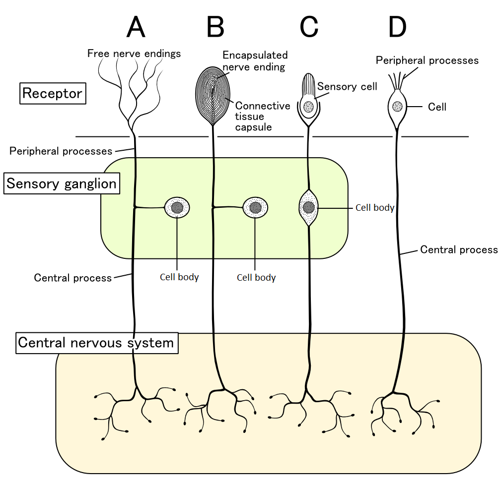
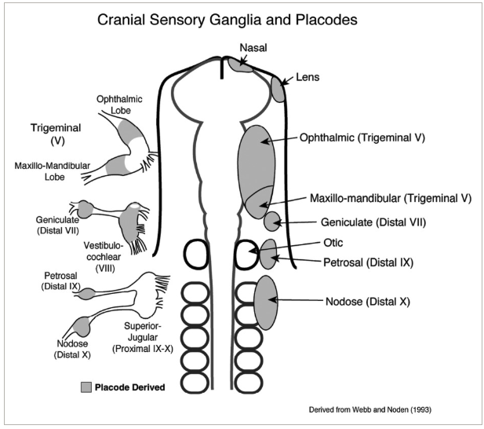
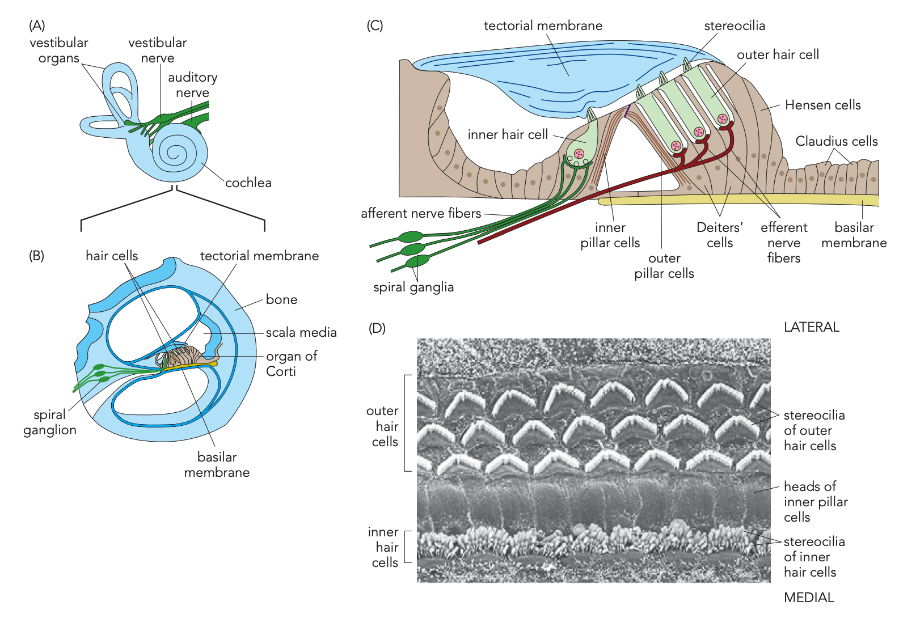
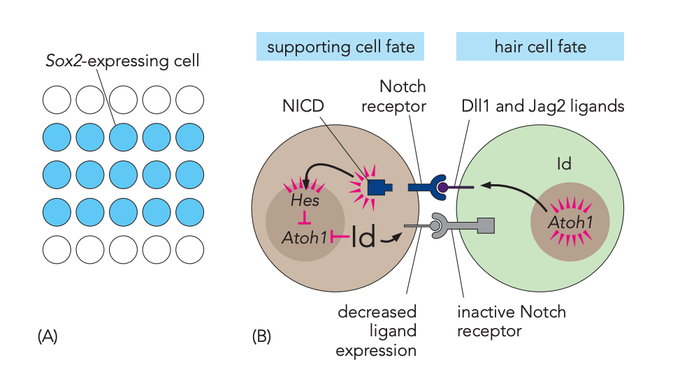
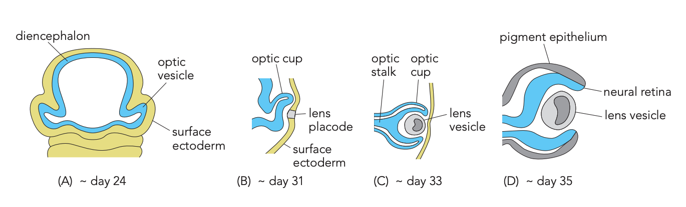
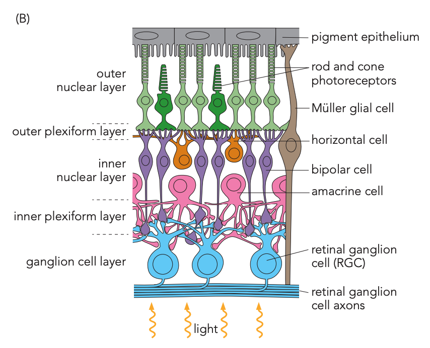
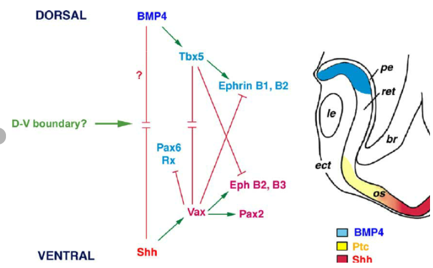

# 感覺器官與周邊神經發育

## 內文

### 一、周邊感覺把資訊送進 CNS，運動輸出再送往身體

**Afferent 傳向 central nervous system（CNS）；efferent 傳離 CNS。** 在脊髓例子中，皮膚的感覺資訊經 sensory neuron、dorsal root ganglion 與 dorsal root 進入 spinal cord；運動訊息則由 ventral root 往周邊傳出。這些連接構成 peripheral nervous system（PNS）的感覺輸入與運動輸出。

| PNS 的資訊方向 | 處理什麼 | 本來源的例子 |
|---|---|---|
| **Sensory／afferent** | 把周邊 receptor 接收的資訊傳向 CNS。 | 皮膚與其他器官的感覺輸入；圖中的 sensory neuron 胞體位於脊髓外的 ganglion。 |
| **Motor／efferent：somatic division** | 控制自主的 skeletal muscle movement。 | 脊髓運動神經元連到 skeletal muscle。 |
| **Motor／efferent：autonomic division** | 調節非自主的反應。 | 圖中連到 blood vessels 的路線，途中另有周邊細胞。 |

來源：L6，7–8。

感覺輸入的第一個接收端有不同形態；接收刺激與向 CNS 傳訊，有時由同一個細胞完成，有時由兩個細胞相接。

| 對應下圖 | 接收端怎麼安排 | 胞體與 CNS 的連接 |
|---|---|---|
| **A：free nerve ending** | 神經末梢直接構成周邊接收端。 | 胞體在 sensory ganglion，另一段 process 連向 CNS。 |
| **B：encapsulated ending** | 接收末梢外有 connective tissue capsule。 | 胞體同樣在 sensory ganglion，接到 CNS。 |
| **C：獨立 sensory cell** | 先由 sensory cell 接收，再傳給與它接觸的 neuron。 | 後一個 neuron 的胞體在 ganglion，並把資訊送向 CNS。 |
| **D：胞體在 receptor 區** | 神經細胞本身位於接收刺激的位置。 | 它有 peripheral processes，另伸出 central process 連向 CNS。 |

圖 A／B 的胞體在 sensory ganglion；C 先由獨立 sensory cell 接收再接到神經元；D 的胞體位於 receptor 區。來源：L6，12。

| 感覺輸入 | 投影片使用的接收者或感覺名稱 |
|---|---|
| Smell | Olfactory neuron |
| Touch | Mechanosensation |
| Sight | Photoreceptors |
| Sound | Hair cells |
| Taste | Taste／gustatory receptors |
| Temperature | Thermoreceptors |
| pH change | Chemosensation |
| Pain stimulus | Nociception |

表中 mechanosensation、chemosensation、nociception 是感覺過程名稱，其餘列出相應的接收細胞或 receptors。來源：L6，11。

### 二、Placode 是表面 ectoderm 的增厚區；眼與耳要分別追蹤來源

**Placodes 是增厚的 ectoderm patches。** 頭部圖中有 nasal、lens、otic placodes，以及與顱感覺 ganglia 相關的區域；它們的位置靠近發育中的腦，但不是 neural tube 本身。

接下來追蹤的 **inner ear 來自 otic placode，lens 來自 lens placode；neural retina 則來自 neural tube 的 diencephalon**，經 optic vesicle、optic cup 形成。耳與眼都接收感覺刺激，但要分別沿各自的胚胎來源理解。來源：L6，13–16、21–24。

圖中灰色標示 placode-derived 的部分，包括 trigeminal 的 ophthalmic／maxillo-mandibular 區、geniculate（distal VII）、vestibulocochlear（VIII）、petrosal（distal IX）、nodose（distal X）等。Superior-jugular（proximal IX–X）另外標在旁邊。**這張圖是不同來源區域的位置圖，不表示每一個 ganglion 都完全由同一個 placode 形成。** 來源：L6，13。

Neural crest 位於 neural tube 背側及其周圍，也會形成部分 PNS 結構。（待補 by codex：neural crest 如何離開神經管、沿哪些路徑遷移，以及各群細胞與 PNS 產物的對應。）來源：L3，18–19；L6，13。

### 三、內耳：先分聽覺與平衡，再看 hair cell 如何和 supporting cell 分開

1. **內耳的兩個感覺區，使用相應的第八對腦神經路線**

   Inner ear 由 **otic placode** 發育。成熟內耳位於 bony capsule 中，auditory portion 處理 sound，vestibular portion 處理 balance；各區 hair cells 的資訊經第八對腦神經的相應部分傳向腦。

   **Cochlea 的 organ of Corti 是聽覺感覺組織**：它沿 cochlear spiral 排列，位於充液 scala media 中的 basilar membrane 上，許多部分有 tectorial membrane 覆蓋。Hair cells 接到 afferent fibers，訊息由 cochlea 中央的 **spiral ganglion neurons** 中繼，送往 brainstem。

   | Cochlear hair cells | 在 organ of Corti 的位置 | 圖中的排列 |
   |---|---|---|
   | **Inner hair cells** | 較 medial，靠近 spiral ganglion。 | 一列，stereocilia 較淺 U-like。 |
   | **Outer hair cells** | 較 lateral。 | 三列，stereocilia 呈 W-like。 |

   兩類都由 supporting cells 圍繞。圖中有 pillar cells；outer hair cells 另有 Deiters cells，外側有 Hensen、Claudius cells。

   

   **平衡屬 vestibular portion；organ of Corti 的這段討論屬聽覺。** 來源：L6，14–16。

2. **Atoh1 促進 hair cell；鄰細胞收到 Notch 後走 supporting cell fate**

   發育中的 cochlear epithelium 有一群 **Sox2-positive cells**，形成能產生 hair cells 與 supporting cells 的 prosensory region。**Atoh1（Math1）** 是促進 hair cell development 的 transcription factor；這些鄰近細胞透過 lateral inhibition 分出不同命運。

   這裡沿用前面 Delta／Notch 的相鄰細胞比較：sending cell 提供 ligand，receiving cell 的 Notch 抑制其分化程式。這次被抑制的是 Atoh1，兩側分別走向 hair cell 與 supporting cell。

   | 讀同一對相鄰細胞 | 偏向 hair cell 的細胞 | 偏向 supporting cell 的細胞 |
   |---|---|---|
   | **Atoh1 的狀態** | Atoh1（Math1）較能維持，促進 hair cell development。 | Atoh1 受到抑制，hair cell fate 被壓低。 |
   | **給鄰居的訊號** | Atoh1 增加膜上 **Dll1／Jag2**，刺激鄰細胞的 Notch。 | Dll1／Jag2 較少，對另一側 Notch 的刺激較弱。 |
   | **收到的 Notch 訊號** | 圖中 Notch 未活化，較能維持 Atoh1。 | Notch 被鄰細胞 ligand 活化，釋出 **Notch intracellular domain（NICD）**；NICD 入核、活化 Hes，**Hes 抑制 Atoh1**。 |
   | **Id 的影響** | Id 較低，允許 Atoh1 持續作用。 | Id 較高，也會抑制 Atoh1，減少 Dll1／Jag2。 |

   **Atoh1 高的細胞用 Dll1／Jag2 讓「旁邊那個細胞」減少 Atoh1**，這才把兩個相鄰命運拉開；不是同一個細胞先做 hair cell，再被自己的 Notch 改成 supporting cell。

   

   來源：L6，17–18。

### 四、眼：diencephalon 向外長成 optic cup，並誘導表面形成 lens

1. **神經來源與表面 ectoderm 同時變形，但形成不同產物**

   | 圖中的順序 | Diencephalon 延伸出來的部分 | Surface ectoderm 的反應 |
   |---|---|---|
   | **約 day 24** | 左右 optic vesicles 向外突出、接近表面。 | 即將與 optic vesicle 接觸的表面區域。 |
   | **約 day 31** | Optic vesicle 內陷成 optic cup。 | 受到誘導，形成增厚的 lens placode。 |
   | **約 day 33** | Optic stalk 維持 eye 與 forebrain 的連接。 | Lens placode 內陷，最後分離成 lens vesicle。 |
   | **約 day 35 的分層** | Optic cup 內層成 **neural retina**，外層成 **pigment epithelium**；optic stalk 後來形成 optic nerve。 | Lens vesicle 形成 lens。 |

   

   圖中日齡為 human embryo 的 approximately gestation days 24–35。（待補 by codex：gestation days 的起算方式與臨床產科週數的對應。）**Lens 來自表面 ectoderm；neural retina 來自 diencephalon 延伸的 optic cup**。來源：L6，21–24。

2. **成熟 retina 的入光方向，與資訊傳回 ganglion cell 的方向相反**

   光經 cornea、lens 進眼；iris 依光強度調整 pupil，ciliary muscle 改變 lens shape 以配合近遠處。到 retina 時，光先穿過靠 lens 的 ganglion cell 側，才到遠端、靠 pigment epithelium 的 **rods／cones**。

   Rods／cones 接收後，資訊經內層 interneurons 傳給 **retinal ganglion cells（RGCs）**，RGC axons 再集合成 optic nerve 把訊息送向 brain。

   | 由外側 pigment epithelium 朝內側 lens 讀 | 主要內容或工作 |
   |---|---|
   | **Pigment epithelium** | 靠近 photoreceptors，幫助移除／回收其功能所需的分子。 |
   | **Outer nuclear layer** | Rods、cones 的胞體。 |
   | **Outer plexiform layer** | 細胞間 synaptic contacts 的區域。 |
   | **Inner nuclear layer** | Bipolar、horizontal、amacrine cells，以及 Müller glia 的胞體。 |
   | **Inner plexiform layer** | 另一個 synaptic-contact 區域。 |
   | **Ganglion cell layer 及其 axons** | RGC 胞體與向 optic nerve 集合的軸突。 |

   **Nuclear layer 放胞體，plexiform layer 放細胞間接觸。** Müller glia 的突起跨越 retina，不只停在胞體所在的 inner nuclear layer。

   

   來源：L6，25–27。

3. **Retinal progenitor cells 依時間產生不同細胞，但生成期會重疊**

   來源指出 retinal cells 由共同的 **retinal progenitor cell（RPC）population** 產生。細胞身分與生成時間有很大關係：

   | 生成高峰 | 細胞群 |
   |---|---|
   | **較早、embryonic development** | Ganglion、horizontal、cone、amacrine cells。 |
   | **較晚、late embryogenesis** | Rod、bipolar、Müller cells；部分物種如 rat，可延續到 early postnatal life。 |

   圖中的曲線互相重疊，所以先後是**生成高峰的差異**，不是一型完全停止才開始下一型。來源：L6，28–29。

4. **改變 transcription factors，會改變早生細胞的命運分配**

   | Mouse genotype | Retinal ganglion cells | Amacrine cells |
   |---|---|---|
   | **Wild type** | 可見 Math5-expressing RGCs。 | 可見 NeuroD／Math3-expressing amacrine cells。 |
   | **Math5−/−** | 減少。 | 增加。 |
   | **NeuroD−/−、Math3−/−** | 增加。 | 減少。 |

   這組比較把 transcription factor 與細胞命運的比例連起來；**減少的細胞類型仍有生成，改變的是兩類細胞的分配**。來源：L6，30–31。

### 五、眼的區域訊號受干擾，可能牽連到形態形成

眼部的背側與腹側有不同的訊號環境。先按所在的一側，追蹤訊號影響哪個 transcription factor，再看後續表現：

| 所在側 | 上游訊號 | 細胞內的調控與後續表現 |
|---|---|---|
| **Dorsal** | BMP4。 | BMP4 促進 **Tbx5**，Tbx5 再促進 **ephrin B1／B2**。 |
| **Ventral** | Shh。 | Shh 促進 **Vax**，Vax 再促進 **Pax2、EphB2／B3**，並抑制 **Pax6／Rx**。 |

圖中兩側的 Tbx5／Vax，以及 ephrin／Eph 模式互相限制。這些關係描述眼部區域的指定；**cyclopamine 抑制 Smoothened（SMO）**，會干擾其中的 Shh pathway。

Shh 參與眼的區域指定；從這段訊號如何接到眼原基的形態，還有以下缺口：

- **眼原基的分隔與單眼表型**：（待補 by codex：Shh／SMO 受抑制如何改變眼原基的分隔與形態，導致單眼。）
- **眼部 DV boundary**：原圖仍有問號。（待補 by codex：形成這個背腹邊界的訊號接續。）

**Holoprosencephaly（HPE）** 也是與 Shh pathway disruption 相關的 birth defect。（待補 by codex：HPE 的結構異常，以及 Shh pathway 擾動如何導致這些異常。）來源：L7，3–7。
