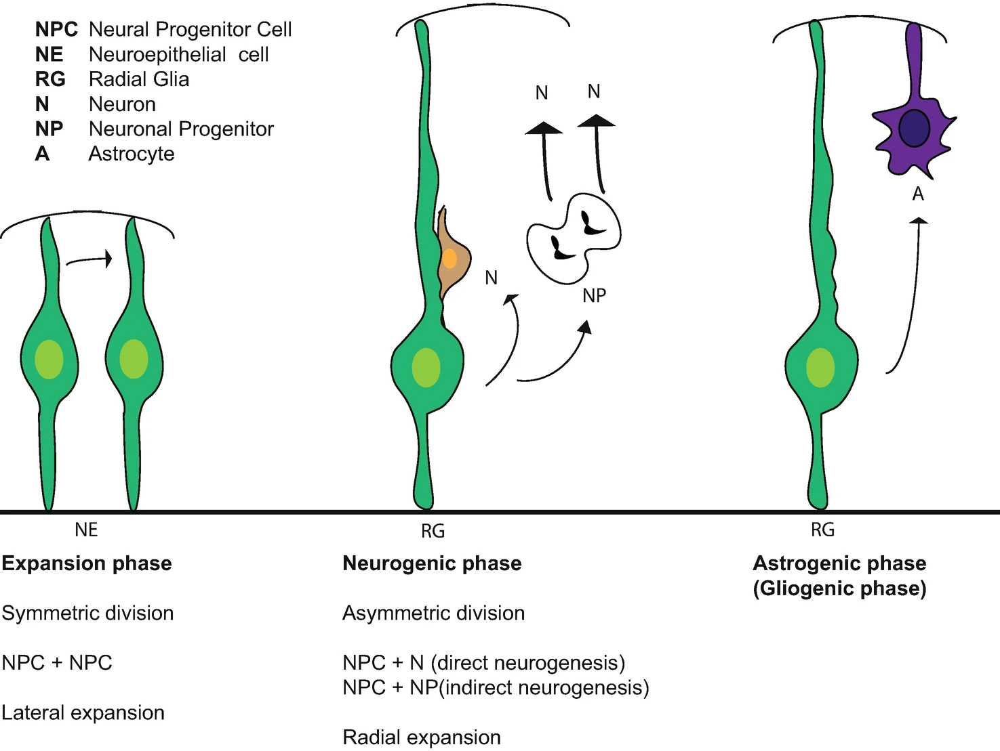
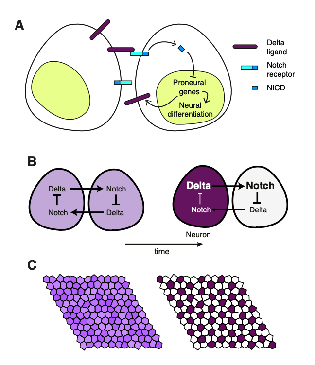
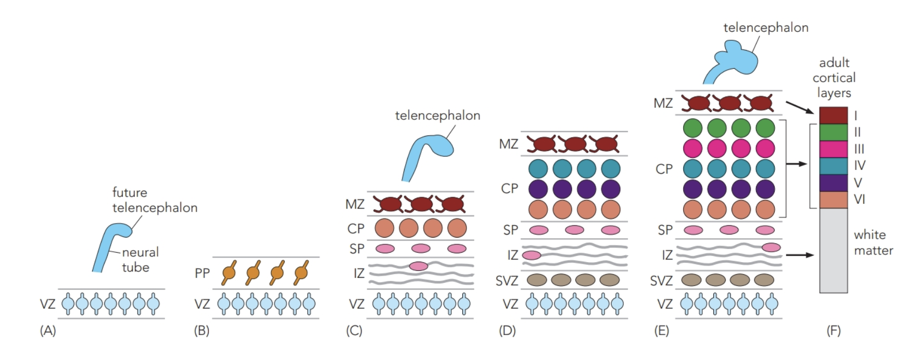
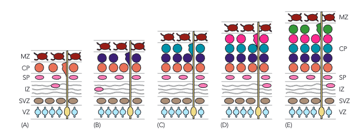
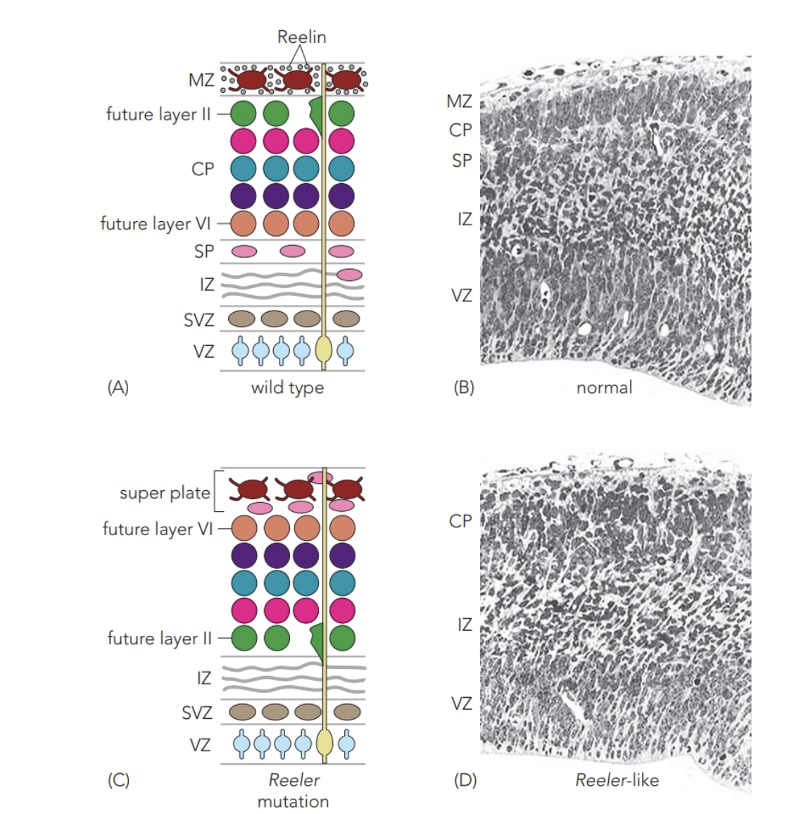
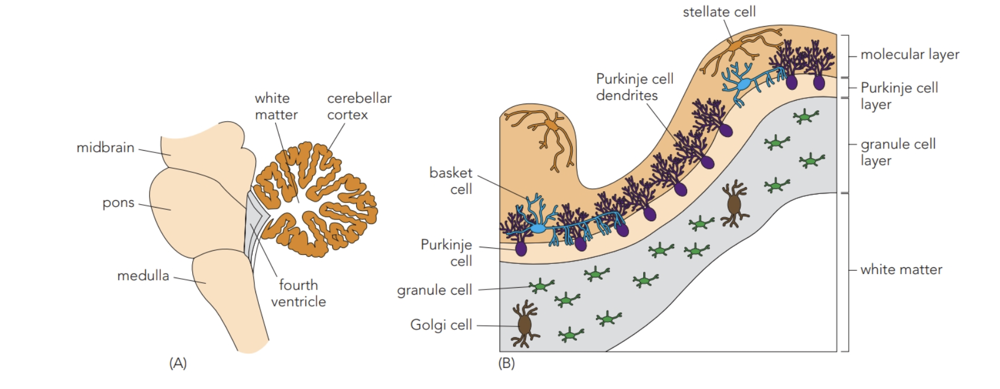
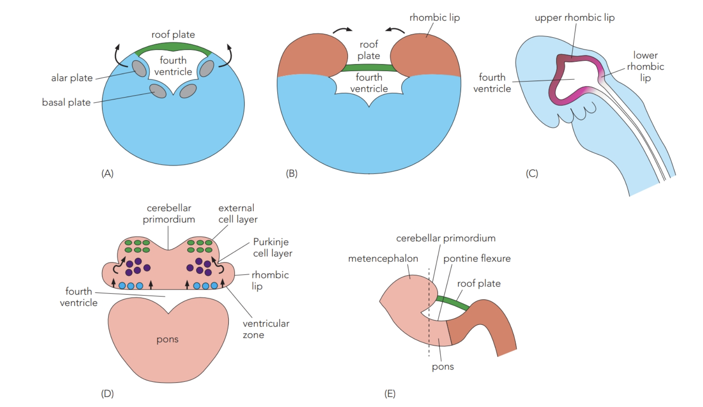
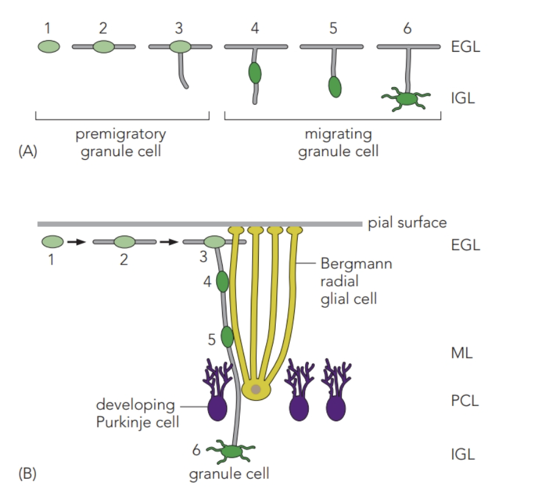
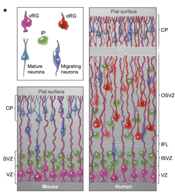
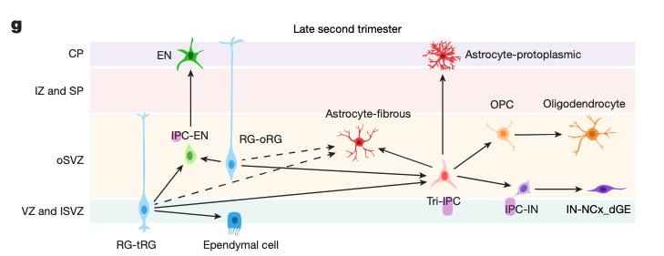

# 神經元生成與皮質小腦分層

## 內文

### 一、先擴增前驅池，再分出不同後代

**Neural progenitor cell（NPC）要同時處理兩件事：保留可繼續產生細胞的來源，以及產出開始分化的後代。** 分裂方式與發育階段會影響兩者的比例。

| 發育中的策略 | 分裂後的去向 | 對組織的意義 |
|---|---|---|
| **Expansion phase：neuroepithelial cells 對稱分裂** | 一個 NPC 產生兩個 NPC，命運相關因子分配較相似。 | 擴大 progenitor pool，圖中對應 lateral expansion。 |
| **Neurogenic phase：radial glia 不對稱分裂** | 保留一個 progenitor，另一個後代開始分化。可以直接產生 neuron，也可先產 neuronal progenitor，再由它產生 neurons。 | 一邊保留來源，一邊增加 neurons，圖中對應 radial expansion。 |
| **後續 astrogenic／gliogenic phase** | 圖中 radial glia 也產生 astrocytes。 | 產物隨階段改變，神經組織開始具有更多 glial cells。 |

**Direct neurogenesis 少一層中間前驅；indirect neurogenesis 先產能繼續產生 neurons 的 progenitor。** 來源：L5／L5V2，28–29。

### 二、Notch 讓相鄰細胞分出命運，保留下一輪需要的前驅

1. **Notch 是相鄰細胞接觸後，將膜上訊號送入核內的路徑**

   Sending cell 的膜上 ligand 接觸 receiving cell 的 **Notch receptor**。這個細胞間訊號使部分細胞維持前驅狀態，保留後續神經生成的來源。

   Notch receptor 家族包括 Notch1–4；ligand 家族圖列出 Jag1、Jag2、DLL1、DLL4、DLL3。下面先追蹤接收細胞如何把膜上的訊號送到核內，再以 Delta／Notch 說明相鄰細胞的命運分化。

   - **先在細胞交界啟動受體。** Ligand 與 Notch 接觸，圖中 sending cell 一側有 endocytosis／trans-endocytosis。
   - **再切割 Notch，釋出細胞內片段。** Notch 經 **ADAM 的 S2 cleavage**，再經 **γ-secretase 的 S3／S4 cleavage**，釋出 **Notch intracellular domain（NICD）**。
   - **NICD 進核，改變轉錄複合體。** 未活化圖中，RBPJ 與 corepressor（CoR）在 DNA 附近；NICD 入核後，與 CSL／RBPJ、MAM 及 coactivators 作用，改變 Hes／Hey 等目標的轉錄狀態。

   **接觸發生在兩個細胞的膜，轉錄改變發生在接收者的核。** 來源：L5／L5V2，30–31。

2. **Proneural genes 與 Delta／Notch 把小差異放大**

   在起初相近的 neural progenitors 中，較多 proneural activity 的細胞會增加 **Delta**，同時朝 neural differentiation 前進。Delta 刺激旁邊細胞的 Notch；旁邊細胞的 NICD 訊號抑制其 proneural genes，使它較不容易在這一輪變成 neuron。

   | 同一對相鄰細胞 | Proneural activity 較高的一側 | 收到較多 Notch 訊號的一側 |
   |---|---|---|
   | **送出的 Delta** | 較多，刺激鄰細胞。 | 因 proneural activity 被壓低，送出的 Delta 較少。 |
   | **自己的命運傾向** | 更容易維持 proneural activity、形成 neuron。 | 保留為未在此輪生成 neuron 的 progenitor。 |
   | **對整體的作用** | 產出本輪神經元。 | 保留之後神經生成的來源。 |

   

   這稱為 **lateral inhibition**：局部看是一個細胞抑制旁邊細胞的 proneural program；兩邊互相影響後，小差異被放大，群體變成分散的 neuron 與 retained progenitor。來源：L5／L5V2，32–33。

3. **Notch 的意義要連同發育階段讀**

   來源把 mouse mutant 的研究結果整理成路線圖：綠色 **Notch** 表示該過程可能需要此訊號，紅色 **Off** 表示可能需要下調。先看細胞目前在哪一個狀態，再讀訊號把它留住或送往哪裡。

   | 細胞狀態 | 圖中標為 Notch 的路線 | 圖中標為 Off 的路線 |
   |---|---|---|
   | **Multipotent CNS progenitor** | 可維持本身；另外有通往 adult neural stem cell、glioblast 的分支。 | 前進到 neuroblast。 |
   | **Neuroblast** | 可維持 neuroblast 狀態。 | 進入 early neuronal differentiation。 |
   | **Adult neural stem cell** | 可維持 adult NSC 狀態。 | 進入 adult neurogenesis。 |
   | **Glioblast** | 通往 astrocytes。 | 通往 oligodendrocytes。 |

   早期 neuronal differentiation 與 adult neurogenesis 之後，走向 **neuronal maturation and function** 的下一段又標回 Notch。**早期維持前驅，不代表所有階段都只會阻止成熟**；同一條 pathway 的意義隨細胞狀態而變。來源：L5／L5V2，34–35。

### 三、大腦皮質：先形成暫時層，再把新神經元送入 cortical plate

1. **先固定兩端：ventricular 在內，pial 在外**

   在這組發育圖中，靠腦室的 **apical／ventricular surface** 在下方，靠腦表面的 **basal／pial surface** 在上方。最初增殖細胞沿腦室排成 **ventricular zone（VZ）**。

2. **離開 VZ 的細胞，逐步形成 PP 與 CP**

   - 最早移出的子細胞先形成 **preplate（PP）**。
   - 後續移出的細胞形成 **cortical plate（CP）**，把原本 PP 分成兩部分：靠 pial 的 **marginal zone（MZ）**，以及 CP 下方的 **subplate（SP）**。
   - 一部分 VZ 細胞在相鄰位置建立第二個增殖區 **subventricular zone（SVZ）**。其他新神經元穿過 SVZ、**intermediate zone（IZ）**、SP，繼續進入 CP。IZ 也有來自其他發育區域的 axons 與部分 subplate neurons。

   

   | 發育中的區域 | 在這段過程中的角色 | 來源中的後續對應 |
   |---|---|---|
   | **VZ** | 靠腦室的初始增殖區。 | 供應往外遷移的細胞。 |
   | **SVZ** | 後來建立的另一個增殖區。 | 成體 CNS 的部分區域仍保留 SVZ。 |
   | **MZ** | 被 CP 分開後，留在最外側的 PP 部分。 | 成體 layer I。 |
   | **CP** | 神經元遷入、逐層加入的區域。 | 成體 layers II–VI。 |
   | **SP** | 位於 CP 下方的暫時層。 | 隨發育進行，多數暫時層消退。 |
   | **IZ** | 神經元通過、也有 axons 的中間區。 | 參與 white matter。 |

   來源：L5／L5V2，37–39；L6，2–3。

3. **細胞往外移，有沿自己突起與沿 glia 兩種方式**

   | 遷移方式 | 起點與附著 | 胞體如何移動 |
   |---|---|---|
   | **較早的 somal translocation** | VZ 細胞先伸出可達 pial surface 的長突起，再失去 ventricular attachment。 | 胞體沿自己仍連著表面的突起被拉向 pial 側。 |
   | **較後的 glia-guided migration** | Radial glia 胞體留在 VZ，長突起跨到 pial；neuron 附在這條 glial scaffold 上。 | Neuron 用 leading process 沿 glia 向外移；雙方的附著與適時脫離受到調節。 |

   **前者沿自己的突起，後者沿另一個細胞的支架。**（待補 by codex：neuron 與 radial glia 之間的附著如何被調節，以配合遷移與脫離。）來源：L5／L5V2，40–41。

### 四、CP 的 inside-out，是後出生的細胞越過先前細胞

1. **先到的細胞形成深層，後到的細胞在更外面落定**

   最先進入 CP 的 neurons 形成未來 **layer VI**；接著形成 layer V 的細胞越過 VI，形成 layer IV 的再越過 V／VI，最後 III／II 的細胞加入更靠近 MZ 的外側。

   **Inside-out 指 CP 的 VI 到 II 層逐漸往外增加。** Layer I 對應早期 MZ，要從前面 PP 的分支理解。

   

   來源：L5／L5V2，42–43。

2. **Reelin 幫助神經元在接近表面時脫離支架，停在 CP**

   MZ 的 **Cajal–Retzius cells 釋放 Reelin**，使遷移中的 neurons 離開 radial glia、不要進入 MZ。CP 隨新增細胞擴大，把 MZ 推向外，後來的神經元仍能在先前細胞外側落定。

   | 條件 | 遷移末段發生什麼 | 層序結果 |
   |---|---|---|
   | **正常 Reelin** | Neurons 在進入 MZ 前脫離 radial glia，在 CP 排列。 | 後到者可越過早到者，維持 inside-out。 |
   | **Reeler mouse 缺少 Reelin** | SP 與 MZ／Cajal–Retzius cells 混成 superplate；最早的 future VI 細胞到達最外側能到的位置，後來細胞被既有細胞擋住、堆在其下。 | 出現早生在外、晚生在內的倒置層序。 |

   

   Reeler mice 的異常步態促成這條路徑的研究；分層的比較則顯示，**「能往外走」之外，還需要在合適位置停止與脫離**。來源：L5／L5V2，44–45。

### 五、小腦：Purkinje cells 先定位，granule cells 在外面擴增後再向內移

1. **先看三層的結果，再追各群細胞的路徑**

   小腦位於 pons 與 fourth ventricle 的背側，成體皮質高度摺疊。由外往內看：

   | 小腦皮質層 | 主要內容 |
   |---|---|
   | **Molecular layer（ML）** | 主要容納 Purkinje cells 展開的複雜 dendrites。 |
   | **Purkinje cell layer（PCL）** | Purkinje cell bodies 排在中間。 |
   | **Granule cell layer** | 大量小型 granule neurons；更內側接 white matter。 |

   Basket、stellate、Golgi interneurons 分布在不同層，可在下圖對照它們與 Purkinje、granule cells 的相對位置。

   

   來源：L5V2，47–48。

2. **Rhombic lips 向中線延伸，形成小腦原基**

   Caudal metencephalon 的 alar plate 向 **dorsomedial** 擴張，越過薄的 roof plate 形成 rhombic lips；兩側向中線延伸、接合成 cerebellar primordium。

   - **Upper／rostral rhombic lip** 產生 granule cells。
   - **Lower／caudal rhombic lip** 則產生 pons 的不同 nuclei。

   在小腦原基中，**VZ 來源的細胞先遷移、形成 Purkinje cell layer**，初期排列成數層不規則的列，之後成為單層。另一群細胞從 rostral rhombic lip 沿表面遷移，形成 pial 下方暫時的 **external granule cell layer（EGL）**。

   

   **Purkinje 的 VZ 路線與 granule 的 rhombic lip／EGL 路線分開追。** 來源：L5V2，49–50。

3. **EGL 是第二個增殖來源，granule cells 成熟前還要往內遷移**

   這裡的 **Math1 就是 Atoh1**，是調節細胞分化的 transcription factor；小腦圖用 Math1，後面的 hair cell 圖用 Atoh1。相同因子在兩處的作用，仍要連同細胞類型理解。來源：L5V2，54；L6，17–18。

   | Granule cell 階段 | 所在位置與移動 | 來源中的分子特徵 |
   |---|---|---|
   | **Proliferating granule cells** | EGL 外排繼續增殖；rodents 與 humans 可延續到出生後。 | 較高的 Notch receptor expression，有利持續增殖。 |
   | **Premigratory granule cells** | EGL 內排準備向內遷移。 | **Math1** 表示 granule fate 的承諾，並誘導 **Zic1／Zic2**。 |
   | **Mature granule cells** | 越過已存在的 PCL，形成 **internal granule cell layer（IGL）**。 | 出現 **GABAα6r** 等成熟蛋白。 |

   **GABAα6r 是成熟時的 receptor marker**，不代表這群細胞釋出的 neurotransmitter 是 GABA。

   FGF、Wnt、BMP、BDNF、Shh 等 extrinsic signals 參與 EGL 到 IGL 的成熟過程。（待補 by codex：這些訊號各自的作用時序、接收細胞及促進／抑制方向。）來源：L5V2，51–54。

4. **Bergmann radial glia 提供往內走的支架**

   Premigratory granule cell 先伸出與 pial surface 平行的 bipolar processes，再形成朝內的第三個 leading process；胞體與 **Bergmann radial glia** 接觸，沿支架穿過 ML、PCL，進入 IGL 後繼續分化。

   

   **大腦 CP 是後生細胞在更外側加入；這段小腦 granule cell 是由 EGL 向內移到 IGL。** Outside-in 在此指 granule cell 的這條路線，不代表所有小腦細胞都從表面往內走。來源：L5V2，55。

### 六、人類皮質的外側前驅區，還能增加局部細胞來源

1. **Outer radial glia 不接腦室表面**

   Human cortex 的 **outer subventricular zone（OSVZ）** 有大量 radial-glia-like cells 與 intermediate progenitor cells。**Outer radial glia（oRG）** 有長 basal process，但不接 ventricular surface。

   Real-time imaging 與 clonal analysis 顯示，oRG 可進行增殖性分裂、自我更新的不對稱分裂，並產生能再增殖的 neuronal progenitors；抑制 OSVZ progenitors 的 Notch，會誘導 neuronal differentiation。

   

   GW15 的時間序列影像追蹤了一個 oRG 及其後代，顯示細胞分裂後的去向。（待補 by codex：圖上 0:00–47:34 的時間單位。）來源：L7，10–11。

2. **Late second trimester 的 Tri-IPCs，提供局部的多種細胞**

   來源的人類 neocortex 圖中，**tripotential intermediate progenitor cells（Tri-IPCs）** 可局部產生三條後代：

   | Tri-IPC 後代支路 | 圖中的中間細胞與產物 |
   |---|---|
   | **GABAergic neuron 支路** | 經 IPC-IN 產生局部 interneurons。 |
   | **Oligodendrocyte 支路** | 先成 oligodendrocyte precursor cell（OPC），再到 oligodendrocyte。 |
   | **Astrocyte 支路** | 產生 protoplasmic 與 fibrous astrocytes。 |

   同圖也有 **IPC-EN 到 EN**，以及 radial glia 到 ependymal cell 的路線；Tri-IPC 是其中一群具有三種局部產物的前驅，不能用它代替全部人類皮質譜系。

   

   （待補 by codex：IPC-EN／EN 的全名、細胞身分及其與相鄰細胞群的比較。）

   圖中部分 radial glia 到 fibrous astrocyte 的箭頭是虛線。（待補 by codex：這些虛線所代表的譜系關係與證據程度。）來源：L7，12。
