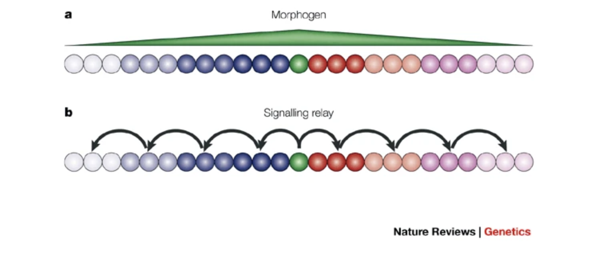

# 神經前驅細胞如何讀取位置訊號

## 內文

### 一、細胞外的訊號，要經過接收與傳遞才能改變細胞

發育中的 **neural stem cell（NSC）與 neural progenitor cell（NPC）** 是產生神經細胞的來源；它們接收外來訊號後，可改變增殖與分化的行為。要理解不同位置為何產生不同型態的神經元，先把 **輸入的訊號、接收它的受體、細胞內的反應** 分開。

1. **Ligand 是訊號，receptor 是接收者。** 在投影片的細胞表面受體例子中，extracellular ligand 結合 cell-surface receptor，啟動細胞內的 signal transduction。
2. **Intracellular signaling molecules 接續傳遞。** 每一步影響下一個分子，直到改變 effector protein 的作用。
3. **Effector 不只有一種。** 它可能改變 ion channel 與膜電位、metabolic enzyme 與代謝、cytoskeletal protein 與細胞形狀／移動，或 gene-regulatory protein 與基因表現。

這一節接著看最後一種：**外面的位置訊號，如何改變裡面的基因表現**。上述例子由細胞表面受體接收；後面的 retinoic acid（RA）則進入細胞，結合核內受體。來源：L4，8–11、18、44–45；L5／L5V2，28–29。

### 二、Morphogen 的濃度，讓不同位置的細胞得到不同訊息

**Morphogen 是能影響形態形成的化學訊號。** 如果它由局部細胞釋出，周圍便可形成濃度梯度；接收細胞離來源的距離不同，接觸的濃度也不同，因而能取得位置資訊。

- **圖 a：直接讀取梯度。** 綠色細胞是訊號來源；周圍細胞依所在位置接觸不同濃度。
- **圖 b：signal relay。** 訊息由相鄰細胞逐段往外傳，細胞的位置資訊來自連續的誘導事件。

兩圖都在說訊號如何跨越一片組織，但傳遞方式不同，不能把 relay 的每一個箭頭都當成同一顆 morphogen 從來源一路擴散。Shh、Wnt、FGF8、RA 是後面會遇到的位置訊號。來源：L4，12–14。

### 三、基因被讀取的程度，會決定細胞製造哪些蛋白

1. **先分清 DNA、RNA、protein 的關係**

   DNA 可以複製成 DNA；基因由 RNA polymerase 轉錄成 RNA，RNA 再由 ribosome 翻譯成 protein。發育中的細胞不只需要「有這個基因」，還需要在合適位置與時間**讀取它、產生相應的產物**。

   | 調節的位置 | 投影片中的做法 | 改變的是什麼 |
   |---|---|---|
   | **Chromatin 的可接近性** | DNA 包裝與 histone 相關標記；例子包括 H3K27Ac。 | DNA 所在區域較開放或較封閉，影響調控蛋白能否接近。 |
   | **Transcription** | Transcription factors 結合 DNA；例子有 **Atoh1（又名 Math1）**。 | 哪些基因被轉錄、表現多少。 |
   | **Translation 之後** | 蛋白的 post-translational modification，例如 glycosylation。 | 已製造出來的蛋白再被修飾。 |

   （待補 by codex：H3K27Ac 與 chromatin 可接近性的具體關係。）來源：L4，15–16；Atoh1／Math1 名稱對應見 L6，17。

2. **Transcription factor 是結合 DNA、調節轉錄的蛋白**

   - **Activator** 結合 enhancer，促進基因表現。圖中 DNA 彎曲，讓較遠的調控區與 promoter、RNA polymerase 及協助蛋白互相作用。
   - **Repressor** 結合 silencer，抑制基因表現。
   - **Pioneer transcription factor** 能接近較封閉 chromatin 中的 DNA；例子是 **NGN2、ASCL1**。

   因此，看到某個分子名稱時，要先問它在做哪一種工作：Shh 可以是細胞外輸入，Atoh1 則是細胞內調節轉錄的蛋白，兩者不在同一個傳訊位置。

3. **Gene regulatory network（GRN）把多個基因的調控接在一起**

   一個基因產生的蛋白，可以影響另一個基因的表現，也能與其他調控蛋白共同作用。這些分子互相調節 mRNA 與 protein 的表現量，形成 **GRN**，進而影響細胞的功能與身分。

   **一個訊號可以改變多個基因，多個基因也可以共同決定一種細胞身分。** 後面 DV patterning 中相鄰 transcription factors 互相抑制，便是把連續濃度訊號轉成清楚區域邊界的具體例子。來源：L4，15–18；L5／L5V2，14–15。
