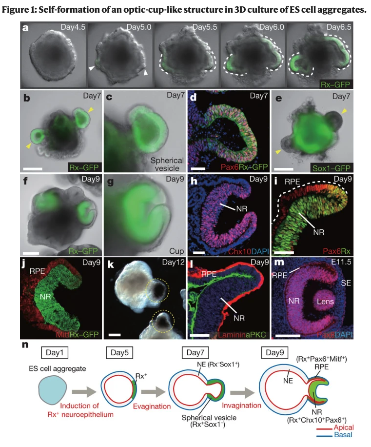
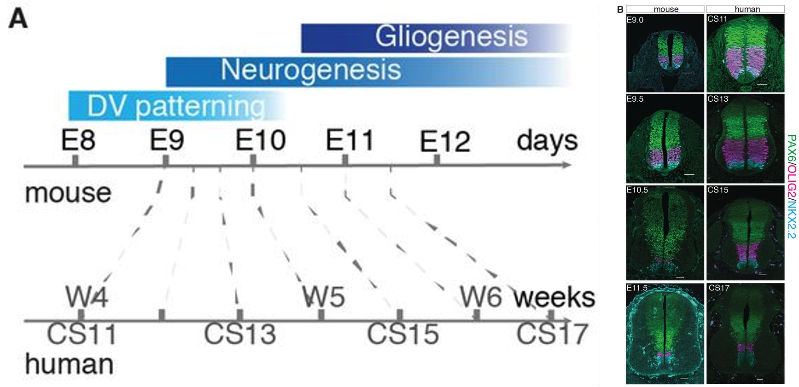

# 神經發育的研究方法

## 內文

### 一、問題不同，要觀察的層次也不同

神經發育研究可以問「細胞在哪裡、表現什麼」，也可以問「它是否能產生活動、在完整動物中做什麼」。這些結果需要互相接合：一個細胞具有 neuron marker，不會自動提供它的全部電生理或行為功能資訊。

| 要回答的問題 | 主要觀察方式 | 直接讀到的東西 |
|---|---|---|
| **組織與細胞在哪裡、長什麼樣** | 顯微鏡、切片、組織染色。 | 位置、形態與組織排列。 |
| **哪些基因或蛋白在表現** | In situ hybridization、antibody staining、qPCR、Western blot；或更大規模的 transcriptome／proteome 觀察。 | RNA、protein 的位置或表現資訊。 |
| **細胞是否產生活動** | Calcium imaging、field potential／MEA、patch clamp。 | 鈣動態、細胞群或單細胞的電活動。 |
| **發育中如何移動、分裂** | 胚胎影像、time-lapse、clonal tracking、移植／訊號擾動。 | 形態變化、後代關係及擾動後的結果。 |
| **整隻動物的反應如何** | 行為試驗、影像追蹤、盲化分析。 | 指定情境中的活動與選擇。 |

來源：L1，5、39–43；L2，8–33；L7，8–12。

### 二、固定與切片，讓組織能被看清楚

1. **工具改善，才更容易區分單一細胞**

   投影片從早期顯微鏡畫到 confocal microscopy，也比較直接用刀片與使用 **microtome** 製作薄片。Microtome 的早期例子是 1770 年 George Adams Jr. 的設計，之後持續改良。

   **Formaldehyde 藉 protein crosslinking 保存組織**；組織可經 paraffin 處理或冷凍，再切成薄片。固定後的形態能保留空間關係，但動態過程需要搭配其他觀察。

   **Cajal** 使用 Golgi silver staining 觀察個別 neurons，提出 neuron doctrine；他與 Golgi 在 1906 年共同獲得 Nobel Prize。來源展示 Cajal 的 inner ear、hippocampus、retina 等繪圖；growth cone 也是他從固定組織形態提出、再推測其動態角色的例子。來源：L2，8–14；L6，34–35。

2. **染色方法與顯示方式，是兩個可以組合的選擇**

   Colorimetric 以顏色顯示，fluorescent 以螢光顯示；dye、hybridization、antibody 則是在問「用什麼辨認目標」。同樣是 hybridization 或 antibody-based 方法，都可以依標記方式產生不同的顯示。

   | 染色／標記方法 | 辨認的對象 | 來源中的讀圖方式 |
   |---|---|---|
   | **Hematoxylin & eosin（H&E）** | 組織結構。 | Hematoxylin 將 nuclei 顯成深紫色，eosin 將 extracellular matrix 顯成粉紅色。 |
   | **Cresyl violet** | Neuronal Nissl bodies。 | 神經元內的 Nissl bodies 顯為深紫色。 |
   | **Luxol fast blue** | Myelin。 | 髓鞘顯成藍色。 |
   | **In situ hybridization** | 特定 mRNA。 | 用對應 probe 與 RNA hybridize，透過 colorimetric 或 fluorescent label 看它位於何處；螢光可同時辨認多個 transcripts。 |
   | **Antibody staining** | 特定 protein。 | Primary antibody 結合蛋白目標；可以直接標記 primary，也可再用 secondary antibody 顯示訊號。Secondary 的 Fab 辨認 primary 的 Fc 區域。 |

   L2 的 in situ 圖例包含 E14.5 的 Ccnd1、Atoh1；多重螢光圖把 GFP（Atoh1）、Ki67、Nestin、DAPI 放在同一組影像中。**不同色道可以疊合位置，但每一個 marker 的角色仍須另有依據**，不能只看顏色就推定全部細胞狀態。來源：L2，15、18–22。

3. **qPCR 看 gene expression，Western blot 看 protein**

   | 方法 | 來源示意中的步驟 | 訊號怎麼出現 |
   |---|---|---|
   | **qPCR** | 以 primers 進行 amplification。TaqMan 圖中的 probe 帶 fluorophore 與 quencher。 | 隨 polymerization，probe 被切開，fluorophore 與 quencher 分開而出現螢光；另一種 SYBR dye 則在結合 double-stranded DNA 後增加螢光。 |
   | **Western blot** | 先把蛋白分離，再轉到 PVDF／nitrocellulose membrane，接著 antibody staining。 | 用 primary／secondary antibody 及其標記顯出 bands。 |

   （待補 by codex：以 qPCR 觀察 gene expression 時，RNA 樣本如何先轉成可供 PCR 擴增的材料。）來源：L2，23。

### 三、神經活動可以由鈣訊號、細胞群電位或單細胞電位讀取

1. **Calcium imaging：把細胞內 Ca²⁺ 動態變成光訊號**

   **Fluo-4** 是鈣指示染劑，**GCaMP** 是 genetically encoded calcium indicator；它們與 Ca²⁺ 結合時產生較強螢光，讓鈣動態可作為神經活動的觀察指標。

   Mouse V2a–Olig2 aggregate 的影片中，螢光隨時間改變，可用來觀察細胞群的鈣動態；尺度為 250 μm、播放標示 2×。來源：L2，24–25。

2. **MEA 與 patch clamp，分別偏向細胞群與單細胞的直接電測量**

   | 方法 | 電極怎麼接近細胞 | 可讀的活動與使用限制 |
   |---|---|---|
   | **Field potential／multi-electrode array（MEA）** | 在細胞外讀電位；可把 neurons 培養在電極陣列上，也可用 implanted electrodes。 | 讀取細胞群的活動與對 drugs 的反應；來源陣列示意也包括 cardiomyocytes。 |
   | **Patch clamp** | 玻璃 pipette 接觸 soma、形成 gigaseal；進入 whole-cell 狀態時，接觸處膜被打開。 | 直接研究單細胞；current clamp 量 voltage，voltage clamp 量 current。可用於 tissue slice 或玻片上的 cultured cells，但 throughput 較低。 |

   神經元的 action potential 與 drug response 可以協助辨認功能身分。**Calcium 是活動相關的間接光訊號，patch clamp 則直接讀電訊號**；比較時要說清自己量的是哪一個變項。來源：L2，24–27。

### 四、體外模型保留的環境不同，能問的問題也不同

| 體外材料 | 怎麼取得與培養 | 能保留或研究什麼 |
|---|---|---|
| **Tissue slice** | 保留一片 brain region，進行培養。 | 可持續數週，研究生長、細胞潛能與電生理；來源也提到部分 human brain tumor tissue。 |
| **Primary neurons** | 從年輕動物解剖、dissociate，放到有合適 coating 的培養表面，再維持培養。圖中例子是 E17.5–E18.5，培養可到約一個月。 | 可比較 wild-type 與 disease models；保留來源細胞的特性，但已離開完整組織。 |
| **Stem-cell-derived neural cells** | Pluripotent stem cells（PSCs）可自我更新，也能在 permissive media、small molecules、mechanical support 等條件下朝不同身分分化。 | 可反覆取得相同方向的細胞；human PSCs 用於發育模型，來自個別病人的 **induced pluripotent stem cells（iPSCs）** 可分化成 neurons 進行研究。 |

**Human embryonic stem cells 來自 inner cell mass；pluripotent 指能形成多種身體細胞類型。** 自我更新與分化是兩種可切換的細胞行為，培養條件要配合研究目的。來源：L2，29–33；L3，9。

**Optic-cup-like organoid 是把發育形態搬到體外的例子。** ES-cell aggregates 的 3D culture 圖中，Day 1 形成 aggregate，Day 5 出現 Rx-positive neuroepithelium，Day 7 外凸成 spherical vesicle，Day 9 內陷成 cup；圖中以 NR／RPE 及相關 marker 區分區域，Day 12 再呈現立體結構。

這些是 **culture days**；旁邊 E11.5 的組織對照有 lens，不代表培養物已形成完整眼睛。此例呈現細胞在體外自我組織出部分眼發育形態。來源：L6，23。

### 五、選動物模型，要連同發育速度、可見性與操作方式比較

| 模型 | 來源指出的特點 | 適合考慮的觀察或操作 |
|---|---|---|
| **Drosophila** | Invertebrate，繁殖快，genetics 容易。 | 用突變研究基因與表型的關係。 |
| **Xenopus** | Vertebrate，胚胎大且容易觀察。 | 觀察胚胎形態、移動與訊號操弄。 |
| **Zebrafish** | Vertebrate，繁殖快，發育中的透明性有利觀察。 | 來源以發育時序與 wild type／casper 外觀比較呈現可見性。 |
| **Chick** | Vertebrate，發育中的 embryo 容易接近。 | 可由 egg window 或培養裝置觀察，方便發育操弄。 |
| **Rodent** | Vertebrate，發育與人類有相似處，genetic tools 多。 | 進行基因、組織、發育時序與行為比較。 |
| **Nonhuman primate** | Vertebrate，與人類較相近，但成本高。 | 選模型時需考慮相似性與資源需求。 |

來源：L2，34–42。

**比較物種時，以階段與形態對齊，不能只比日數。** 課程圖例包括 mouse 圖中的 TS 分期、human 圖中的 CS 分期、chick Hamburger–Hamilton stages（HH），以及 zebrafish 的 epiboly／somite／prim stages。Mouse 與 human 的 DV patterning、neurogenesis、gliogenesis 時間帶互有重疊；L2 的例子把 mouse E9.0–E11.5 與 human CS11–CS17 放在一起，並用 PAX6、OLIG2、NKX2.2 等位置 marker 比較。

來源也有 mouse TS11–TS27、chick HH11–HH18、zebrafish 70% epiboly 到 48 hours 的形態序列，以及 axolotl neural folding 的內嵌影片；它們讓不同模型的形態變化可直接對照，並不提供一套跨物種共用日齡。來源：L1，27–30；L2，35–41。

### 六、用擾動、細胞追蹤與行為測量，把相關性推向可檢驗的關係

1. **移植或改變訊號，比單看正常形態多一層因果資訊**

   前面已用 notochord 移除／移植、Shh 共培養、roof plate 刪除、retinal transcription factor knockouts、Reeler 與 Robo mutants，逐個比較「操作什麼、結果改變什麼」。單純染色共現只能說位置或表現相鄰；擾動後的差異，才進一步支持某個訊號或基因參與特定過程。

   Human **outer subventricular zone（OSVZ）** 的 live imaging 與 clonal analysis 則追蹤 **outer radial glia（oRG）** 如何分裂、後代如何再增殖，把某一群細胞的來源接回實際動態。來源：L5／L5V2，8–16、21–22、44–45；L6，30–31、40–41；L7，10–11。

2. **行為試驗先定義要量什麼，再看基因型的差異**

   | 試驗 | 裝置與觀察內容 | 本來源關注的變項 |
   |---|---|---|
   | **Open Field Test（OFT）** | 方形場地中觀察 general activity。 | Time in center。 |
   | **Light–Dark Box（LDB）** | 有相通的明、暗兩個空間。 | Time in light。 |
   | **Elevated Plus Maze（EPM）** | 十字形迷宮包含 open 與 enclosed arms。 | Time in open arm。 |

   L7 的內嵌影片示範三種裝置；**DeepLabCut** 追蹤 body center，圖中以 x／y pixel positions 畫 trajectory，並標示 arena corners。講者備註以 spexin knockout 為研究問題：8-week-old mice 完成 OFT／LDB／EPM，先對 genotype **盲化**，完成分析後再揭盲，降低知道分組而影響分析的可能。

   **先追蹤活動，再比較不同 genotype 的指標**，才能研究基因與行為的關係。（待補 by codex：各時間指標如何用來判讀 anxiety-related behavior，以及 spexin knockout 的實際比較結果。）來源：L7，8–9 及 p9 講者備註。

### 七、分子圖譜與體外組織模型，能把發育知識接到研究應用

1. **多種分子觀察，可以共同辨認細胞與所在區域**

   | 方法或資料層次 | 在課程中用來問什麼 |
   |---|---|
   | **Single-cell RNA analysis** | 分辨細胞間的 gene-expression 差異、辨認不同 cell types。 |
   | **Chromatin accessibility** | 觀察哪些 genomic regions 比較可被接近，與 gene regulation 連結。 |
   | **Spatial transcriptomics** | 把 gene expression 放回組織位置。 |
   | **Proteomics** | 觀察細胞的 protein 層次。 |
   | **Population genetics** | 尋找與疾病相關的 candidate genes；關聯圖本身不代表已證明每個候選基因的因果。 |

   課程以 mouse brain 的細胞圖譜、空間分布與 population genetics 圖示，呈現從分子差異到細胞類型的研究方式。**Transcriptome 告訴我們表現什麼，spatial 資訊再告訴我們在哪裡。** 來源：L1，39–43。

2. **Tissue engineering 嘗試重現發育中的組織環境**

   課程把 in vivo mouse studies、in vitro cells、computational GRNs 放在互相對照的研究架構中。Stem-cell differentiation、organoids、gene editing、biomaterials 與 cell replacement，都是用來建立或操弄模型的方式。

   | 應用例子 | 模型裡比較或安排什麼 | 研究用途 |
   |---|---|---|
   | **Neural-tube-like folding** | Control 72 h 與 ROCK inhibitor、novobiocin、valproic acid 條件下的組織形態。 | 用體外折疊模型比較不同擾動；（待補 by codex：各處理如何改變折疊的分子機制）。 |
   | **Spinal cord injury 與移植** | 圖中 injury 後 6–8 週的 chronic 階段有 cavity、axon endbulbs；移植來源 neurons／axons 形成跨病灶的 relay 概念，並展示 hTau-positive fibers。 | 用發育所得的細胞研究跨病灶的修復與連接。 |
   | **Parkinson disease brain-on-chip** | Brain channel 含 dopaminergic neurons、astrocytes、microglia 與 pericytes；vascular channel 有 endothelial cells。α-Synuclein fibrils 組的血管側 pSer129-αSyn 螢光高於 monomers 組，用來模擬血管累積與 BBB breakdown。 | 在分開的 neural 與 vascular channels 中，研究神經與血管的交互作用。 |

   **體外模型的價值，是把某一段結構或反應放到可控制、可比較的環境中。** 來源：L1，5、32、34–38。

### 八、研究命名的背景：表型如何成為基因名稱

| 來源中的命名例子 | 名稱與觀察的關係 |
|---|---|
| **Sevenless** | Mutant fly 缺少 R7 photoreceptor。 |
| **Hedgehog** | 果蠅缺失後的表面短刺形態促成命名；脊椎動物同源名包括 Indian、Desert、Sonic hedgehog。 |
| **Smad** | 結合 C. elegans 的 **sma** 與 Drosophila 的 **Mad**：sma mutation 伴隨 worm size 變小；Mad 與 decapentaplegic 的調節有關，後者參與 imaginal discs 的形成。 |
| **ZBTB7** | 原名 Pokémon，來自 POK erythroid myeloid ontogenic 的縮寫，後改名；屬 POK／ZBTB family，是 mammalian cancer proto-oncogene。 |

Shh 與人類 birth defects 的連結，也使遊戲角色式命名涉及家屬如何感受這個病名。命名會留下發現時的表型與歷史，解釋機制時則仍要回到基因的實際作用。來源：L7，3–4。
