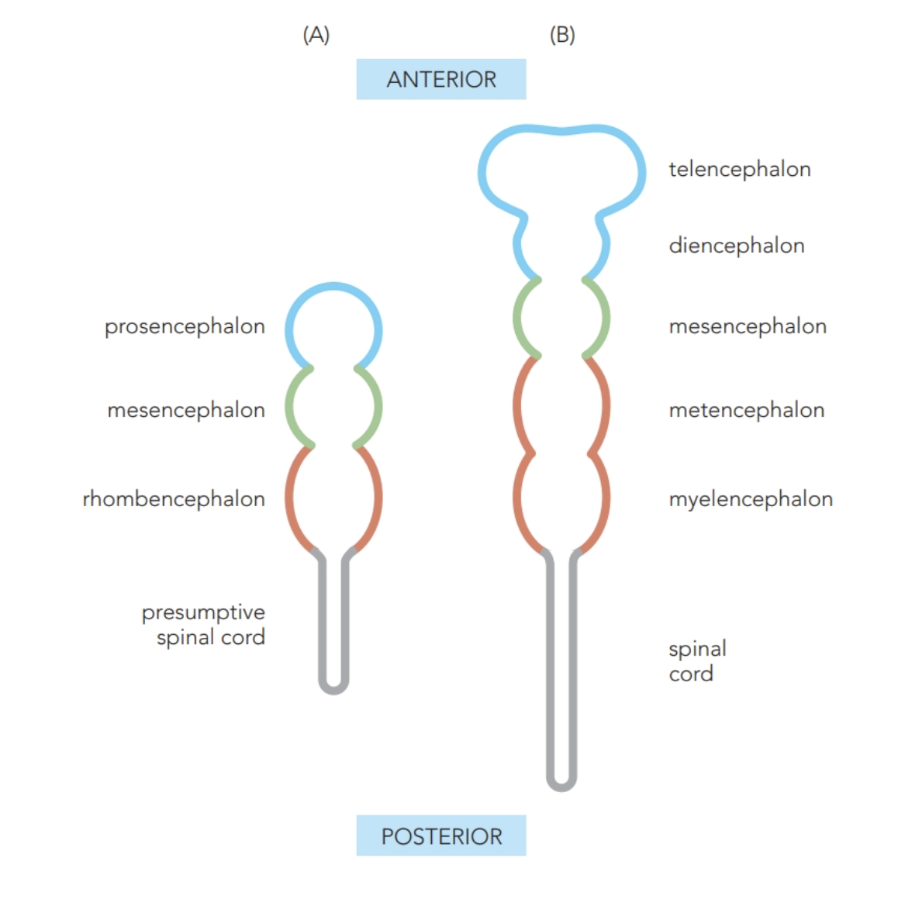
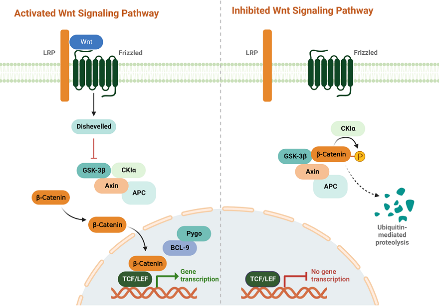
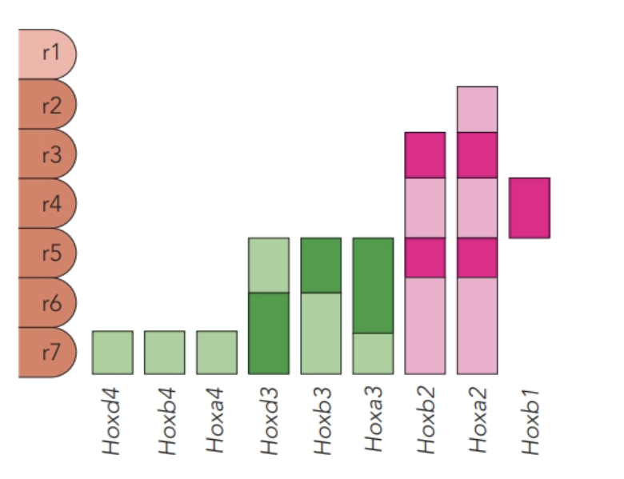
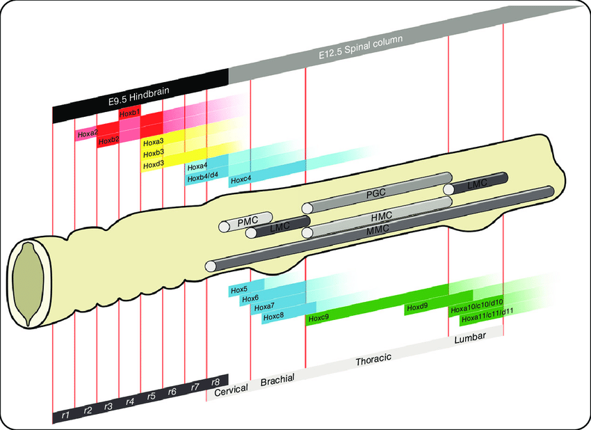

# 神經管的前後分區

## 內文

### 一、先用腦泡定位，再看各區域怎麼取得身分

神經管的前端形成 brain vesicles，後方延續成 spinal cord。**先分成三個主要腦泡，再看後續五個腦泡**，就能保留各分支的歸屬。

| 最初的主要腦泡 | 後續腦泡 | 所屬的大區域 |
|---|---|---|
| **Prosencephalon** | Telencephalon、diencephalon | Forebrain |
| **Mesencephalon** | Mesencephalon | Midbrain |
| **Rhombencephalon** | Metencephalon、myelencephalon | Hindbrain |

來源：L3，20–23；L4，7、20。

腦泡之內還有較小的暫時性分節 **neuromeres**：前腦圖中以 prosomeres p1–p6 標示，p1 靠近中腦；後腦以 rhombomeres r1–r7 標示。某些交界處也是 **organizer／signaling center**，它們的訊號會改變鄰近組織的發育，而不只是地圖上的分界線。

| 訊號中心 | 在哪裡 | 與區域指定的關係 |
|---|---|---|
| **AVE（anterior visceral endoderm）** | 胚胎前方、發育中前腦下方的 extraembryonic visceral endoderm | 影響頭與前腦發育，也影響 ANR 的指定。 |
| **ANR（anterior neural ridge）** | 神經管最前端、telencephalon 前緣 | 前腦的局部訊號來源。 |
| **ZLI（zona limitans intrathalamica）** | Diencephalon 內，位於 prethalamus 與 thalamus 之間 | 是前腦內的訊號中心；誘導作用見下方待補。 |
| **Isthmus／MHB（midbrain–anterior hindbrain border）** | Midbrain 與 anterior hindbrain 的交界 | 提供 FGF8、Wnt，參與中腦與前方後腦的指定。 |
| **Prechordal plate／notochord** | 分別位於前腦下方，以及較後方神經管的腹側 | 提供不同區域下方的訊號環境；notochord 的 Shh 接到 DV patterning。 |

（待補 by codex：ZLI 與 prechordal plate 分別釋出哪些訊號、作用於哪些組織，以及如何影響其區域身分。）來源：L4，23–25、30–31。

### 二、前腦需要局部誘導，也需要阻擋後方訊號擴進來

1. **AVE 影響前腦與 ANR；ANR 再作局部訊號中心**

   AVE 釋出 fibroblast growth factors（**FGFs**）等訊號，影響前腦發育與 ANR 的指定。ANR 位於神經管最前方，進一步影響前腦的基因表現與發育。兩者一個在神經組織下方，一個在神經管前緣。來源：L4，23–24。

2. **在前腦區域抑制 Wnt，避免前腦被推向較後方的身分**

   Wnt 可參與中腦的區域指定；如果這類訊號過度向前延伸，便會使前方組織朝後方的區域特性改變。因此，前腦來源的 **Cerberus、secreted Frizzled-related proteins（sFRPs）、Dickkopf（Dkk）** 會限制 Wnt 訊號。

   | 抑制者 | 在哪個位置阻擋 Wnt |
   |---|---|
   | **Cerberus、sFRP** | 阻止 Wnt 與 receptor complex 的作用。 |
   | **Dkk** | 作用於 LRP，阻擋 Wnt 訊號。 |

   **Xenopus 的過量 Dkk 實驗**：胚胎的內源 Wnt 訊號被阻擋後，頭與腦的區域變大，向原本的 midbrain 區延伸。這是「抑制後方化訊號能擴大前方組織」的證據，不表示 Wnt 在神經系統所有位置都應被抑制。來源：L4，27–30。

3. **Wnt 的細胞內路徑：有沒有留下 β-catenin，會改變轉錄**

   前面比較的是細胞外如何限制 Wnt；進入接收細胞後，關鍵則是 **β-catenin 能否累積並進核**。

   | 條件 | 膜與細胞質內發生什麼 | 細胞核的結果 |
   |---|---|---|
   | **有 Wnt 訊號** | Wnt 結合膜上的 Frizzled／LRP receptor complex，經細胞內的 Dishevelled 抑制 β-catenin 降解機制。β-catenin 得以累積、進入核內。 | β-catenin 與 TCF／LEF 及協助蛋白作用，促進目標基因轉錄。 |
   | **沒有啟動 Wnt 的條件** | 圖中的 CKIα、GSK-3β、Axin、APC 參與使 β-catenin 被磷酸化並走向 ubiquitin-mediated proteolysis。 | 缺少 β-catenin 的促進作用，圖中的目標轉錄沒有啟動。 |

   

   圖中 Pygo、BCL-9 位於核內轉錄複合體旁。（待補 by codex：Pygo、BCL-9 在此複合體中的作用。）來源：L4，26。

4. **區域 transcription factors 互相限制，讓邊界停在一定位置**

   - **Otx2** 表現在前腦至中腦範圍，參與這些頭部結構的發育；**Pax6** 在 p1–p6 的表現，與正常前腦、眼、耳形成有關。
   - **Six3** 主要在較前方 p3–p6；**Irx3** 在 p1、p2 及更後方。Six3 與 Irx3 互相抑制，使彼此限制在不同區域。
   - **MHB 的 Wnt 增強 Irx3**，有助於限制前腦向後方擴張；前方的 Wnt inhibitors 又限制後方訊號向前延伸。

   **邊界靠兩側互相限制**，所以要連同「在哪一邊」一起記 Six3、Irx3 與 Wnt。來源：L4，25、29–30。

### 三、中腦與後腦交界的訊號，能改變鄰近組織的命運

1. **MHB 同時提供 FGF8 與 Wnt**

   Isthmus 的窄縮區表現 **FGF8**；Wnt 初期分布於較大範圍的中腦，之後限制在 FGF8 前方的一帶。來源圖中的調節關係是：FGF8 促進 Wnt、抑制 r1 的 Hox expression；Wnt 抑制 Otx2 的作用、促進後方的 Gbx2。這些訊號影響相鄰區域的 gene expression，讓 midbrain 與 anterior hindbrain 取得不同特性。

2. **搬動組織與放入訊號，可以測試「這裡是否有誘導能力」**

   | 實驗操作 | 放到哪裡、保留什麼條件 | 觀察結果與可支持的關係 |
   |---|---|---|
   | **Quail midbrain tissue graft** | 把相近發育階段的 quail mesencephalon 組織轉向 180°，移到 chick telencephalon。 | 出現額外的 midbrain 與 cerebellar tissue，且方向與正常區域相反；顯示移入組織具有改變局部發育的訊號作用。 |
   | **FGF8-coated bead** | 在 posterior forebrain、靠 mesencephalon／p1 邊界處放入帶 FGF8 的 bead，並與未處理胚胎比較。 | 出現異位 midbrain 與 cerebellar-like tissue；支持 FGF8 參與這些區域的指定。 |

   兩種操作都顯示，**改變局部訊號，可以在新的位置誘導不同的區域命運**。來源：L4，21–22、31–32。

### 四、後腦分節之後，還要維持各節的界線與身分

1. **Rhombomeres 與後續結構有特定對應**

   | Rhombomere | 投影片列出的相關產物／cranial motor neuron 所屬神經 |
   |---|---|
   | **r1** | 參與形成 cerebellum。 |
   | **r2、r3** | Trigeminal。 |
   | **r4** | Facial。 |
   | **r5** | Facial、abducens。 |
   | **r6** | Abducens、glossopharyngeal。 |
   | **r7** | Glossopharyngeal、vagus。 |

   **一條 cranial nerve 的相關細胞可以跨不只一個 rhombomere，同一節也可產生屬於不同神經的細胞。** 來源：L4，33–34。

2. **奇偶相鄰不混合，同性質的節移到相鄰時可以混合**

   正常相鄰的奇數與偶數 rhombomeres 有界線，細胞不任意跨越。Chick grafting experiments 把不同節放到新位置：奇數與偶數相鄰時仍保持分界；把兩個偶數節放在一起會混合，兩個奇數節也有相同結果。這顯示細胞是否混合，與節的性質有關，不能只用「移到新位置」解釋。來源：L4，35–36。

3. **EphA 與 ephrin 接觸後互相排斥，限制細胞跨界**

   **Krox20** 是 r3、r5 的 transcription factor，調節 **EphA receptor** 表現。相鄰節細胞表面的 **ephrin A ligand** 與 EphA 結合後，受體側產生 forward signaling，ligand 側也有 reverse signaling；這種雙向訊號限制細胞跨越界線。

   | 缺少的 transcription factor | 原本的表現區域 | 來源中的分節結果 |
   |---|---|---|
   | **Krox20** | r3、r5 | r3、r5 未能維持，r2、r4、r6 接在一起，hindbrain 變短。 |
   | **Kreisler** | r5、r6 | r5、r6 融合，後方也沒有正常繼續分節。 |

   所以 **「先表現指定的調控蛋白，再形成排斥性的邊界」** 有實驗上的連接；EphA 是受體，Krox20 是調節它表現的蛋白，兩者不要互換。來源：L4，37–38。

### 五、Hox code 把前後位置接到各區段的細胞身分

1. **基因在 chromosome 上的排列，對應沿身體前後軸的表現**

   Hox genes 在演化中經過 duplication；mouse 有 A–D 四個 clusters，圖中分別位於 chromosomes 6、11、15、2。**字母區分 cluster，數字幫助辨認在群內的前後順序**；每個 cluster 只含 13 個 subfamilies 中的一部分。

   從 cluster 的 **3′ 端到 5′ 端**，對應較前方到較後方的身體區域，稱為 **colinearity**。3′ 側基因通常較早表現，5′ 側較晚，因此基因在 cluster 內的排列，也對應其表現的位置與時間。

2. **一個 rhombomere 的身分，取決於 Hox 組合及表現量**

   向 posterior 移動時，Hox expression 的組合會累積。圖中的深淺色分別代表相對高、低表現；同一節可以同時表現多個 Hox genes，合起來稱 **Hox code**。此圖是 mouse E9.5 的例子，物種與發育時間不同時，表現可略有差異。

   

   圖中 r4 的 Hoxb1 很突出，Hoxa2／Hoxb2、Hox3 與 Hox4 類的範圍則逐漸往後延伸；**重疊色帶顯示同一節的 Hox 組合**。來源：L4，39–42。

   Spinal cord 也有 Hox expression 的前後排列，與 cervical、brachial、thoracic、lumbar 及不同 motor columns 的位置並列：

   

   圖中的 **lateral motor column（LMC）** 產生走向 limb bud 的 motor axons；其背腹選路會在軸突導引時接續說明。PMC、PGC、HMC、MMC 則標出其他 motor columns。（待補 by codex：其餘 motor columns 的定義，以及 Hox 組合如何指定各群 motor neurons。）來源：L4，43；L6，38–39。

3. **RA 從兩旁來，在細胞核內影響 Hox transcription**

   Somites 釋出 **retinoic acid（RA）**。來源圖中的濃度在 hindbrain／spinal cord 交界較高，向前方 hindbrain 以及向後方 spinal cord 逐漸降低。

   RA 進入回應細胞，並移至細胞核；**cellular RA-binding proteins（CRABPs）** 可協助 RA 的移動。RA 結合 **retinoic acid receptor（RAR）**，RAR 再與 Hox promoter 的 **RA-response element（RARE）** 作用，啟動 transcription。因此這裡的 **RAR 是接收 RA 的蛋白，RARE 是 DNA 上的回應位置**。來源：L4，44–45。

4. **RA、Cyp26 與 FGF／Cdx 共同限制前後表現範圍**

   | 所在區域 | 局部訊號關係 | Hox 表現結果 |
   |---|---|---|
   | **Hindbrain** | Cyp26 影響 RA 梯度；r6／r7 的 Cyp26 較低，RA 較高。RA 也抑制 Cdx expression。 | 較高 RA 可誘導 **3′ Hox genes**，例如 Hoxb4；並限制 Cdx 在 hindbrain 的作用。 |
   | **Spinal cord** | FGF 梯度透過 **Cdx transcription factors** 傳遞影響；FGF 也影響 RA synthesis。RA 與 Cyp26 的量互相調整。 | Cdx 介導 **5′ Hox genes**，例如 Hoxb9 的表現。 |

   **RA 結合 RAR，由受體作用於 RARE；FGF 的這一支則透過 Cdx 調節 Hox expression。** 兩者經由不同的細胞內接續，影響 Hox 的前後表現範圍。來源：L4，46。
