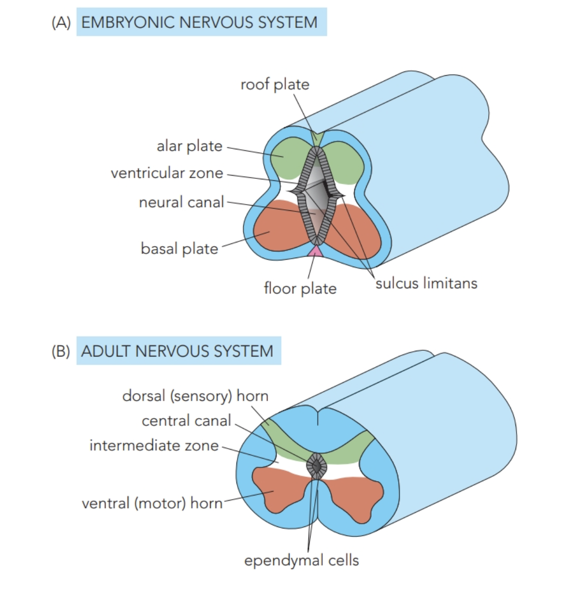
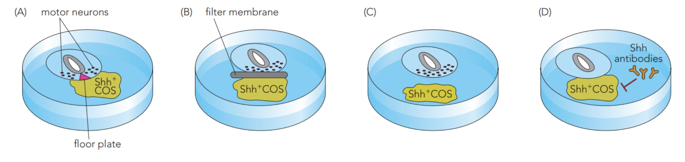
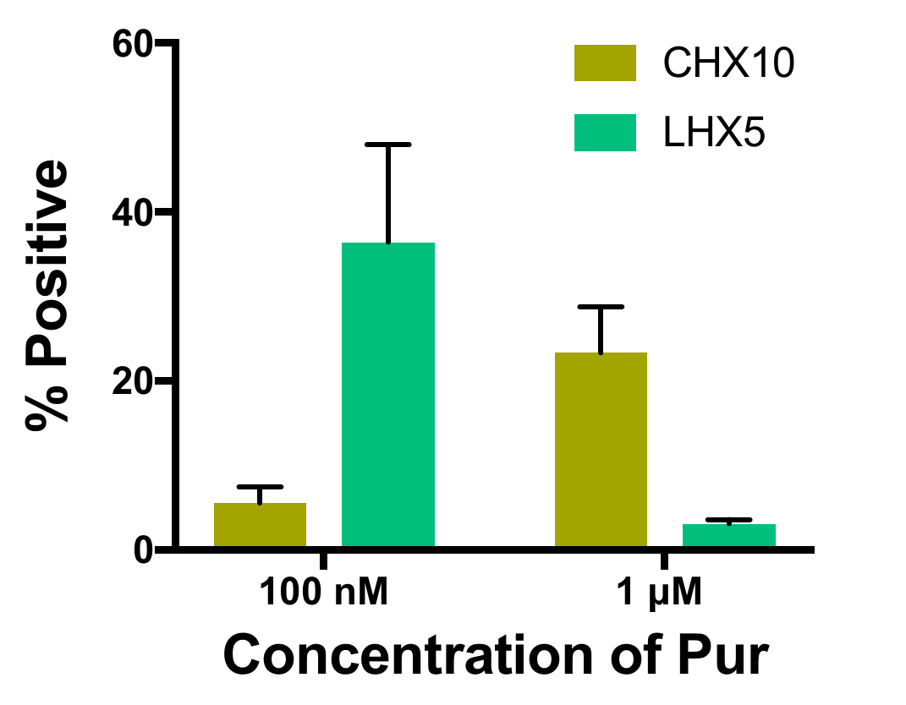
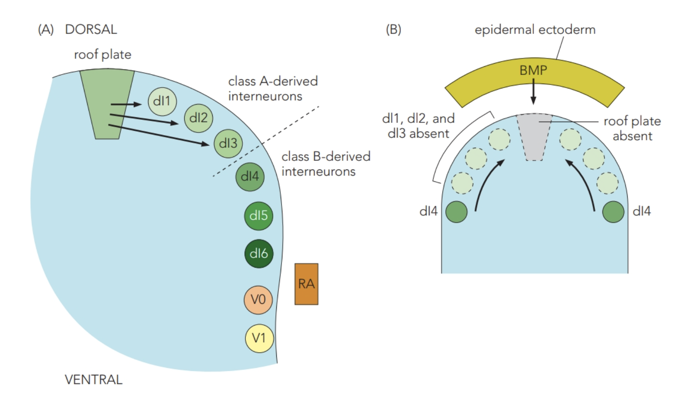
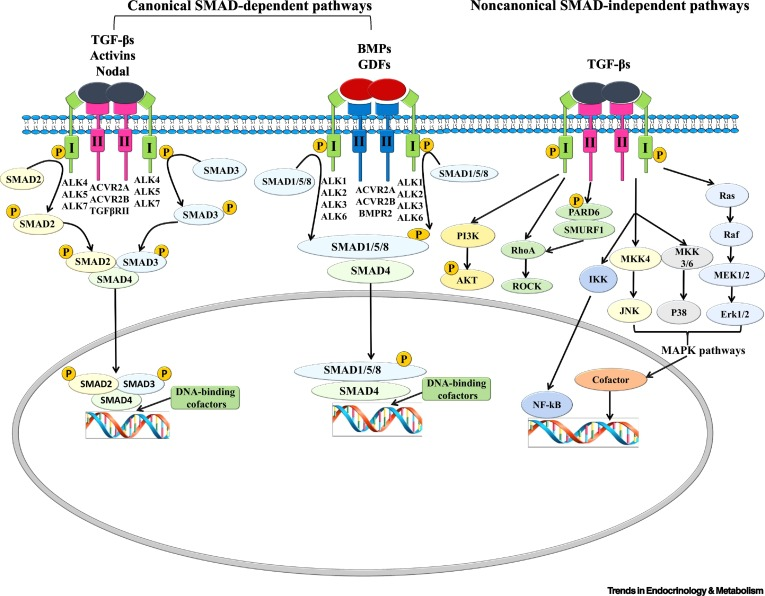
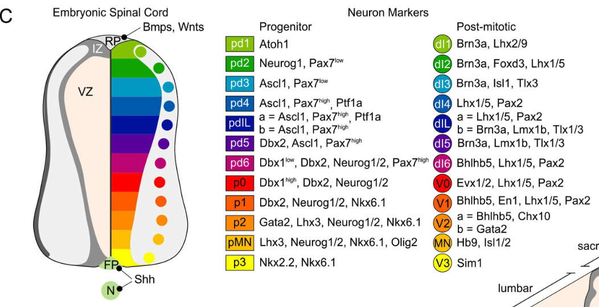

# 神經管的背腹分區

## 內文

### 一、同一橫切面內，前驅細胞從管腔周圍向外產生不同神經元

這裡以 **caudal CNS／spinal cord** 為主。新神經元由靠近 neural canal 的 **ventricular zone（VZ）** 產生；管壁背側是 **alar plate**，腹側是 **basal plate**，兩者之間有 **sulcus limitans**。

| 胚胎管壁區域 | 主要產生什麼 | 脊髓後續的區域對應 |
|---|---|---|
| **Alar plate** | Sensory interneurons。 | Dorsal sensory horn。 |
| **Basal plate** | Motor neurons 與相關 interneurons。 | Ventral motor horn。 |

細胞群擴張後，多數區域的 sulcus limitans 不再明顯；部分成體脊髓節段的 intermediate zone 同時有感覺與運動相關 interneurons。Neural canal 縮成 **central canal**，由 ependymal cells 襯裡。

來源：L5／L5V2，5–7。

### 二、腹側先由 notochord 誘導，再由 floor plate 延續 Shh 訊號

1. **拿掉或搬動 notochord，能看出它的誘導作用**

   | 操作 | Floor plate | Motor neurons | 支持的關係 |
   |---|---|---|---|
   | **正常 notochord** 位於神經管腹側 | 正常形成。 | 在附近形成。 | Notochord 對腹側神經管提供訊號。 |
   | **移除 notochord** | 不形成。 | 不形成。 | 在這個實驗條件下，缺少 notochord 會失去兩種產物。 |
   | **把 notochord 移植到神經管側方** | 側方出現異位 floor plate。 | 在異位 floor plate 兩旁出現。 | Notochord 能在新位置誘導腹側特性。 |

   Floor plate 形成後，本身成為誘導 motor neurons 的主要訊號來源。**Notochord 是管外的起始來源，floor plate 是被誘導後的管內來源。** 來源：L5／L5V2，8–9。

2. **Shh 可以擴散，但遠近條件產生的細胞不完全相同**

   **Sonic hedgehog（Shh）** 是這段腹側指定的重要 morphogen。實驗讓 **COS cells** 表現 Shh，作為局部蛋白來源，再與 neural tube explant 共培養。COS 是來自猴腎組織的 fibroblast-like cell line。

   | Shh-expressing COS cells 與 explant 的關係 | Floor plate | Motor neurons |
   |---|---|---|
   | **直接接觸** | 形成。 | 形成。 |
   | **用濾膜隔開** | 未誘導出。 | 仍形成。 |
   | **在培養皿中彼此分離** | 未誘導出。 | 仍形成。 |
   | **加入抗 Shh 抗體** | 不形成。 | 不形成。 |

   隔開後仍能形成 motor neurons，支持 **Shh 不必靠兩種細胞直接接觸才能作用**；加抗體後效應消失，則把作用接回 Shh。接觸與分離條件對 floor plate 的結果不同，也提醒我們不能把「可擴散」讀成任何距離都得到相同命運。

   

   來源：L5／L5V2，10–12。

3. **Shh 接到 PTC／SMO，再改變 Gli 的轉錄作用**

   **Patched（PTC）** 是接收 Hedgehog ligand 的膜上受體，原本會抑制膜上的 **Smoothened（SMO）**；**Gli** 則是下游調節目標基因的 transcription factor。

   | 條件 | PTC 與 SMO 的關係 | Gli 與目標基因 |
   |---|---|---|
   | **沒有 Hedgehog ligand** | PTC 抑制 SMO。 | Gli 走向抑制型 **GliR**，抑制目標轉錄。 |
   | **有 Hedgehog ligand** | Ligand 作用於 PTC，解除 PTC 對 SMO 的抑制。 | Gli 走向活化型 **GliA**，促進 PTCH1、Gli1 等目標基因。 |

   **Shh 解除一道抑制，讓 SMO 的下游反應能進行。** 這個接法也能解釋為何刺激 SMO 的 purmorphamine，或抑制 SMO 的 cyclopamine，會被用來擾動這條 pathway。來源：L5／L5V2，13、16；L7，5。

### 三、Shh 梯度透過兩類 transcription factors，分出腹側前驅區

1. **靠近腹側中線，Shh 較高；往背側逐漸降低**

   Notochord 與 floor plate 提供 Shh，位置不同的 progenitors 接觸不同濃度。Shh 對兩類 transcription factors 的作用方向相反：

   | 類別 | Shh 對它的影響 | 來源中的例子 |
   |---|---|---|
   | **Class I** | 抑制其表現。 | Dbx1、Dbx2、Irx3、Pax6。 |
   | **Class II** | 活化其表現。 | Nkx6.2、Nkx6.1、Olig2、Nkx2.2。 |

2. **兩類因子互相抑制，把漸變濃度轉成較清楚的邊界**

   來源圖配對 **Dbx1／Nkx6.2、Dbx2／Nkx6.1、Irx3／Olig2、Pax6／Nkx2.2**。相互抑制使邊界兩側偏向不同的表現組合；例如一側維持 Irx3，另一側維持 Olig2。這是在特定互抑關係中選擇一側，不代表一個 neuron 只能表現一種 transcription factor。

   | 由較背側往腹側讀的前驅區 | 產生的神經元 |
   |---|---|
   | **p0** | V0 interneurons |
   | **p1** | V1 interneurons |
   | **p2** | V2 interneurons |
   | **pMN** | Motor neurons（MN） |
   | **p3** | V3 interneurons |

   **p 指 progenitor domain；離開增殖階段後，才讀右欄的 neuron 身分。** 來源：L5／L5V2，14–15。

3. **在 human iPSC 分化實驗中，提高 Shh pathway 刺激會改變相對產物**

   **Induced pluripotent stem cells（iPSCs）** 能在合適的培養訊號下分化成 neurons。這個實驗用 human iPSCs，比較改變 Shh pathway 刺激強度後，產生的 neuron 類型比例如何改變。來源：L2，32–33；L5／L5V2，16。

   **Purmorphamine（Pur）是 Shh pathway agonist。** 投影片比較 100 nM 與 1 μM Pur：提高劑量時，代表 V2a 的 **CHX10-positive** 細胞比例增加，課頁用來辨認 V0 的 **LHX5-positive** 細胞比例減少。

   

   **提高 Pur，兩類細胞的比例朝不同方向改變**，把 Shh pathway 的刺激強度接到細胞命運的分配。來源：L5／L5V2，16，含原 PPTX 內嵌圖。

### 四、背側由 epidermal BMP 啟動 roof plate，但不是每一群都依賴 roof plate

1. **Epidermal ectoderm 與 roof plate 有先後接力**

   神經管背側的 **epidermal ectoderm 釋出 BMP4、BMP7**，誘導 roof plate 成為次級訊號來源。Roof plate 再提供 **dorsalin-1、BMPs、activin、GDF7**，它們屬於 **TGF-β superfamily**。

   TGF-β superfamily 包含 BMP、TGF-β 等不同 ligands。要知道 roof plate 的訊號對哪些細胞必要，可以比較保留與移除 roof plate 的結果。來源：L5／L5V2，17–20。

2. **拿掉 roof plate，能區分 class A 與 class B 的依賴條件**

   | 背側 interneuron 群 | 包含哪些類型 | 對 roof plate 的依賴 |
   |---|---|---|
   | **Class A** | dI1、dI2、dI3。 | 需要 roof plate 訊號。 |
   | **Class B** | dI4、dI5、dI6。 | 不依賴 roof plate；paraxial mesoderm 的 RA 看來參與其發育，亦與 V0／V1 有關。 |

   在小鼠中，以 diphtheria toxin gene 取代 roof-plate-specific **GDF7**，使 roof plate 細胞退化、不形成。**Epidermal BMP 仍存在**，但 dI1–dI3 沒有生成；dI4 仍能形成，且向原本 dI1–dI3 所在的背側區域擴張。

   

   所以，不能把 dorsal interneurons 全部解釋成同一種 roof plate 依賴；這個實驗同時顯示 **「外面的 BMP 還在」不等於「管內 roof plate 的作用被保留」**。來源：L5／L5V2，21–24。

3. **TGF-β superfamily 有不同的 SMAD 分支**

   上面的實驗區分了哪些細胞依賴 roof plate；接著看這類訊號如何傳到細胞核。不同 ligands 接到不同的 SMAD 分支，再影響基因表現。

   | 輸入支路 | 接到的 SMAD | 如何影響核內轉錄 |
   |---|---|---|
   | **TGF-β／Activin／Nodal** | SMAD2／3。 | 與 SMAD4、DNA-binding cofactors 合作影響基因表現。 |
   | **BMP／GDF** | SMAD1／5／8。 | 同樣接到 SMAD4 與核內調控。 |

   簡圖的 receptor 例子是 TGF-β 對 TGFR-2／TGFR-1，以及 BMP9／10 對 BMPR-2／ACTR-IIA、ALK-1。**這是分支比較的例子，背側誘導最初指的是 BMP4／7。**

   圖中另外有不經 SMAD 的 PI3K／AKT、RhoA／ROCK、MAPK 等支路。上表比較的是 SMAD 支路。

   

   讀圖時，把左側兩組 ligand 分別對上 SMAD2／3 與 SMAD1／5／8，再看共同的核內輸出。（待補 by codex：上述非 SMAD 支路在背側神經管指定中的作用對象與結果。）來源：L5／L5V2，19–20。

### 五、把各 domain、細胞產物與 marker 放回同一張橫切面

**BMP／TGF-β 訊號由背側較高，Shh 由腹側較高；兩邊也會互相拮抗：一方上調的基因，會受到另一方壓制。** BMP 的作用不只取決於濃度，也取決於訊號作用的發育時機。區域身分因此需要連同位置、訊號強度與發育階段一起判讀。

圖左是神經管，中央是 **progenitor markers**，右側是 **post-mitotic neuron markers**。例如 pd1 的 Atoh1 對到 dI1 的 Brn3a／Lhx2/9；pMN 的 Olig2 等組合對到 MN 的 Hb9／Isl1/2。p2 的產物還分 V2a、V2b，分別標示 Chx10 與 Gata2 相關組合；dIL 也分 a、b，需分別對照各支的 marker 組合。

**Marker 組合可協助辨認前驅區與產物；判斷某個 factor 是否參與命運指定，還需結合擾動實驗。**（待補 by codex：各組 progenitor markers 如何接到相應的神經元分化，尤其 p2 的 V2a／V2b 分支與 dIL 的 a／b 分支。）來源：L1，31；L5／L5V2，23–24。
