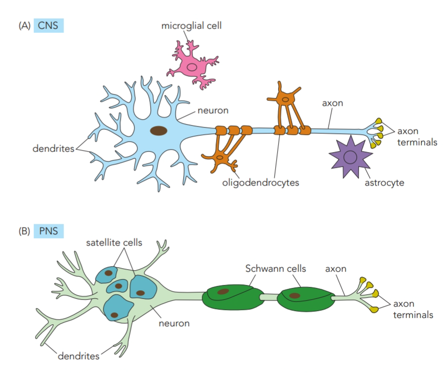
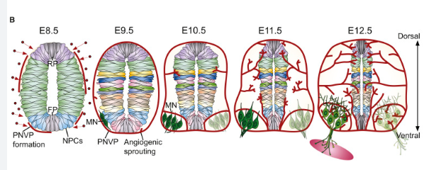

# 神經膠細胞與神經組織血管

## 內文

### 一、Glia 與神經元相鄰，但不同類型位於不同位置

| 所在系統 | Glial cell | 位置、作用與已知發育來源 |
|---|---|---|
| **Central nervous system（CNS）** | Oligodendrocyte | 包裹 axons，形成 myelinating glia。 |
| **CNS** | Astrocyte | 分布在神經元周圍；發育後期可由 radial glia 產生，部分人類局部來源也見 Tri-IPC。 |
| **CNS** | Microglia | 位於神經元周圍；（待補 by codex：發育來源與作用）。 |
| **Peripheral nervous system（PNS）** | Schwann cell | 包裹 axons 的 myelinating glia；（待補 by codex：發育譜系）。 |
| **PNS** | Satellite cell | 環繞 neuron cell bodies；（待補 by codex：發育譜系）。 |

**CNS 的 oligodendrocyte 與 PNS 的 Schwann cell 都位於 axon 周圍；satellite cell 則圍在胞體旁。** Radial glia 在前面的皮質生成與遷移過程中，還兼有前驅與支架角色；小腦的 Bergmann radial glia 提供 granule cell 遷移支架，retina 的 Müller glia 則以突起跨越視網膜。

（待補 by codex：oligodendrocyte 與 Schwann cell 如何形成髓鞘，以及髓鞘的成熟過程。）來源：L2，47–48；L5／L5V2，28、34–35、40–41；L5V2，55；L6，27；L7，12。

### 二、血管由神經管周圍往內長入

神經組織的血管具有 **mesodermal origin**。Mesodermal angioblasts 被招募到鄰近 **neural progenitor cells（NPCs）** 的區域，先在外圍形成 **perineural vascular plexus（PNVP）**，再由這個 plexus 長出 vascular sprouts，進入 neural tube 並逐漸增加分枝。

圖中先看管外 angioblasts／PNVP，再看紅色血管從外側往管壁伸入；背腹位置仍可用 roof plate、floor plate 與 motor neuron 區定位。另一張較長時序圖同時呈現神經元、glia 與血管逐漸多樣化，從 embryogenesis 延續到 postnatal。

圖中分別以 E8.5–E12.5、E9.5–E18.5 標示胚胎日齡。（待補 by codex：兩組時序圖的物種。）

（待補 by codex：招募 angioblasts 的 ligand／receptor，以及 NPCs 與血管萌芽之間的訊號。）來源：L7，13–14。
