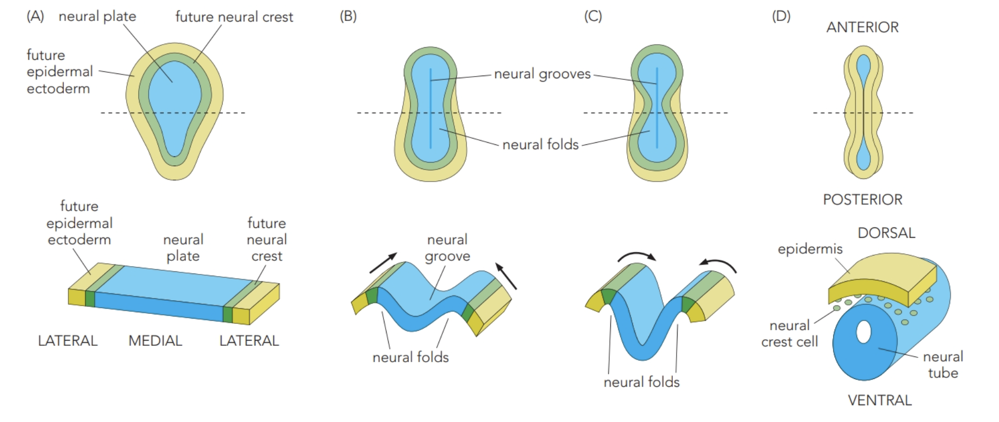
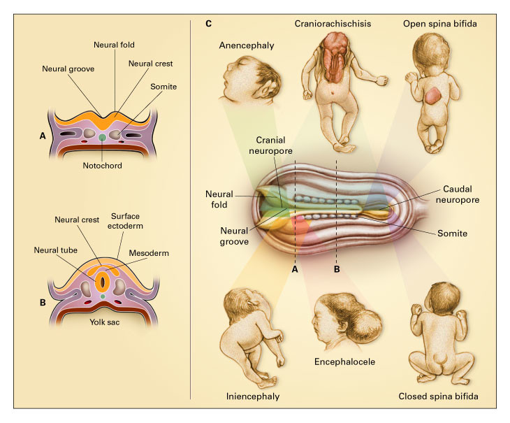

# 胚胎如何形成神經管

## 內文

### 一、先產生許多細胞，再把它們移到三個胚層

1. **Cleavage 增加細胞數，形成 blastula 階段的結構**

   受精卵（zygote）連續分裂，產生 blastomeres。兩棲類的圖中，細胞圍成中空的 **blastula**，內部空腔是 blastocoel；後面的 gastrulation 才會把細胞重新安排到內外不同位置。

   蛙卵在受精前，animal pole 與 vegetal pole 的內容物已不同：animal pole 的細胞質含較密集的脂質與顆粒，與後來的 epidermis、neural tissue 有關；vegetal pole 與 gut-related tissue 有關。早期區域差異會影響後續的發育去向。

   **不同物種的早期結構，要連同細胞與卵黃的位置比較：**

   | 例子 | 早期結構怎麼排列 | 接下來閱讀時要辨認什麼 |
   |---|---|---|
   | **兩棲類** | 球狀 blastula；blastocoel 周圍是細胞。 | Animal／vegetal 兩側及後來的 blastopore。 |
   | **鳥類** | 細胞在大片卵黃上形成較扁的 blastodisc，包含 epiblast、hypoblast。 | 上下層的位置，以及細胞往內移動的入口。 |
   | **哺乳類** | 形成 blastocyst，其中有 inner cell mass、腔與外圍 trophoblast。 | Inner cell mass 先於 epiblast 形成；human embryonic stem cells 可由 inner cell mass 取得，具有 pluripotency，能形成多種身體細胞類型。 |

   來源：L3，4–9；L2，32–33。

2. **Gastrulation 改變細胞位置，形成 ectoderm、mesoderm、endoderm**

   Gastrulation 的重點是**細胞往哪裡移**。原本在表面的細胞有些留在外側，有些移入內部，因而形成三個 germ layers。

   | 胚層 | 投影片列出的後續細胞或組織例子 |
   |---|---|
   | **Ectoderm** | Epidermis、neurons／brain、pigment cells。 |
   | **Mesoderm** | Cardiac、skeletal、smooth muscle，kidney tubule cells，red blood cells。 |
   | **Endoderm** | Lung alveolar cells、thyroid cells、pancreatic 與消化道相關細胞。 |

   接下來追蹤細胞的移動，才能看出 neural tube、notochord、somites 如何取得彼此的位置。

   - **兩棲類：由 blastopore 往內移。** Mesoderm 與 endoderm 進入胚胎內部，形成 primitive gut／gastrocoel；axial mesoderm（chordamesoderm）往 neural plate 下方移動，形成 **notochord**。留在外側的 ectoderm 中，背側區域走向 neural ectoderm，其他區域形成 epidermal ectoderm。Dorsal blastopore lip 的訊號參與 neural induction。
   - **小鼠：由 primitive streak 往內移。** Cup-like epiblast 的細胞經 primitive streak 進入，在 epiblast 與 visceral endoderm 之間形成新的 mesoderm、endoderm；streak 前端有 node。原本的 visceral endoderm 屬於 extraembryonic tissue，不能直接當作 definitive endoderm；gastrulation 中它會被新進入的細胞取代。位於前方的 **anterior visceral endoderm（AVE）** 在前腦發育時還有訊號作用。

   兩者都靠細胞內移安排胚層，但 blastopore 與 primitive streak 的外形、所在胚胎結構不同。來源：L3，4–14。

### 二、Neural plate 先凹陷，再把兩側邊緣合起來

1. **從平面到管：groove、folds、tube 是同一段折疊過程**

   Ectoderm 中的 **neural plate** 中央下陷成 neural groove，兩邊的 neural folds 抬高、向中線靠攏，最後在背側接合，形成 neural tube。表面的 epidermal ectoderm 隨之在管的外側連續起來。

   原本 neural plate 與 epidermal ectoderm 的交界，包含未來的 **neural crest**；管閉合後，這群細胞位於神經管背側。Neural tube 位於表皮下，**notochord 在管的腹側，成對 somites 在兩旁**。先分清這三個位置，後面 Shh 從下方來、retinoic acid 從兩旁來，才不會只剩訊號名稱。

   

   上排沿頭尾方向看閉合，下排看橫切面如何捲起。**Neural crest 是邊界細胞；neural tube 是折起後的管**。來源：L3，16–19；L4，6。

2. **沿神經管長軸，閉合也有先後**

   哺乳類的示意圖先在中段偏前的位置接合，再往 anterior、posterior 延伸；不是整條神經管同時封口。投影片並列的發育時間是 mouse E7.5–E10.5、human「gestation days 18–28」、chick 23–33 hours post-fertilization。這些數字屬各物種的標示，不能直接互換。

   （待補 by codex：圖中 human gestation days 的起算方式，以及與臨床產科週數的對應。）來源：L3，17。

3. **管旁的 mesoderm，也參與後續神經區域的指定**

   - **Notochord 提供 Shh**，參與神經管的腹側指定。
   - **Somites 提供 retinoic acid（RA）**，參與神經管延長與沿頭尾方向的區域指定。

   兩個訊號來源位置不同，後面分別接到 DV 與 AP 的討論。來源：L3，16–19。

### 三、閉合與頭部形態出問題，可以出現不同的 neural tube defects

**Neural tube defects（NTDs）的部位與外觀不同。** 投影片用側面與後方位置圖並列六種名稱：

| 圖中的名稱 | 用圖先分辨的部位或外觀 |
|---|---|
| **Anencephaly** | 顱側的大範圍缺損。 |
| **Craniorachischisis** | 缺損從顱側延續到脊柱背側。 |
| **Open spina bifida** | 脊柱背側開放的缺損。 |
| **Iniencephaly** | 頭頸位置明顯後仰的形態。 |
| **Encephalocele** | 顱部向外突出的囊狀構造。 |
| **Closed spina bifida** | 脊柱區域的缺損在表面覆蓋下。 |

來源：L3，24。

（待補 by codex：上述六種缺陷各自的胚胎機制、涉及組織與臨床表現。）

**Folate 與閉合的關係**：NTDs 的原因可包含遺傳、染色體異常及環境因素。Folate（vitamin B9）參與 DNA methylation，而 DNA methylation 參與正常細胞生長的控制；早期懷孕有大量細胞分裂，可能出現 folate 不足。投影片指出增加 folate 可減少 NTDs，也可減少部分心臟缺陷與 oral clefts。這說明 folate 是相關因素之一，不能把所有 NTDs 都歸因於 folate 缺乏。

（待補 by codex：DNA methylation 如何影響神經管閉合。）來源：L4，5。
