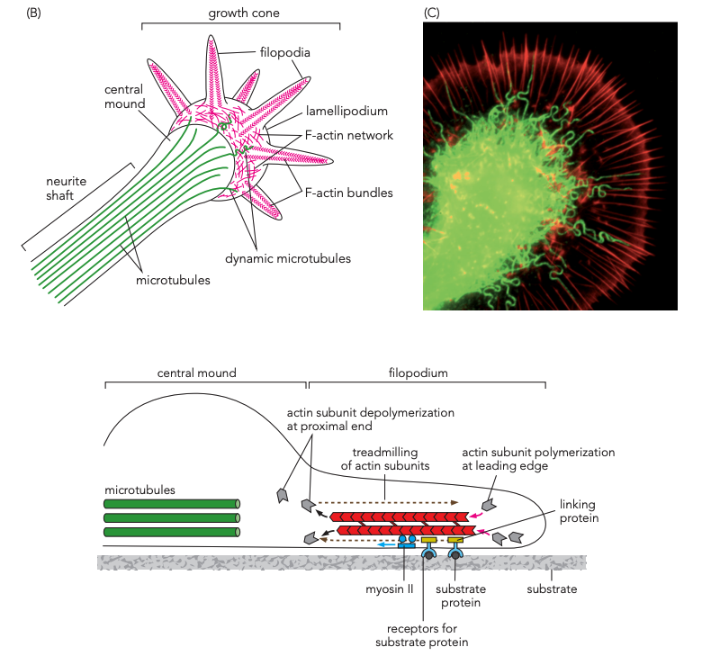
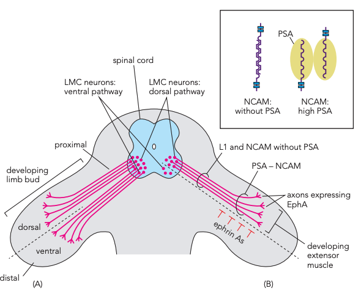
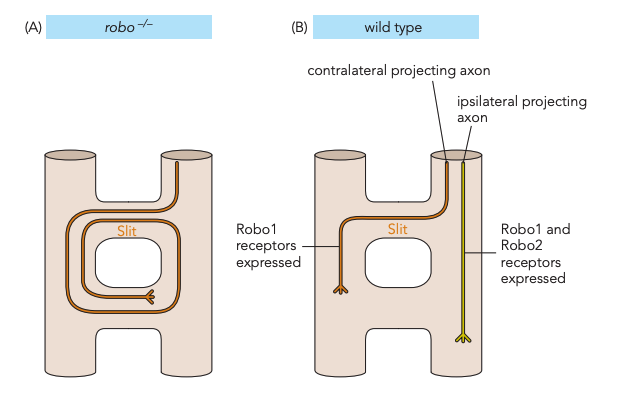

# 軸突如何找到目標

## 內文

### 一、Growth cone 在 axon 最前端，接觸環境並調整生長方向

**Growth cone 是神經突起向前伸展的末端。** Cajal 在固定組織中看到這種構造，據其形態推測它是動態的生長端；來源另以 embryonic day 4（E4）chick spinal cord 的實際影像展示。

| 細胞骨架所在位置 | 結構 | 與生長的關係 |
|---|---|---|
| **Axon shaft、growth cone 的中央近端** | Microtubules 較豐富，從 shaft 伸到 central mound。 | 支撐已形成的軸突；部分 dynamic microtubules 伸入更遠端，參與前進方向。 |
| **Lamellipodium** | 網狀 F-actin。 | 形成生長端較寬的薄片區域。 |
| **Filopodia** | 從 lamellipodium 伸出的 F-actin bundles。 | 接觸、取樣周圍 substrate，參與路徑選擇。 |

**Filopodium 會一邊組裝、一邊拆解 actin：subunits 在 leading edge 加入，在 proximal end 脫離。** 這個 treadmilling 過程，讓細胞骨架持續更新；生長端因此能改變形態、回應接觸到的環境。

圖中的 myosin II、linking proteins、substrate receptors 把細胞骨架與接觸面連起來。這裡的關鍵是**前端接觸到什麼，會影響突起往哪裡伸**；具體導引分子的例子接在下面。來源：L6，34–37。

### 二、進入 limb bud：先一起走，再選路，最後在肌肉上分枝

Lateral motor column（**LMC**）的 axons 起初合成一束，接近發育中的 limb bud 才在 choice point 分成兩路。這段過程同時需要黏附與排斥：**NCAM 是參與黏附的分子，polysialic acid（PSA）修飾會改變 axons 彼此黏附的程度**。

| 所在路段 | 哪個分子作用於誰 | 形成的走行結果 |
|---|---|---|
| **接近 limb bud 的近端** | Axons 上的 **L1、低 PSA 的 NCAM** 促進彼此黏附。 | Axons 維持在同一束，稱 **fasciculation**。 |
| **Limb bud 的分岔處** | Ventral limb bud 的 **ephrin A（圖標 ephrin A5）** 排斥具有 **EphA receptor** 的 axons。 | EphA-positive axons 避開 ventral 路徑，走向 dorsal；圖中 lateral LMC 走 dorsal，medial LMC 走 ventral。 |
| **接近 developing extensor muscle／myotubes** | NCAM 參與 axon 與肌肉的接觸；此處較高的 **PSA** 干擾相鄰 axons 的 NCAM homophilic binding。 | Axons 減少聚束，在肌肉表面分枝。 |

**低 PSA 時較能保束，高 PSA 時較易解束、分枝。** 如果只記「NCAM 讓軸突黏在一起」，就無法解釋同一條路後段為何需要分開。來源：L6，38–39。

前面的 rhombomere 邊界也用到 **EphA／ephrin 的排斥**，限制相鄰節的細胞混合；在 limb bud，接收排斥的是正在延伸的 axon，使它避開 ventral 路徑。相同的排斥作用，因接收細胞與所在位置不同，分別影響組織邊界與軸突選路。來源：L4，37–38；L6，38–39。

### 三、在中線：Slit／Robo 的排斥，限制軸突反覆跨越

**Contralateral projection 走向對側；ipsilateral projection 留在同側。** 來源用 **Drosophila** 的 interneuron axons，示範中線訊號與突變比較。

中線的 **Slit** 作用於 axon 上的 **Robo（roundabout）receptors**，提供排斥訊號。圖中的跨中線 axons 表現 Robo1，同側投射表現 Robo1 與 Robo2。

| 果蠅的比較條件 | 跨中線或靠近中線的結果 | 可以看出的作用 |
|---|---|---|
| **Wild type** | 圖中 contralateral axon 跨一次後走向對側，ipsilateral axon 留在同側。 | 正常導引能維持不同投射路線。 |
| **robo mutant** | Commissural axons 反覆來回穿越 transverse commissure，與 slit mutant 類似。 | Slit／Robo 排斥參與限制再次跨越；反覆繞行也是 roundabout 名稱的由來。 |
| **robo1、robo2 都缺少** | 來源圖說指出同側投射靠向中線並 collapse；這項結果沒有畫在對照圖中。 | 兩個 receptors 對 ipsilateral axons 回應中線排斥很重要。 |

（待補 by codex：commissural axon 在第一次跨中線前後，如何調整對 Slit 的反應，才能先跨越、之後再受到排斥。）來源：L6，40–41。
