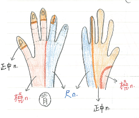
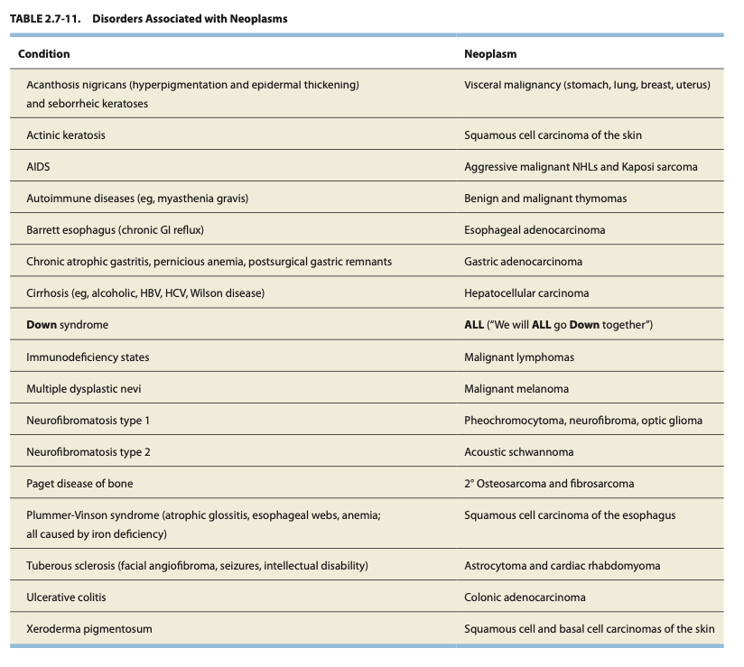

# 國考豆知識

## 內文
GAD > 6 months, Panic & schizo > 1 month, MDD > 2 week, mania > 1 week

重複問一樣的問題 ⇒ antegrade amnesia ex: 失智症

Dopamine agonist 用於 parkinson, hyperprolactinemia, restless leg syndrome, OHSS 抗 VEGF

Dopamine agonist：Bromocriptine (ergot 類，短效)、cabergoline (長效)

anti-cholinergic for drug induced parkinson

輕度認知障礙 (mild cognitive impairment) vs 失智症 (dementia)：MCI 不會影響日常生活功能

valproic acid 有顫抖的副作用

[[國考豆知識/Levodopa|摘要]]

Levodopa-induced chorea: Parkinsons 常用 levodopa後常見，有就是Parkinsons

[[國考豆知識/vit B deficiency|摘要]]

植物人 vs Coma: 植物人會睡覺 / 睡醒、眼睛睜開

抗癲癇藥物要五倍半衰期

status epilepticus 如果 vital sign 不穩定 不要急著 BZD (會呼吸抑制)

RBD 常發生在 Parkinsons ⇒ BZD

腦梗後水腫 ⇒ ADC 下降、DWI 上升

vasovagal syncope 也可能出現短暫肌肉強直的症狀 (不是只有癲癇)

**<u>carbamazepine 治三叉神經痛不治頭痛</u>**

治頭痛的抗癲癇：Topiramate, Gabapentin, Valproate

一氧化碳中毒常在 白質 & 蒼白球 (⇒ parkinson’s)

<u>**acetazolamide**</u> (是一種 sulfa drug): 治 Periodic paralysis、IICP、glaucoma、高山症 (respiratory alkalosis)、any alkalosis

鉛中毒：axonal degeneration（運動為主）

1. NMO: anti-aquaporin (AQP4)
2. Miller Fisher: anti-Gle
3. Myasthenia Gravis: anti—MuSK (anti-postsynaptic acetylcholine (ACh) receptors)
4. **Lambert-Eaton:** anti-presynaptic calcium channels
5. 肉毒桿菌毒素：阻止 pre-synapse Ach 釋出

parkinson 單側開始抖 essential tremour 雙側對稱一起開始抖

Notch-3 gene: CADASIL，遺傳性反覆中風 (尤其anterior temporal)

[[國考豆知識/aphasia subtypes 可以重複字句的都是 transcortical|摘要]]

HSV encephalitis ⇒ temporal lobe

low grade giloma 比較容易 seizure (長在temporal lobe)

只有 情緒、記憶固化 & 短期記憶、聽覺、Wernicke 在 temporal

其他 ex: hemineglect, apraxia 都在 parietal ，broca 在 frontal

臉盲 prosopagnosia 在 occipital

