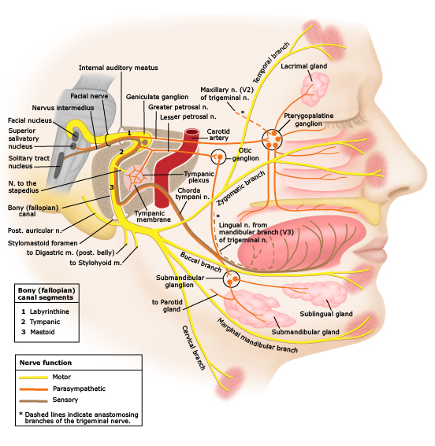

# Etiology：nerve inflammation

## 內文
1. Viral infection ex: HSV, Herpes zoster，但臨床上不會測也測不出原因。30/100000 a year
2. Facial nerve ischemia, especially DM
3. Other immune-mediated inflammatory response / Pregnancy-related fluid retention

Facial nerve inflammation ⇒ Myelin sheaths undergo degeneration

Usually in narrow labyrinthine part of the facial canal (edema causes nerve & blood compression)

