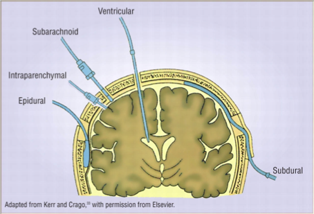

# ICP monitor 種類：ventricular, intraparenchymal, subarachnoid, subdural, epidural, non-invasive

## 內文
- 注意：noninvasive ICP monitoring 目前 evidence 高的方式有 TCD (transcranial doppler)、TDTD（封閉吸盤罩住眼窩後加壓，看何時眼窩內 ophthalamic a. 波形跟顱內 ophthalamic a. 一樣 ）、ONSD（用強度很低的超音波看眼後3mm optic nerve寬度）

