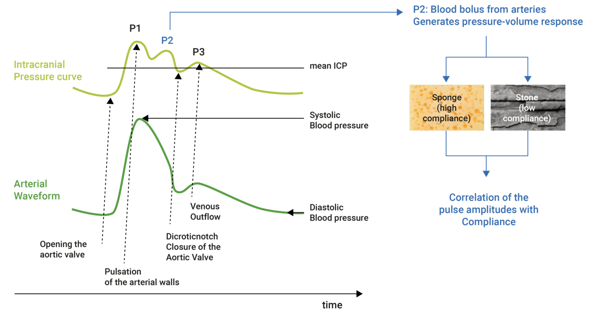
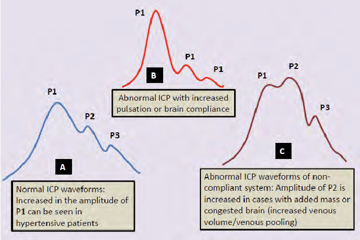

# ICP waveform：三個 pulse（一般artery是兩個）

## 內文
1. P1 是 systolic pulse，P3 是 diastolic pulse(一般artery都有這兩個pulse)，P2是因為腦是軟的，所以有回彈波。
2. 如果是systolic hypertesion，P1 會變得又尖又高
3. 如果腦有病變（tumor / ICP過高）導致complicance 下降，則 P2 會很高，比 P1 還高，甚至最後會連在一起變成 plateau

↓ 這篇寫很好可以看一下：

[Interpretation of intracranial pressure curves](https://www.miethke-journal.com/en/icp/interpretation-of-intracranial-pressure-curves)

