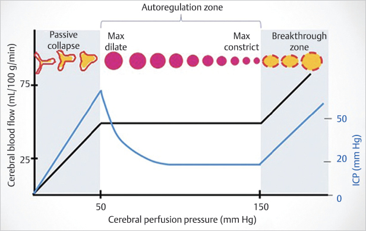
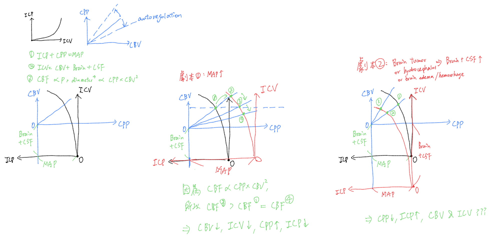

# 2) Autoregulation：此階段的重點是要維持 cerebral blood flow

## 內文
[[2) Autoregulation：此階段的重點是要維持 cerebral blood flow/前言- 小心 IICP 時 autoregulation 會爛掉|摘要]]

[[2) Autoregulation：此階段的重點是要維持 cerebral blood flow/前言- Intracranial compliance：由 venous blood 決定|摘要]]

圖說：

1. ICP: intracranial pressure; ICV: intracranial volume; CPP: cerebral perfusion pressure; CBV: cerebral blood volume; CBF: cerebral blood flow; MAP: Mean arterial pressure
2. 左黑圖：整個顱內腔的compliance，[由 venous blood 貢獻](https://www.miethke-journal.com/en/icp/interpretation-of-intracranial-pressure-curves)；右藍圖：腦中動脈的compliance，由血管肌肉進行 autoregulation 調整。
3. autoregulation zone：血管肌肉的 autoregulation 有限度，超過這個範圍就無能為力
4. 只有在藍色座標的第一象限才有血流進大腦，若 ICP > MAP 則 blood flow = 0
5. [[2) Autoregulation：此階段的重點是要維持 cerebral blood flow/Pressure reactivity index (PRx) = correlation|扁平]]
6. [[2) Autoregulation：此階段的重點是要維持 cerebral blood flow/Other regulation factors：chemical, neural|扁平]]
