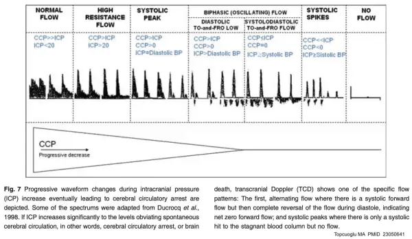
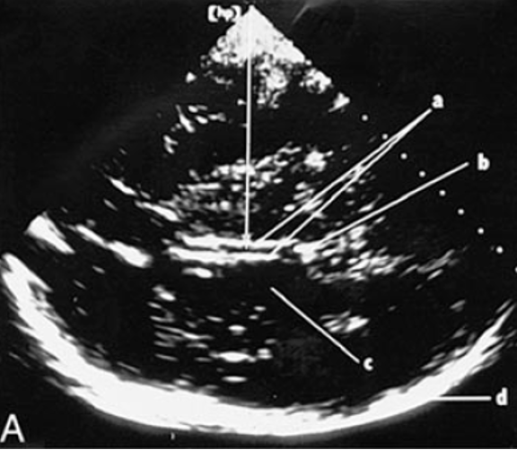
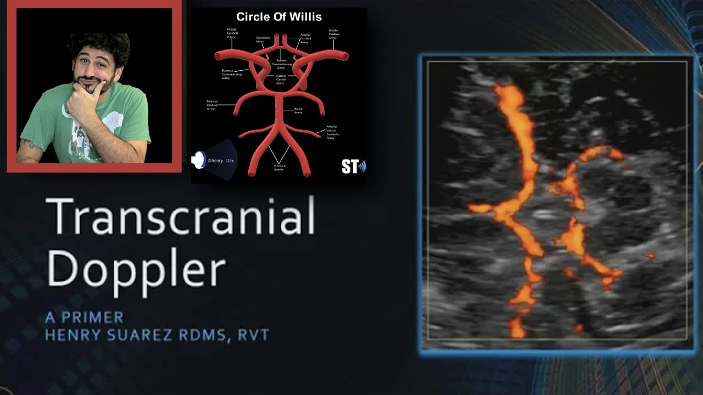

# 3) Cerebral blood velocity monitor: TCD (transcranial doppler)

## 內文
重要參數：

1. Mean cerebral blood velocity ( MV = CBF / CBV )：動脈血的流速，通常 MCA: 60, ACA: 50, PCA: 40, all ±10 (cm/s)
2. Pulsatility index（PI）： $\cfrac{peak\ velocity(Vmax) - end\ diastolic\ velocity(Vmin)}{Mean\ velocity}$ ，通常 0.8~1.1
   

- 注意：看到流速很快要想：
  1. 是水龍頭開很大 （strong CBF，low PI）
  2. 還是血管被捏起來（low CBV，high PI）：一開始捏的時候流速會變快（CBF autoregulation），到最後流速會掉下來（掉出autoregulation zone）
  3. Vasospasm : if absolute MCA velocity
     1. > 120cm/s： 88% sensitivity, 72% specificity
     2. > 200cm/s： 98% specificity

Procedure:

1. 用心超探頭
2. 要看到對面頭骨(>15cm)
3. 在zygomatic arch 之上，太陽穴之下平移找穿透力好的window
4. 透過同一個好的window，tilting 找 plane
5. 重要 planes
   1. 3rd ventricle：如鐵軌般兩細線
      
   2. MCA, PCA, midbrain, circle of willis：可以用 doppler 量血流速度
      - 注意：MCA 從 circle of willis 直奔探頭，兩條 PCA 包住米老鼠（midbrain）
        
