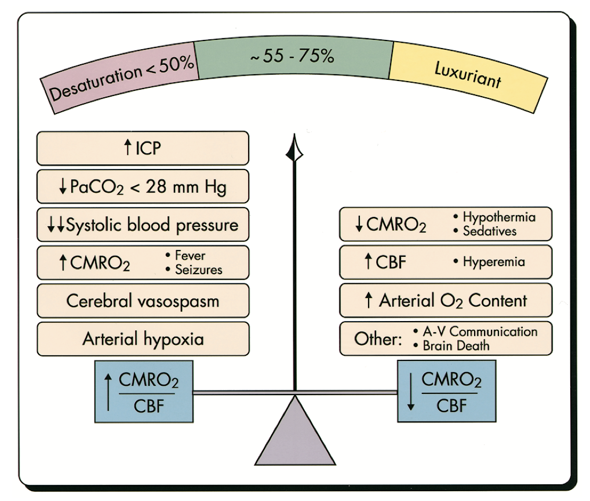
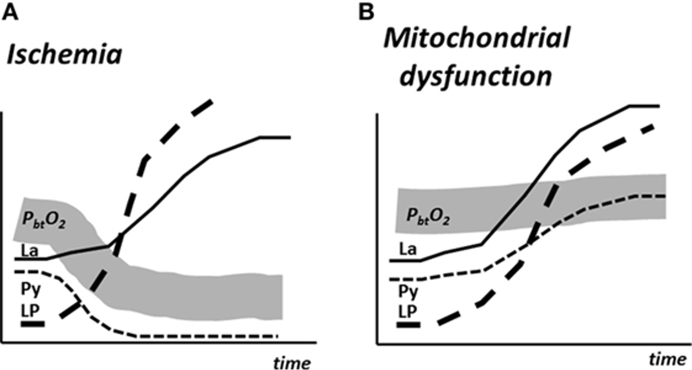

# Interpretation

## 內文
1. 代表腦中耗氧、耗能多的指標：CMRO2↑，Lactate/Pyruvate ratio↑ (by microdialysis)
2. 耗氧、耗能改變的原因
   - 注意：注意！耗氧、耗能高代表出事了，需要處理；耗氧、耗能少則不代表沒事，可能是因為細胞死光了
   
3. 下圖左右比較：左圖 pyruvate & O2 低，可能是運不進來，如果打通還有救。 右圖 pyruvate & O2 正常，代表細胞爛了，運來也沒用
   
