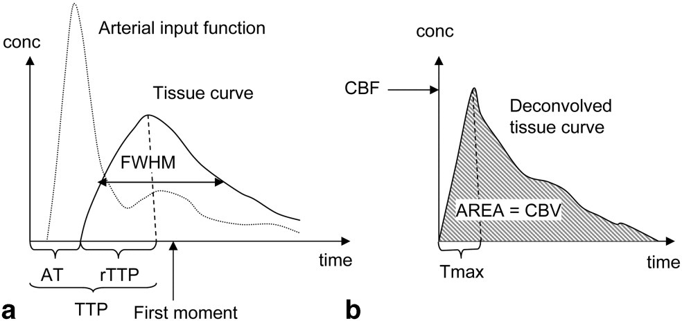

# 最正確的做法

## 內文
1. 因為 tissue-density curve 是由 <u>血液中顯影劑的濃度 x 組織中的血液濃度</u> 兩者乘在一起
2. 因此應該對 AIF 進行 deconvolution，才能得到真正的 blood_flow - time 圖
   
   - 此圖最高點即為 CBF ，面積即為 CBV
   - AIF 即為血液中顯影劑的濃度曲線，通常由測量正常的血管獲得

     [[最正確的做法/示意圖|摘要]]
