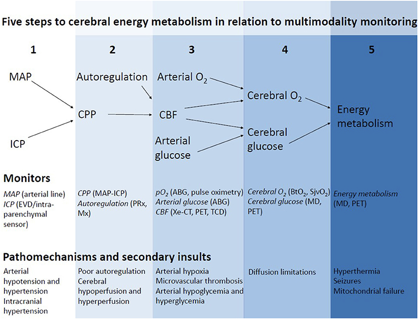

# 前言：Multimodal monitor

## 內文
[[前言：Multimodal monitor/為什麼要 multimodel monitor？|摘要]]

在圖中的 five steps 中可以監測很多參數，由這些上下游參數構成一個 big picture，來看整個大腦的總體狀態。

- 注意：緊急的時候，應該先維持下游（blood flow & energy）的通暢；但平常的治療目標，應該要想辦法維持好的上游（ICP）狀態

