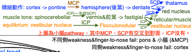

# Structure dysfunction: stroke, spinal, hemorrhage, thrombosis

## 內文
- [[Structure dysfunction stroke, spinal, hemorrhage/Stroke location|扁平]]
- [[Structure dysfunction stroke, spinal, hemorrhage/Spinal lesion|扁平]]
- [[Structure dysfunction stroke, spinal, hemorrhage/Horner syndrome (永遠同側) sympathetic dysfunction ⇒|扁平]]
- [[Structure dysfunction stroke, spinal, hemorrhage/Chiari malformation type 1 有 tonsil herniation|扁平]]
- **SAH**：劇痛 + meningeal sign (畏光、噁心嘔吐)
  - Hemorrhage 後常先 rebleeding (24hr 內) 再 vasospasm (3~10 天)
- **Cavernous sinus thrombosis**: 臉感染 (SA為主) ⇒ 細菌回去 CS ⇒ 頭痛、眼痛、sepsis
  - Treatment: antibiotic (vanco for SA + metronidazole for anaerobic + 3 or 4 cepha)
- [[Structure dysfunction stroke, spinal, hemorrhage/眼球控制：大同橋異|扁平]]
- [[Structure dysfunction stroke, spinal, hemorrhage/視野|扁平]]

